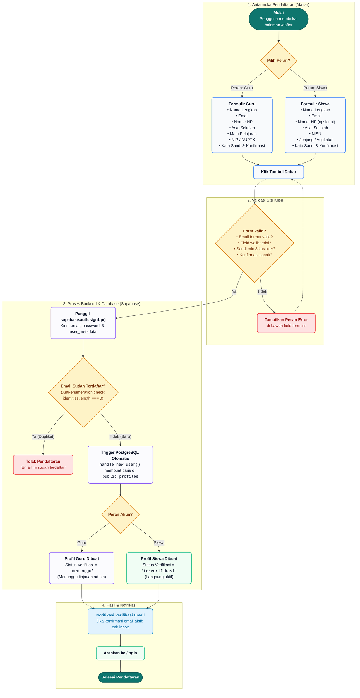
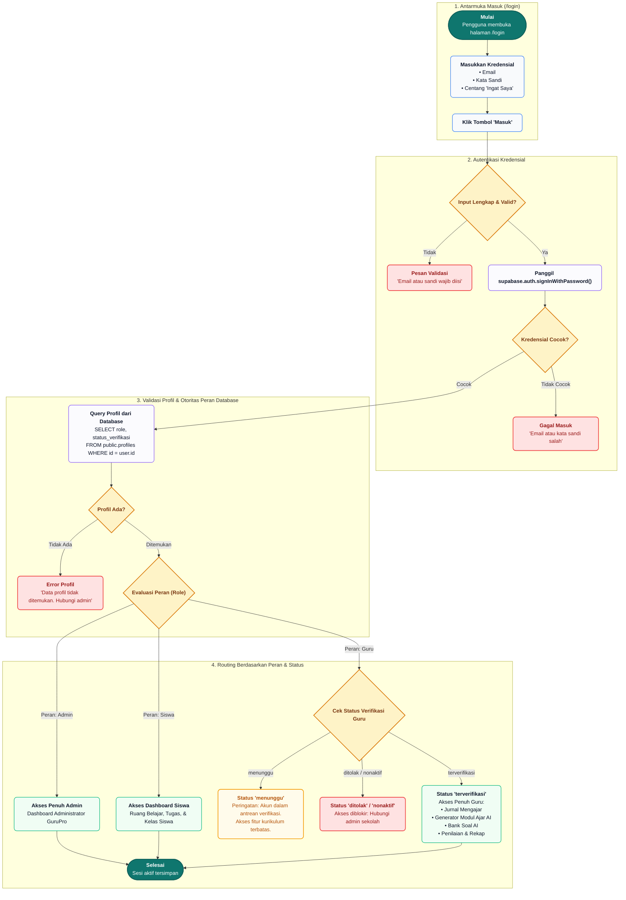

# Flowchart Alur Autentikasi: Login & Daftar Akun (GuruPro)

Dokumen ini memuat diagram alur (*flowchart*) dan spesifikasi teknis lengkap untuk proses **Pendaftaran Akun (Register)**, **Masuk Akun (Login)**, dan **Verifikasi Peran & Otorisasi Sesi (Auth Middleware)** pada platform **GuruPro**.

Arsitektur ini merujuk langsung pada implementasi produksi di:
* `src/routes/login.tsx`
* `src/routes/daftar.tsx`
* `src/lib/auth-store.ts`
* `src/integrations/supabase/auth-middleware.ts`
* Database Trigger `handle_new_user()` pada Supabase (`public.profiles`)

---

## 1. Flowchart Pendaftaran Akun (Daftar Akun Guru & Siswa)

---

## 2. Flowchart Masuk Akun (Login) & Sesi

---

## 3. Matriks Hak Akses & Status Akun (Single Source of Truth)

Sistem otorisasi GuruPro menegakkan prinsip **Single Source of Truth (SSOT)** langsung dari tabel basis data `public.profiles`, bukan dari klaim token yang dikirimkan oleh klien:

| Peran (*Role*) | Status Verifikasi | Akses Dashboard | Akses Generate Modul & Soal AI | Akses Penilaian & Nilai |
| :--- | :--- | :--- | :--- | :--- |
| **Admin** | `terverifikasi` | Penuh (Semua Modul & Pengaturan) | Ya (Penuh) | Penuh (Semua Kelas) |
| **Guru** | `terverifikasi` | Penuh (Dashboard Guru) | Ya (Penuh dengan Otoritas AI Guard) | Ya (Kelas yang Diampu) |
| **Guru** | `menunggu` | Terbatas (Menunggu Verifikasi) | Ditolak (`requireGuruAuth` guard) | Ditolak |
| **Guru** | `ditolak` / `nonaktif` | Diblokir | Ditolak | Ditolak |
| **Siswa** | `terverifikasi` | Ruang Siswa (Tugas, Materi, Nilai) | Ditolak (Khusus Guru/Admin) | Hanya melihat nilai sendiri |

---

## 4. Keamanan & Proteksi Khusus

1. **Anti-Enumerasi Email**:
   * Jika pengguna mencoba mendaftar dengan email yang telah terdaftar, sistem mendeteksi array `identities` kosong dari Supabase Auth dan menampilkan pesan standar yang aman tanpa membocorkan data sensitif.
2. **Strict Server-Side Role Enforcement**:
   * API server TanStack Start / Nitro menggunakan middleware `requireGuruAuth` dan `requireTeacherAiAuth` yang selalu memverifikasi baris pengguna di tabel `public.profiles`. Upaya mengubah metadata role pada sisi klien secara otomatis ditolak (*Fail Closed*).
3. **Pemisahan Jalur Guru vs Siswa**:
   * Siswa dapat langsung aktif untuk pengerjaan tugas (`status_verifikasi = 'terverifikasi'`).
   * Guru memerlukan verifikasi status (`status_verifikasi = 'menunggu'` saat awal daftar) demi menjamin keamanan data administratif sekolah dan integritas materi ajar.
