# Flowchart Alur Generate Modul (GuruPro – Modul Ajar)

Dokumen ini memuat diagram alur (*flowchart*) dan spesifikasi lengkap proses **Generate Modul (Modul Ajar / Slide Presentasi Pembelajaran)** pada sistem **GuruPro**, sesuai dengan diagram arsitektur pipeline produksi.

---

## 1. Diagram Alur (Mermaid Flowchart)

```mermaid
flowchart TD
    %% Styling Class Definitions
    classDef startEnd fill:#0f766e,stroke:#115e59,stroke-width:2px,color:#ffffff,rx:15,ry:15;
    classDef process fill:#f8fafc,stroke:#3b82f6,stroke-width:1.5px,color:#0f172a,rx:8,ry:8;
    classDef processPurple fill:#fbfbfe,stroke:#8b5cf6,stroke-width:1.5px,color:#0f172a,rx:8,ry:8;
    classDef processGreen fill:#f0fdf4,stroke:#10b981,stroke-width:1.5px,color:#0f172a,rx:8,ry:8;
    classDef processCyan fill:#f0f9ff,stroke:#0284c7,stroke-width:1.5px,color:#0f172a,rx:8,ry:8;
    classDef processTeal fill:#f0fdfa,stroke:#0d9488,stroke-width:1.5px,color:#0f172a,rx:8,ry:8;
    classDef decision fill:#fef3c7,stroke:#d97706,stroke-width:2px,color:#78350f;
    classDef decisionPink fill:#fdf2f8,stroke:#db2777,stroke-width:2px,color:#831843;
    classDef errorNode fill:#fee2e2,stroke:#ef4444,stroke-width:2px,color:#991b1b,rx:8,ry:8;
    classDef retryNode fill:#ffedd5,stroke:#f97316,stroke-width:2px,color:#9a3412,rx:8,ry:8;
    classDef draftNode fill:#f1f5f9,stroke:#64748b,stroke-width:1.5px,color:#334155,rx:8,ry:8;

    %% 1. Input & Validasi Awal
    subgraph S1 ["1. Input & Validasi Awal"]
        S1_Start(["<b>Mulai</b><br/>Guru klik tombol 'Generate Modul'"]):::startEnd
        S1_Input["<b>Ambil Data Input</b><br/>• Judul modul<br/>• Kelas & Mata Pelajaran<br/>• Tujuan Pembelajaran<br/>• Gaya Presentasi<br/>• Parameter lainnya"]:::process
        S1_Validate["<b>Validasi Request</b><br/>• Autentikasi guru<br/>• Kepemilikan modul<br/>• Status approval (GEN-0)<br/>• Target type = modul<br/>• Outline & style valid"]:::process
        S1_CheckValid{"<b>Valid?</b>"}:::decision
        S1_Error["<b>Tampilkan pesan error ke pengguna</b>"]:::errorNode

        S1_Start --> S1_Input
        S1_Input --> S1_Validate
        S1_Validate --> S1_CheckValid
        S1_CheckValid -- "Tidak" --> S1_Error
    end

    %% 2. Bangun Konteks Terarah
    subgraph S2 ["2. Bangun Konteks Terarah"]
        S2_Context["<b>Ambil Konteks Modul</b><br/>• Data outline disetujui<br/>• Data Modul Ajar terkait<br/>• Referensi sumber & bukti<br/>• Tujuan pembelajaran"]:::processPurple
        S2_Filter["<b>Filter & Ranking Relevan</b><br/>• Seleksi sumber sesuai topik<br/>• Ambil bukti yang relevan<br/>• Batasi konteks (token limit)"]:::processPurple
        S2_Grounded["<b>Hasil: Grounded Context</b><br/>Konteks terstruktur per slide<br/>(berdasarkan outline)"]:::processPurple

        S2_Context --> S2_Filter
        S2_Filter --> S2_Grounded
    end

    %% 3. Generate Konten dengan AI
    subgraph S3 ["3. Generate Konten dengan AI"]
        S3_CallAI["<b>Panggil AI Provider</b><br/>Gunakan prompt registry<br/><code>presentation_content_generator_grounded_v1</code><br/>+ konteks terarah."]:::processGreen
        S3_Output["<b>Hasil Generasi</b><br/>Structured output sesuai schema:<br/>• Slide content<br/>• Content blocks<br/>• Visual direction<br/>• Speaker notes (jika aktif)"]:::processGreen

        S3_CallAI --> S3_Output
    end

    %% 4. Validasi Output
    subgraph S4 ["4. Validasi Output"]
        S4_L1["<b>Validasi Deterministik (Layer 1)</b><br/>• Struktur & jumlah slide<br/>• Urutan slide<br/>• Tipe konten yang didukung<br/>• Konsistensi parameter"]:::processCyan
        S4_L2["<b>Validasi Grounding & Fakta (Layer 2)</b><br/>• Cek sumber & bukti<br/>• Cek nilai/angka yang tepat<br/>• Deteksi klaim tidak didukung<br/>• Cek kontradiksi"]:::processCyan
        S4_Sem["<b>Evaluasi Semantik (Content Quality)</b><br/>• Kesesuaian dengan outline<br/>• Tujuan pembelajaran<br/>• Kelayakan pedagogis<br/>• Kesesuaian style & content density"]:::processCyan
        S4_CheckEval{"<b>Hasil Evaluasi</b>"}:::decision
        S4_Retry["<b>Lakukan 1x Correction Retry</b>"]:::retryNode
        S4_Reject["<b>Gagal Generate</b><br/>Tampilkan pesan error"]:::errorNode

        S4_L1 --> S4_L2
        S4_L2 --> S4_Sem
        S4_Sem --> S4_CheckEval
        S4_CheckEval -- "Revisi" --> S4_Retry
        S4_CheckEval -- "Reject" --> S4_Reject
    end

    %% 5. Simpan Hasil
    subgraph S5 ["5. Simpan Hasil"]
        S5_Save["<b>Simpan Presentation Content Package</b><br/>• Generation request ID<br/>• Style & parameter snapshot<br/>• Konten terstruktur (immutable)<br/>• Provenance & metadata"]:::processTeal
    end

    %% 6. Update Status & Preview
    subgraph S6 ["6. Update Status & Preview"]
        S6_Status["<b>Update Status</b><br/>prepared → generating → validating → ready"]:::processPurple
        S6_Preview["<b>Tampilkan Preview ke Guru</b><br/>• Slide number & title<br/>• Key points<br/>• Content blocks<br/>• Visual direction<br/>• Referenced asset IDs<br/>• Grounding references (jika tersedia)<br/>• Speaker notes (jika aktif)"]:::processPurple
        S6_Decision{"<b>Guru Lanjut?</b>"}:::decisionPink
        S6_Draft["<b>Simpan sebagai draft (opsional)</b>"]:::draftNode

        S6_Status --> S6_Preview
        S6_Preview --> S6_Decision
        S6_Decision -- "Tidak" --> S6_Draft
    end

    %% 7. Siap ke Tahap Berikutnya
    subgraph S7 ["7. Siap ke Tahap Berikutnya"]
        S7_Ready["<b>Konten Modul Siap</b><br/>Menunggu proses:<br/>PPT-1C (Renderer),<br/>PPT-1D (Integrasi Ilustrasi),<br/>PPT-1E (Review Guru),<br/>PPT-1F (Quality Gate)"]:::processTeal
        S7_End(["<b>Selesai</b><br/>Konten modul berhasil dibuat dan tersimpan"]):::startEnd

        S7_Ready --> S7_End
    end

    %% Alur Antar Tahapan
    S1_CheckValid -- "Ya" --> S2_Context
    S2_Grounded --> S3_CallAI
    S3_Output --> S4_L1
    S4_Retry -. "Loop Revisi (Maks 1x)" .-> S3_CallAI
    S4_CheckEval -- "Pass" --> S5_Save
    S5_Save --> S6_Status
    S6_Decision -- "Ya" --> S7_Ready
```

---

## 2. Keterangan Simbol & Legenda

| Simbol / Tipe | Representasi Bentuk | Deskripsi |
| :--- | :--- | :--- |
| **Mulai / Selesai** | Stadium / Kapsul Hijau/Teal | Menandai titik awal aksi guru (*trigger*) dan titik akhir sukses modul tersimpan. |
| **Proses** | Kotak Persegi Panjang (*Rounded*) | Langkah eksekusi fungsional (pengambilan data, filter, pemanggilan AI, validator, dan penyimpanan). |
| **Keputusan** | Belah Ketupat (*Diamond*) Kuning / Merah Muda | Titik percabangan logika berbasis kondisi boolean atau multi-kondisi. |
| **Error / Gagal** | Kotak Merah dengan ikon silang (X) | Kondisi kegagalan sistem atau penolakan validasi yang menampilkan pesan kesalahan ke guru. |
| **Retry / Loop** | Kotak Oranye dengan ikon refresh | Mekanisme perbaikan otomatis 1 kali (*targeted correction retry*) jika terdeteksi isu semantik minor. |
| **Alur Proses** | Panah Solid / Putus-putus | Garis arah alur kerja sistem, termasuk putaran balik koreksi (*feedback loop*). |

---

## 3. Rincian Penjelasan 7 Tahapan Pipeline

### Tahap 1: Input & Validasi Awal
* **Mulai**: Guru menekan tombol **"Generate Modul"** pada antarmuka GuruPro.
* **Ambil Data Input**: Sistem membaca payload input yang meliputi:
  * Judul modul
  * Kelas & Mata Pelajaran (Fase & Kurikulum)
  * Tujuan Pembelajaran (TP)
  * Gaya Presentasi (*tone*, format, visual profile)
  * Parameter lainnya (jumlah slide, tingkat kedalaman materi)
* **Validasi Request**: Memeriksa otentikasi dan otorisasi guru, kepemilikan modul, status approval perencanaan awal (**GEN-0**), target type (`modul`), serta integritas outline dan style.
* **Keputusan (Valid?)**:
  * **Tidak**: Sistem membatalkan proses dan menampilkan pesan error ke guru (*fail-closed*).
  * **Ya**: Berlanjut ke Tahap 2.

---

### Tahap 2: Bangun Konteks Terarah
* **Ambil Konteks Modul**:
  * Data outline yang telah disetujui (otoritas hierarki outline).
  * Data Modul Ajar terkait dalam database kurikulum.
  * Referensi materi sumber terverifikasi (*grounding sources*) beserta kutipan bukti (*evidence chunks*).
  * Tujuan pembelajaran spesifik.
* **Filter & Ranking Relevan**:
  * Menyeleksi potongan materi sumber yang relevan dengan topik slide.
  * Mengambil bukti referensi berbobot tinggi.
  * Membatasi ukuran konteks agar aman terhadap batas token model AI (*token limit & anti-context overflow*).
* **Hasil (Grounded Context)**:
  * Dokumen konteks terstruktur per slide yang siap disuntikkan ke dalam prompt AI.

---

### Tahap 3: Generate Konten dengan AI
* **Panggil AI Provider**:
  * Menggunakan sistem registri prompt resmi: `presentation_content_generator_grounded_v1`.
  * Menggabungkan system prompt, instruction hierarchy, dan grounded context yang telah difilter.
* **Hasil Generasi**:
  * Menghasilkan output terstruktur dalam format JSON skema valid yang mencakup:
    * **Slide content**: Judul, subjudul, dan narasi per slide.
    * **Content blocks**: Blok-blok konten spesifik (poin kunci, perbandingan, studi kasus, fakta penting).
    * **Visual direction**: Arahan layout, meta-ilustrasi, ikon, dan komposisi visual.
    * **Speaker notes**: Catatan panduan mengajar untuk guru (jika diaktifkan).

---

### Tahap 4: Validasi Output (3-Layer Quality Gate)
Output AI diperiksa secara ketat melalui 3 lapisan validasi bertingkat:
1. **Validasi Deterministik (Layer 1)**:
   * Memastikan struktur & jumlah slide sesuai pesanan.
   * Urutan nomor slide kontigu ($1, 2, \dots, N$).
   * Tipe konten didukung oleh sistem (24 tipe blok konten terstandar).
   * Konsistensi seluruh parameter input.
2. **Validasi Grounding & Fakta (Layer 2)**:
   * Memeriksa kesesuaian klaim dengan sumber & bukti rujukan.
   * Cek ketepatan angka, rumus, dan terminologi faktual.
   * Deteksi halusinasi atau klaim yang tidak berdasar.
   * Cek tidak adanya kontradiksi internal antar-slide.
3. **Evaluasi Semantik (Content Quality)**:
   * Mengukur keselarasan materi terhadap outline yang disetujui.
   * Kesesuaian materi terhadap Tujuan Pembelajaran.
   * Kelayakan pedagogis (kesesuaian usia dan level peserta didik).
   * Kepadatan materi (*content density*) dan kesesuaian gaya presentasi.
* **Keputusan (Hasil Evaluasi)**:
  * **Revisi**: Jika terdapat kesalahan yang dapat diperbaiki, sistem melakukan **1x Correction Retry** terarah dan kembali memanggil AI Provider (Tahap 3).
  * **Reject**: Jika setelah perbaikan tetap tidak lolos atau terdapat pelanggaran fatal, sistem berhenti (**Gagal Generate**) dan menampilkan pesan error.
  * **Pass**: Lolos seluruh lapisan pengujian, lanjut ke Tahap 5.

---

### Tahap 5: Simpan Hasil
* **Simpan Presentation Content Package**:
  * Menyimpan paket data konten tervalidasi ke basis data (*immutable presentation content*).
  * Komponen yang disimpan:
    * `generation_request_id`
    * Snapshot style & parameter input
    * Konten terstruktur (*immutable presentation payload*)
    * Provenance sumber, metadata bukti, dan riwayat validasi.

---

### Tahap 6: Update Status & Preview
* **Update Status Lifecycle**:
  * Mengubah status pipeline secara transparan: `prepared` $\rightarrow$ `generating` $\rightarrow$ `validating` $\rightarrow$ `ready`.
* **Tampilkan Preview ke Guru**:
  * Menampilkan pratinjau terstruktur kepada guru sebelum finalisasi:
    * Nomor dan judul slide
    * Poin-poin utama (*key points*)
    * Blok konten terformat
    * Arahan visual (*visual direction*)
    * Referensi ID aset visual
    * Rujukan materi sumber (*grounding references*)
    * Catatan pembicara (*speaker notes*)
* **Keputusan (Guru Lanjut?)**:
  * **Tidak**: Guru dapat menyimpan konten saat ini sebagai draft untuk diedit kemudian (*opsional*).
  * **Ya**: Guru menyetujui konten dan melanjutkan ke tahap rendering dan produksi akhir.

---

### Tahap 7: Siap ke Tahap Berikutnya
* **Konten Modul Siap**:
  * Menjadi dasar input terstandar untuk downstream engine berikutnya:
    * **PPT-1C**: *Renderer Engine* (Konversi ke dokumen OpenXML / binary PPTX asli).
    * **PPT-1D**: *Integrasi Ilustrasi* (Menyematkan aset visual / gambar yang dihasilkan VIS-1B).
    * **PPT-1E**: *Review Guru* (Tinjauan interaktif akhir dari guru).
    * **PPT-1F**: *Quality Gate E2E* (Pengecekan integritas akhir sebelum distribusi).
* **Selesai**:
  * Konten modul ajar berhasil dibuat, tervalidasi, dan tersimpan dengan integritas penuh.
