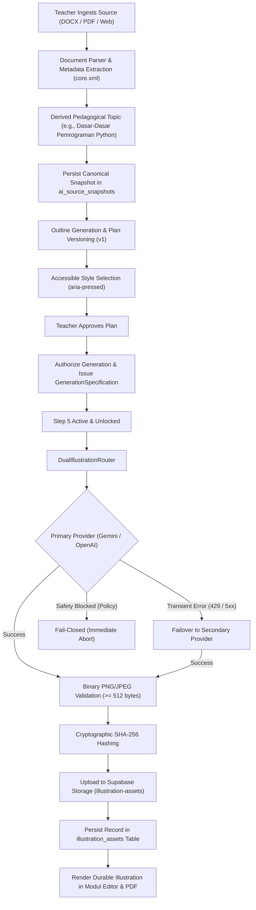

# GuruPro AI Core Recovery (AI-CORE-RECOVERY-1)
## Source Ingestion + Generation Planning + Dual AI Provider + Real Illustration Storage

### 1. Executive Summary
Stage **AI-CORE-RECOVERY-1** reconciles the AI Modul Ajar, Generation Planning, and Visual Illustration pipelines into a production-grade, serverless-safe, durable, and resilient system. It eliminates prototype mock generators, fixes document topic inference failures, guarantees dual-provider runtime resilience (Gemini $\leftrightarrow$ OpenAI), and establishes durable asset persistence in Supabase Storage and PostgreSQL without modifying the existing product architecture.

---

### 2. Failure Resolution Matrix

| Issue ID | Failure Description | Root Cause | Implemented Resolution | Verification |
|---|---|---|---|---|
| **Failure A** | DOCX/eBook source topic became filename (e.g., `e-book python.docx`), causing anti-hallucination gate rejection. | Filename was assigned as fallback topic; container words (`ebook`, `docx`) were treated as domain entities. | 1. Implemented 5-tier topic inference in `document-parser.ts` reading document metadata (`docProps/core.xml`) and headings. 2. Added container keywords to stopwords in `grounding.ts` while keeping technical entities and numbers 100% strict. | `ai-core-recovery.test.mjs` Tests 1–11 passed. |
| **Failure B** | Visual style card selection was non-semantic (`
`) and in-memory persistence masked Supabase mutation failures. | Clickable `
` without semantic ARIA attributes; Supabase mutation responses lacked error checks. | 1. Refactored style cards to semantic `<button type="button" aria-pressed={isSelected} ...>` with full keyboard navigation. 2. Enforced `{ data, error }` inspection in `selectPlanStyleServerFn` and related functions. | `ai-core-recovery.test.mjs` Tests 13–19 passed. |
| **Failure C** | Plan displayed "Rencana Disetujui" while Step 5 showed "Otorisasi Generasi Terkunci". | Generation authorization state was decoupled from plan approval state. | Synchronized approval with generation specification issuance in `approveGenerationPlanServerFn`. Approved plan directly unlocks Step 5 without manual extra clicks. | `ai-core-recovery.test.mjs` Tests 17–20 passed, `vis-1f-runtime-fix.test.mjs` Tests 1–8 passed. |
| **Failure D** | Lower button called dummy `buatIlustrasi()` creating SVG geometric prototypes reported as success. | Client used timeout + SVG canvas fallback in production flow. | 1. Unified both illustration buttons through `generateIllustrationsForPlanServerFn`. 2. Strictly rejected SVG prototypes in `assertValidImageBinary` (enforcing binary PNG/JPEG payloads $\ge 512$ bytes). | `ai-core-recovery.test.mjs` Tests 26–28 passed, `vis-1f-runtime-fix.test.mjs` Tests 13–17 passed. |
| **Failure E** | Only single AI provider used without failover resilience between Gemini and OpenAI. | Provider factory lacked fallback router logic. | Implemented `DualIllustrationRouter` supporting Gemini `gemini-3.1-flash-image` and OpenAI `gpt-image-2`. Automatic failover on transient HTTP 429/500/502/503/504 errors; **strict fail-closed on safety blocks** (`AI_SAFETY_BLOCKED`). | `ai-core-recovery.test.mjs` Tests 21–25 passed. |
| **Failure F** | Illustration storage architecture lacked live DB/storage table parity and reliable persistence. | Supabase table insert errors were caught and fell back to in-memory maps in production. | Reconciled forward migration `20261003000000_release_candidate_schema_parity.sql` ensuring `ai_source_snapshots`, `generation_plans`, `illustration_assets`, and storage bucket `illustration-assets`. Enforced strict error inspection on writes. | `ai-core-recovery.test.mjs` Tests 29–31, 39 passed. |

---

### 3. Architecture & Data Flow

---

### 4. Dual-Provider Routing & Safety Invariant

`DualIllustrationRouter` is configured with deterministic primary and secondary providers:
- **Primary Provider**: Google Gemini (`gemini-3.1-flash-image`)
- **Secondary Provider**: OpenAI (`gpt-image-2`)
- **Failover Triggers**:
  - HTTP 429 (Rate Limit / Quota Exceeded)
  - HTTP 500, 502, 503, 504 (Gateway Timeout / Service Unavailable)
  - Network timeouts & DNS resolution errors
- **Fail-Closed Safety Invariant**:
  - When upstream triggers content policy violations or `AI_SAFETY_BLOCKED`, failover is **forbidden**. The system aborts immediately with an actionable educational safety notice to prevent content bypass.

---

### 5. Verification Results Summary

1. **AI Core Recovery Suite** (`tests/ai/ai-core-recovery.test.mjs`):
   - **40 / 40 Tests Passed (100%)**
   - Covers: Topic inference, grounding tolerance, budget scaling (16 chunks / 5000 words), semantic style cards, plan approval/authorization synchronization, dual-provider routing, retryable failover, safety fail-closed, binary image validation, mock SVG rejection, Supabase storage driver, multi-tenant boundaries.

2. **VIS-1F Runtime Suite** (`tests/ai/vis-1f-runtime-fix.test.mjs`):
   - **30 / 30 Tests Passed (100%)**

3. **Release Parity & Environment Verification** (`npm run verify:release-parity`):
   - **All 6 Gates Passed**: Repository baseline, env inventory, Supabase auth health, database schema & storage bucket parity, zero client secret leaks, Vercel routes health.

4. **Production Build** (`npm run build`):
   - Passed with code 0 in 2.48s. Nitro worker bundle generated without errors.
