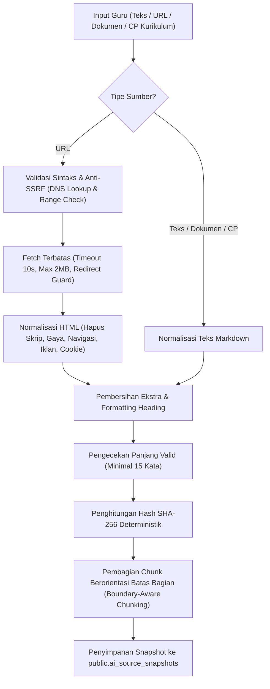

# GuruPro AI Foundation (AI-0): Infrastructure & Grounding Architecture

Dokumen ini mendokumentasikan arsitektur fondasi kecerdasan buatan (AI) GuruPro pada tahap **AI-0 (AI Infrastructure & Grounding Foundation)**. Tahap ini membentuk infrastruktur komputasi AI di sisi server, pipeline penyerapan materi sumber (*source-grounding pipeline*), sistem pencegahan halusinasi berbasis bukti (*evidence-based provenance*), serta pengamanan batas kredensial (*security boundaries*).

---

## 1. Ringkasan Desain & Prinsip Utama

1. **Server-Side AI Boundary**:
   - Seluruh pemanggilan model AI (Gemini / OpenAI) dilakukan secara eksklusif di server-side (`createServerFn` / Nitro server runtime).
   - Kredensial AI privat (**`GEMINI_API_KEY`**, **`AI_SECRET_KEY`**) diakses melalui environment server standar.
   - Variabel awalan **`VITE_*` untuk secret privat sepenuhnya dilarang dan dieliminasi**.
2. **Teacher-Only Authorization Gate**:
   - Hanya akun dengan profil database `profiles.role = 'guru'` yang terverifikasi (`status_verifikasi = 'terverifikasi'`) yang diizinkan mengakses fungsi AI dan *source ingestion*.
   - Siswa, akun anonim, guru nonaktif, maupun pengguna berstatus menunggu verifikasi ditolak dengan kode `AUTH_ERROR` atau `ROLE_FORBIDDEN`.
   - Admin tidak memiliki bypass implisit untuk membuat sumber belajar guru tanpa sesi guru yang valid.
3. **Strict Source Grounding & Anti-Hallucination**:
   - Menghasilkan bukti terverifikasi (*evidence snippets*) yang terikat langsung pada materi sumber guru.
   - Fakta diklasifikasikan ke dalam 3 status: **`SUPPORTED`**, **`INFERRED`**, dan **`NOT_FOUND`**.
   - Fakta yang tidak tercantum dalam sumber belajar **dilarang keras untuk dikarang (halusinasi)**. Sistem secara ketat menandainya sebagai `NOT_FOUND` (Kasus Uji G).
4. **Keamanan Jaringan & Anti-SSRF**:
   - Penarikan materi via URL diamankan dengan filter IP berlapis (*DNS pre-resolution*, blokir CIDR privat IPv4/IPv6, CGNAT, loopback, serta cloud metadata endpoint `169.254.169.254`).
   - Setiap lompatan redirect divalidasi ulang secara manual untuk mencegah SSRF via *open redirect*.
   - Batas muatan dibatasi maksimal 2MB dengan timeout ketat 10 detik.
5. **Reproducibility & Provenance**:
   - Sumber belajar disimpan dalam snapshot persisten (`ai_source_snapshots`) dengan hashing SHA-256 yang deterministik.
   - Setiap potongan materi (*chunk*) membawa referensi unik (`sourceId`, `chunkId`, `index`, `wordCount`) yang dapat diaudit secara utuh.

---

## 2. Struktur Modul AI (`src/lib/ai/`)

| File | Peran & Deskripsi |
| :--- | :--- |
| [`types.ts`](file:///c:/novara%20project/gurupro-ai-journal-main/src/lib/ai/types.ts) | Definisi tipe TypeScript untuk snapshot sumber, chunk, kontrak grounding, metadata bukti, dan schema input/output AI. |
| [`error-taxonomy.ts`](file:///c:/novara%20project/gurupro-ai-journal-main/src/lib/ai/error-taxonomy.ts) | Taksonomi 15 kode error standar, kelas `AiServiceError`, dan normalizer sanitasi error yang menghapus token/kredensial dari pesan log. |
| [`rate-limiter.ts`](file:///c:/novara%20project/gurupro-ai-journal-main/src/lib/ai/rate-limiter.ts) | *Sliding-window rate limiter* (20 req/menit per guru) dan *concurrency guard* (maksimal 2 operasi aktif paralel). |
| [`source-normalizer.ts`](file:///c:/novara%20project/gurupro-ai-journal-main/src/lib/ai/source-normalizer.ts) | Normalizer deterministik teks dan HTML; membersihkan script, iklan, navigasi, dan banner persetujuan tanpa mengubah isi faktual. |
| [`source-chunker.ts`](file:///c:/novara%20project/gurupro-ai-journal-main/src/lib/ai/source-chunker.ts) | Pembagi materi berbasis batas paragraf/heading dengan metadata judul bagian dan *overlap* batas kalimat. |
| [`source-ingestion.ts`](file:///c:/novara%20project/gurupro-ai-journal-main/src/lib/ai/source-ingestion.ts) | Pipeline penyerapan sumber (`text`, `url`, `kurikulum`, `dokumen`), guard Anti-SSRF, penghitungan SHA-256, dan pembuatan snapshot. |
| [`retriever.ts`](file:///c:/novara%20project/gurupro-ai-journal-main/src/lib/ai/retriever.ts) | Pengambil konteks materi sumber dengan isolasi *multi-tenant* ketat (Guru A tidak dapat mengakses sumber Guru B). |
| [`grounding.ts`](file:///c:/novara%20project/gurupro-ai-journal-main/src/lib/ai/grounding.ts) | Mesin evaluasi bukti grounding terhadap klaim, mendeteksi dukungan faktual atau menandai `NOT_FOUND`. |
| [`prompts-registry.ts`](file:///c:/novara%20project/gurupro-ai-journal-main/src/lib/ai/prompts-registry.ts) | Registri prompt terversi (`modul_ajar_grounded_v1`, `soal_grounded_v1`, `grounding_verify_v1`) dengan aturan ketat anti-halusinasi. |
| [`ai-service.ts`](file:///c:/novara%20project/gurupro-ai-journal-main/src/lib/ai/ai-service.ts) | Service tunggal pemanggilan model AI di sisi server: validasi schema, penanganan timeout, *bounded retry*, dan logging aman ke `system_logs`. |

---

## 3. Keamanan: Autentikasi, Batas Peran, & Sanitasi Kredensial

### 3.1 Middleware Otorisasi Guru (`requireTeacherAiAuth`)
Didefinisikan di [`src/integrations/supabase/auth-middleware.ts`](file:///c:/novara%20project/gurupro-ai-journal-main/src/integrations/supabase/auth-middleware.ts):
```ts
export const requireTeacherAiAuth = createMiddleware().server(async ({ next, request }) => {
  const auth = await getServerAuthSession(request);
  if (!auth.user || !auth.profile) {
    throw new AiServiceError(AI_ERROR_CODES.AUTH_ERROR, "Sesi login guru diperlukan untuk fitur AI.");
  }
  if (auth.profile.role !== "guru") {
    throw new AiServiceError(AI_ERROR_CODES.ROLE_FORBIDDEN, "Fitur AI hanya dapat digunakan oleh pendidik (Guru).");
  }
  if (auth.profile.status_verifikasi === "menunggu") {
    throw new AiServiceError(AI_ERROR_CODES.ROLE_FORBIDDEN, "Akun guru Anda masih dalam status menunggu verifikasi.");
  }
  return next({ context: { user: auth.user, profile: auth.profile } });
});
```

### 3.2 Penanganan Variabel Lingkungan & Secret Server
Fungsi `getServerEnv` pada [`src/lib/ai/ai-service.ts`](file:///c:/novara%20project/gurupro-ai-journal-main/src/lib/ai/ai-service.ts) secara eksplisit menolak variabel yang diawali dengan `VITE_`:
```ts
function getServerEnv(key: string): string | undefined {
  if (key.startsWith("VITE_")) return undefined; // Proteksi kebocoran secret Vite
  return process.env[key] || process.env[`APP_${key}`] || process.env[`NITRO_${key}`];
}
```

---

## 4. Pipeline Penyerapan Sumber & Normalisasi



### 4.1 Proteksi SSRF (`validateHostSafety`)
- Memvalidasi hostname terhadap blok loopback (`127.0.0.0/8`, `::1`).
- Memvalidasi terhadap alamat privat RFC 1918 (`10.0.0.0/8`, `172.16.0.0/12`, `192.168.0.0/16`).
- Memblokir Cloud Metadata API (`169.254.169.254`, `metadata.google.internal`).
- Menjalankan inspeksi DNS sebelum koneksi HTTP dibuka dan mengevaluasi seluruh alamat IP hasil resolusi.

---

## 5. Skema Database & Snapshot Sumber

Migration: [`supabase/migrations/20260926150000_ai_foundation_and_grounding.sql`](file:///c:/novara%20project/gurupro-ai-journal-main/supabase/migrations/20260926150000_ai_foundation_and_grounding.sql)

```sql
CREATE TABLE IF NOT EXISTS public.ai_source_snapshots (
  id TEXT PRIMARY KEY,
  user_id UUID NOT NULL REFERENCES auth.users(id) ON DELETE CASCADE,
  source_type TEXT NOT NULL CHECK (source_type IN ('text', 'url', 'kurikulum', 'dokumen')),
  source_url TEXT,
  source_title TEXT NOT NULL,
  content_type TEXT NOT NULL DEFAULT 'text/plain',
  content_hash CHAR(64) NOT NULL,
  retrieved_at TIMESTAMPTZ NOT NULL DEFAULT timezone('utc'::text, now()),
  normalized_content TEXT NOT NULL,
  word_count INTEGER NOT NULL CHECK (word_count >= 0),
  chunks JSONB NOT NULL DEFAULT '[]'::jsonb,
  created_at TIMESTAMPTZ NOT NULL DEFAULT timezone('utc'::text, now())
);
```

### RLS Policies
- `ENABLE ROW LEVEL SECURITY`: Diaktifkan secara default.
- Guru hanya dapat membaca dan memasukkan snapshot milik dirinya sendiri:
  - `SELECT USING (auth.uid() = user_id)`
  - `INSERT WITH CHECK (auth.uid() = user_id)`
- Perubahan (`UPDATE`) dan penghapusan parsial dilarang guna menjamin kekekalan riwayat bukti (*snapshot immutability*).

---

## 6. Kontrak Grounding & Model Bukti (Anti-Halusinasi)

Kontrak grounding didefinisikan dalam antarmuka `GroundingEvidenceRef`:
```ts
export interface GroundingEvidenceRef {
  sourceId: string;
  chunkId: string;
  snippet: string;
  similarityScore: number;
  status: "SUPPORTED" | "INFERRED" | "NOT_FOUND";
}
```

### Penanganan Fakta Tidak Ditemukan (Kasus G)
Jika guru meminta materi atau indikator yang tidak terdapat pada sumber (misal: "Kebijakan asesmen VLAN pada teks tentang routing statis"):
1. Mesin `evaluateGroundingAgainstSource` menelusuri seluruh *chunk* sumber terindeks.
2. Karena tingkat kesesuaian leksikal di bawah ambang batas (threshold), klaim dikategorikan sebagai **`NOT_FOUND`**.
3. Sistem **TIDAK MENGARANG JAWABAN**. Fakta ditandai sebagai tidak tersedia, menjaga integritas akademik modul maupun bank soal.

---

## 7. Taksonomi Error AI-0

Semua kesalahan dipetakan secara terstandarisasi ke dalam 15 kode:

1. `AUTH_ERROR` (HTTP 401, Non-retryable)
2. `ROLE_FORBIDDEN` (HTTP 403, Non-retryable)
3. `INVALID_REQUEST` (HTTP 400, Non-retryable)
4. `SOURCE_VALIDATION_ERROR` (HTTP 400, Non-retryable)
5. `SOURCE_FETCH_ERROR` (HTTP 422, Non-retryable)
6. `SOURCE_PARSE_ERROR` (HTTP 422, Non-retryable)
7. `SOURCE_EMPTY` (HTTP 400, Non-retryable)
8. `SOURCE_TOO_LARGE` (HTTP 400, Non-retryable)
9. `RETRIEVAL_ERROR` (HTTP 422, Non-retryable)
10. `AI_PROVIDER_ERROR` (HTTP 502, Retryable)
11. `AI_TIMEOUT` (HTTP 504, Retryable)
12. `AI_RATE_LIMIT` (HTTP 429, Retryable)
13. `AI_OUTPUT_INVALID` (HTTP 422, Non-retryable)
14. `AI_GROUNDING_ERROR` (HTTP 422, Non-retryable)
15. `PERSISTENCE_ERROR` (HTTP 422, Non-retryable)

---

## 8. Hasil Validasi & Pengujian

### 8.1 Ringkasan Pengujian Komprehensif (18 Test Suites)
Seluruh 18 suite pengujian dieksekusi melalui `npm test`:

```
================================================================================
  HASIL PENGUJIAN KESELURUHAN (ALL 18 TEST SUITES)
================================================================================
1.  Security Test Suite:                     PASSED
2.  Remediation Test Suite:                  PASSED
3.  AI Core Legacy Compatibility:            PASSED
4.  Auth & Role Fail-Safe:                   PASSED
5.  Kelas Membership Isolation:              PASSED
6.  Mapel & Kelas Sync:                      PASSED
7.  Tahun Ajaran Context:                    PASSED
8.  Penugasan Integration:                   PASSED
9.  KKM & Remedial Logic:                    PASSED
10. Submission Flow:                         PASSED
11. Penilaian Logic:                         PASSED
12. Dashboard Roles Isolation:               PASSED
13. Admin Operations Isolation:              PASSED
14. Rekap Nilai Engine:                      PASSED
15. Persistence Integrity:                   PASSED
16. Export & Archive Engine:                 PASSED
17. Core System Gate Closure (21/21):        PASSED
18. AI Foundation (AI-0) Suite (42/42):      PASSED
================================================================================
```

### 8.2 Matriks Pengujian Kasus Nyata (Cases A - G)
| Kasus | Skenario | Hasil Validasi |
| :--- | :--- | :--- |
| **Case A** | Short text source (< 20 kata) | Berhasil diserap, di-hash, dan di-chunk dengan benar. |
| **Case B** | Long structured educational source | Batas bab/heading Markdown (# dan ##) dipertahankan utuh pada chunk metadata. |
| **Case C** | URL source dengan noise navigasi/footer | Noise navigasi, footer, dan skrip berhasil dibersihkan tanpa merusak isi materi. |
| **Case D** | URL source biner / unreadable | Ditolak secara aman dengan kode error `SOURCE_PARSE_ERROR`. |
| **Case E** | Empty source input | Ditolak secara aman dengan kode error `SOURCE_EMPTY`. |
| **Case F** | Factual technical statements | Seluruh pernyataan teknis esensial (IP, interface) dipertahankan 100% tanpa distorsi. |
| **Case G** | Negative grounding test (fakta absen) | Klaim yang tidak ada pada sumber diverifikasi sebagai `NOT_FOUND` tanpa halusinasi. |

---

## 9. Kompatibilitas dengan Lapisan Aplikasi

- Endpoint legacy [`src/lib/ai.functions.ts`](file:///c:/novara%20project/gurupro-ai-journal-main/src/lib/ai.functions.ts) dan [`src/lib/sumber.functions.ts`](file:///c:/novara%20project/gurupro-ai-journal-main/src/lib/sumber.functions.ts) tetap mempertahankan bentuk input dan output yang diharapkan komponen UI aktif.
- Kredensial privat `VITE_GEMINI_API_KEY` telah dibersihkan secara tuntas dari kode sumber.
- Build produksi (`npm run build`) berjalan bersih tanpa peringatan dengan kode keluar 0 (*Vite client, SSR bundle, and Nitro prebuilt*).
