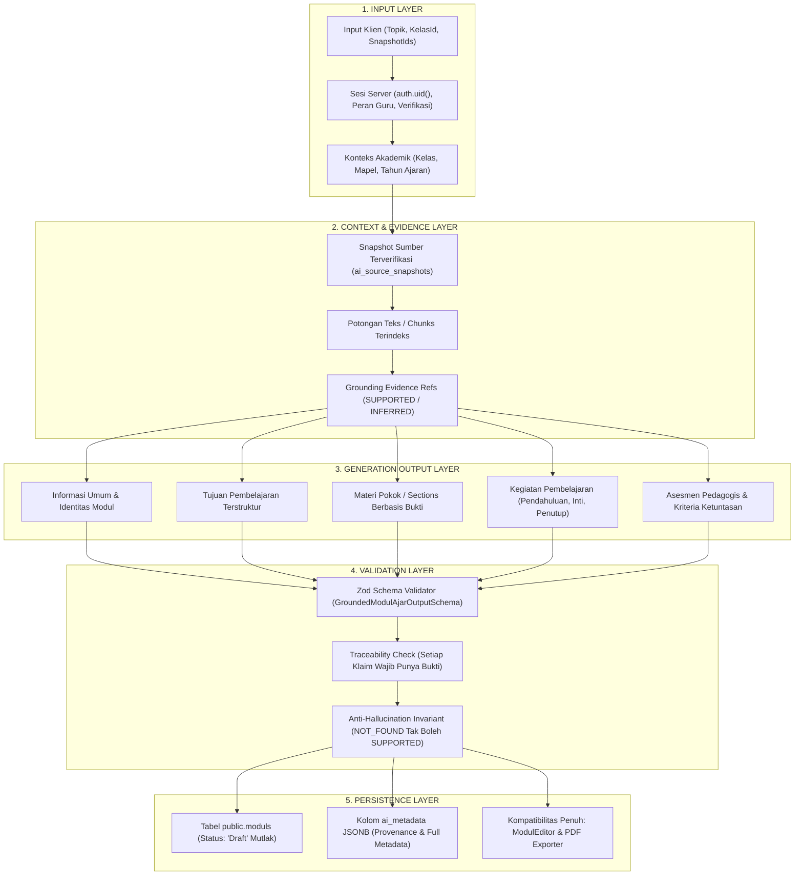

# GuruPro — AI-2A: Modul Ajar Generation Contract & Output Schema

Dokumen ini mendokumentasikan spesifikasi kontrak data, skema keluaran, aturan grounding, dan pemetaan persistensi kanonikal untuk modul ajar berbasis AI (**AI-2A: Modul Ajar Generation Contract & Output Schema**) pada aplikasi GuruPro.

Kontrak ini menjadi fondasi tunggal bagi tahap-tahap selanjutnya:
- **AI-2B**: *Grounded Context Builder*
- **AI-2C**: *Real AI Generation*
- **AI-2D**: *Grounding & Quality Validation*
- **AI-2E**: *UI + Draft Persistence + E2E*

---

## 1. Arsitektur Kontrak Domain

Kontrak Modul Ajar AI secara tegas memisahkan 5 lapisan kekhawatiran (*concerns*):



---

## 2. Kontrak Masukan Pembuatan Modul (`ModulGenerationInput`)

### A. Skema Validasi Masukan
```ts
export const ModulGenerationInputSchema = z.object({
  sourceSnapshotIds: z.array(z.string().min(1)).min(1, "Minimal satu snapshot materi sumber wajib dipilih."),
  kelasId: z.string().uuid("ID Kelas harus berformat UUID yang valid."),
  topik: z.string().trim().min(3).max(150),
  mapel: z.string().trim().min(2).optional(),
  targetFase: z.enum(["A", "B", "C", "D", "E", "F"]).default("E"),
  alokasiWaktu: z.string().trim().min(3).default("2 x 45 menit"),
  generationOptions: z.object({
    includeActivities: z.boolean().default(true),
    includeAssessmentRubric: z.boolean().default(true),
    additionalTeacherPrompt: z.string().max(500).optional(),
  }).optional().default({}),
});
```

### B. Aturan Otorisasi & Batas Keamanan Server
1. **Identitas Guru**: Nilai `userId`, `teacherId`, atau `ownerId` dari payload klien ditolak keras dengan `INVALID_REQUEST`. Identitas pengguna mutlak dibaca dari sesi server `auth.uid()`.
2. **Pemeriksaan Peran Guru**: Hanya akun dengan `role = 'guru'` dan `status_verifikasi = 'terverifikasi'` yang dapat menjalankan kontrak pembuatan modul. Akun `siswa` atau guru berstatus `menunggu` ditolak dengan `ROLE_FORBIDDEN`.
3. **Integritas Konteks Kelas**: `kelasId` harus terdaftar sebagai kelas yang diampu langsung oleh guru peminta (`k.guruId === context.teacherId`). Guru tidak dapat membuat modul untuk kelas milik guru lain.
4. **Kepemilikan Snapshot Sumber**: Semua `sourceSnapshotIds` yang diminta wajib milik guru yang bersangkutan (`snap.userId === context.teacherId`). Akses lintas guru diblokir dengan `ROLE_FORBIDDEN`.

---

## 3. Skema Keluaran Kanonikal (`GroundedModulAjarOutput`)

Skema keluaran didefinisikan menggunakan **Zod** (`GroundedModulAjarOutputSchema`, versi `1.0.0`):

```ts
export const GroundedModulAjarOutputSchema = z.object({
  schemaVersion: z.literal("1.0.0").default("1.0.0"),
  judul: z.string().trim().min(3),
  mapel: z.string().trim().min(2),
  kelas: z.string().trim().min(2),
  fase: z.enum(["A", "B", "C", "D", "E", "F"]),
  alokasiWaktu: z.string().trim().min(3),
  ringkasan: z.string().trim().min(20),
  tujuanPembelajaran: z.array(GroundedObjectiveSchema).min(1),
  sections: z.array(GroundedSectionSchema).min(1),
  kegiatanPembelajaran: LearningActivitiesSchema,
  asesmen: PedagogicalAssessmentSchema,
  catatanKeterbatasan: z.string().trim().optional(),
  evidenceRefs: z.array(GroundingEvidenceRefSchema).default([]),
});
```

### Struktur Tiap Komponen:
1. **Tujuan Pembelajaran (`tujuanPembelajaran`)**:
   - `id`: string unik (misal: `"TP-01"`)
   - `deskripsi`: butir capaian pembelajaran terukur
   - `evidenceIds`: array ID chunk rujukan
   - `status`: `"SUPPORTED"` | `"INFERRED"` | `"NOT_FOUND"`
2. **Materi Pokok (`sections`)**:
   - `id`: string unik
   - `judul`: judul bab materi
   - `poin`: daftar poin pemahaman utama
   - `isi`: penjelasan konseptual/prosedural lengkap (min 30 karakter)
   - `evidenceIds`: array ID chunk rujukan
   - `status`: `"SUPPORTED"` | `"INFERRED"` | `"NOT_FOUND"`
   - `keyTerms`?: istilah teknis materi
3. **Kegiatan Pembelajaran (`kegiatanPembelajaran`)**:
   - `pendahuluan`: `{ alokasiMenit, aktivitas[], evidenceIds[] }`
   - `inti`: `{ alokasiMenit, aktivitas[], evidenceIds[] }`
   - `penutup`: `{ alokasiMenit, aktivitas[], evidenceIds[] }`
4. **Asesmen Pedagogis (`asesmen`)**:
   - `kriteria`: kriteria ketuntasan tujuan pembelajaran (KKTP)
   - `teknik`: teknik penilaian (misal: Tes Formatif, Unjuk Kerja)
   - `instrumen`: instrumen penilaian (misal: Rubrik Praktik, Lembar Observasi)
   *(Catatan: Bagian ini tidak membuat bank soal ataupun beririsan dengan Generator Soal)*
5. **Bukti Sumber (`evidenceRefs`)**:
   - `sourceId`: UUID snapshot materi sumber
   - `chunkId`?: ID unik potongan materi
   - `snippet`: kutipan faktual sumber
   - `status`: status grounding bukti

---

## 4. Invarian Grounding & Anti-Halusinasi

1. **Keterlacakan Bukti**: Setiap ID yang tertera pada `evidenceIds` (pada tujuan maupun bab materi) wajib terdaftar di dalam array `evidenceRefs`. Referensi bukti palsu/dangling ditolak seketika dengan kode `GROUNDING_FAILED`.
2. **Larangan Promosi Status Palsu**: Jika rujukan bukti memiliki status `NOT_FOUND`, bagian/tujuan tersebut **DILARANG KERAS** mengklaim status `SUPPORTED`. Upaya klaim sepihak ini memicu error validasi `GROUNDING_FAILED`.
3. **Eksplisit INFERRED**: Penataan pedagogis atau elaborasi kontekstual yang merupakan simpulan logis guru wajib dilabeli sebagai `INFERRED`, bukan `SUPPORTED`.

---

## 5. Pemetaan Persistensi Basis Data (`public.moduls`)

Modul hasil pembuatan AI dipetakan secara alami ke entitas `public.moduls` yang sudah ada:

| Kolom Database | Sumber Data AI-2A | Keterangan & Jaminan |
| :--- | :--- | :--- |
| `id` | `gen_random_uuid()` | Otomatis dibuat saat insert |
| `user_id` | `auth.uid()` | Terikat ke guru pembuat |
| `judul` | `output.judul` | Judul materi modul |
| `kelas` | `output.kelas` | Label kelas (misal: "X TKJ 1") |
| `kelas_id` | `context.targetClass.id` | Foreign Key ke `public.kelas(id)` |
| `mapel` | `output.mapel` | Nama mata pelajaran |
| `status` | `'Draft'` | **Mutlak berstatus Draft** saat di-generate |
| `ringkasan` | Ringkasan + Capaian | Teks terformat untuk pratinjau |
| `sections` | `output.sections` | Array `ModulSection` kompatibel editor & PDF |
| `slides` | `[]` | Diinisialisasi kosong (bukan tugas AI-2A) |
| `sumber_tipe` | Pilihan guru | `CP / ATP` / `eBook / Dokumen` / dsb. |
| `sumber_judul`| Judul snapshot sumber | Nama dokumen rujukan |
| `is_archived` | `false` | Default aktif |
| **`ai_metadata`**| **JSONB metadata AI** | **Menyimpan rincian tujuan, kegiatan, asesmen, promptVersion, dan bukti sumber** |

### Struktur `ai_metadata` (Kolom Baru):
```json
{
  "promptVersion": "modul_ajar_grounded_v1",
  "sourceSnapshotIds": ["uuid-snapshot-1"],
  "schemaVersion": "1.0.0",
  "generatedAt": "2026-09-26T17:50:00.000Z",
  "validationStatus": "valid",
  "evidenceRefs": [...],
  "tujuanPembelajaran": [...],
  "kegiatanPembelajaran": {...},
  "asesmen": {...},
  "catatanKeterbatasan": "..."
}
```

---

## 6. Kompatibilitas Sistem yang Ada

1. **Modul Editor (`src/components/modul-editor.tsx`)**: Dapat langsung memuat modul hasil AI karena struktur `sections` memenuhi tipe `ModulSection[]`.
2. **PDF Exporter (`src/lib/exporters.ts` `exportModulAjarPdf`)**: Berjalan 100% mulus mengekspor dokumen PDF tanpa modifikasi karena field `judul`, `mapel`, `kelas`, `ringkasan`, dan `sections` tersedia sesuai kontrak.
3. **Modul Manual Lama**: Tetap berfungsi tanpa terpengaruh karena kolom `ai_metadata` bernilai `NULL` secara default untuk modul non-AI.
4. **Visibilitas Siswa**: Siswa hanya dapat melihat modul dengan status `Terbit`. Karena modul AI selalu disimpan sebagai `Draft`, modul tidak akan bocor ke siswa sebelum guru meninjau dan menerbitkannya.

---

## 7. Status Pengujian Kontrak (16/16 Checks Lulus)

Suite pengujian khusus [`tests/ai/modul-generation-contract.test.mjs`](file:///c:/novara%20project/gurupro-ai-journal-main/tests/ai/modul-generation-contract.test.mjs) memverifikasi:
- [x] Input valid diterima dan konteks akademik terselesaikan dengan tepat
- [x] Akses kelas yang tidak dimiliki guru ditolak (`ROLE_FORBIDDEN`)
- [x] Percobaan manipulasi `userId` klien diblokir (`INVALID_REQUEST`)
- [x] Peran selain guru (`siswa`) diblokir (`ROLE_FORBIDDEN`)
- [x] Snapshot sumber yang tidak ada ditolak (`RETRIEVAL_ERROR`)
- [x] Snapshot sumber milik guru lain ditolak (`ROLE_FORBIDDEN`)
- [x] Output kanonikal valid lolos skema Zod `1.0.0`
- [x] Field wajib yang hilang ditolak (`PROVIDER_MALFORMED_OUTPUT`)
- [x] Tipe data salah (fase tidak valid) ditolak (`PROVIDER_MALFORMED_OUTPUT`)
- [x] Konten kosong ditolak (`PROVIDER_MALFORMED_OUTPUT`)
- [x] Referensi bukti fiktif/dangling ditolak (`GROUNDING_FAILED`)
- [x] Promosi bukti `NOT_FOUND` menjadi `SUPPORTED` digagalkan (`GROUNDING_FAILED`)
- [x] Versi prompt `modul_ajar_grounded_v1` terdokumentasi di prompt registry
- [x] Status draft mutlak dipertahankan pada pemetaan persistensi
- [x] Modul AI kompatibel penuh dan sukses diekspor oleh `exportModulAjarPdf`
- [x] Parser respons AI aman terhadap blok kode markdown (` ```json `) dan teks non-JSON
