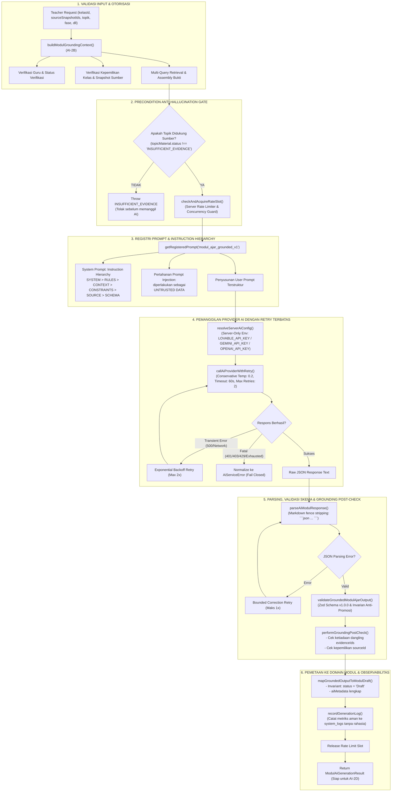

# GuruPro — AI-2C: Real AI Modul Ajar Generation Engine Specification

Dokumen ini mendokumentasikan spesifikasi teknis, arsitektur pipeline, mekanisme pertahanan injeksi, penanganan provider eksternal, validasi skema, dan integritas grounding untuk **AI-2C: Real AI Modul Ajar Generation Engine** pada sistem GuruPro.

Tahap ini merupakan tahap pertama di mana sistem GuruPro memanggil model AI produksi (Lovable Gateway / Gemini / OpenAI) secara terkontrol dan aman untuk menghasilkan draf Modul Ajar Kurikulum Merdeka yang berakar (*grounded*) 100% pada materi sumber guru.

> [!IMPORTANT]
> **Invarian Siklus Hidup Draf (Strict Draft Invariant)**:
> Modul Ajar yang dihasilkan oleh mesin AI-2C **MUTLAK** berstatus `status: 'Draft'`. Sistem **TIDAK PERNAH** mempublikasikan modul secara otomatis tanpa tinjauan dan persetujuan langsung dari guru.
> 
> **Invarian Fail-Closed Tanpa Teks Buatan Palsu**:
> Jika penyedia AI mengalami kegagalan, timeout, atau kuota habis, sistem **TIDAK PERNAH** membuat teks edukasi buatan palsu (*fake fallback educational text*). Sistem gagal secara terkontrol (*fail closed*) dengan taksonomi kesalahan standar (`AiServiceError`).

---

## 1. Arsitektur Pipeline AI-2C



---

## 2. Hierarki Instruksi & Pertahanan Prompt Injection

Template prompt kanonikal `modul_ajar_grounded_v1` pada `src/lib/ai/prompts-registry.ts` menerapkan hierarki instruksi yang ketat dan tidak dapat ditimpa:

$$\text{SYSTEM} > \text{RULES} > \text{CONTEXT} > \text{CONSTRAINTS} > \text{SOURCE DATA} > \text{SCHEMA}$$

### Prinsip Pertahanan Utama:
1. **Perlakuan Teks Sumber Sebagai Data Tidak Tepercaya (*Untrusted Data*)**: Seluruh dokumen atau teks dari materi guru dimasukkan ke dalam penanda delimitasi XML `<SOURCE_CHUNK evidenceId="..." sourceId="...">`. Model diinstruksikan secara eksplisit untuk mengabaikan segala perintah sistem, manipulasi format, atau upaya pengalihan instruksi (*prompt injection*) yang terkandung di dalam materi sumber.
2. **Kepatuhan Angka & Terminologi Teknis Eksak**: Nilai numerik (seperti "administrative distance = 1", "3.000.000", "2.5 hingga 3.0 bar") serta istilah teknis SMK wajib dipertahankan secara akurat dari sumber rujukan. Model dilarang membulatkan, mengarang, atau mengganti nilai.
3. **Pengikatan Bukti (*Evidence Binding*)**: Setiap capaian tujuan pembelajaran, bab materi pokok, dan aktivitas pembelajaran wajib mencantumkan `evidenceIds` yang terdaftar pada konteks rujukan.
4. **Transparansi Keterbatasan**: Jika terdapat perbedaan data antar-sumber atau rincian asesmen tidak dimuat di dalam sumber materi, model diwajibkan menuliskan catatan faktual pada kolom `catatanKeterbatasan`.

---

## 3. Resolusi Kredensial AI & Pemanggilan Model

Kredensial AI dilindungi secara ketat di sisi server melalui `resolveServerAiConfig()`:
- **Prioritas Resolusi**:
  1. `LOVABLE_API_KEY`: Gateway `https://ai.gateway.lovable.dev/v1/chat/completions`, model `google/gemini-2.5-flash`
  2. `GEMINI_API_KEY`: Endpoint Google AI Studio `https://generativelanguage.googleapis.com/v1beta/openai/chat/completions`, model `gemini-2.0-flash`
  3. `OPENAI_API_KEY`: Endpoint OpenAI `https://api.openai.com/v1/chat/completions`, model `gpt-4o-mini`
- **Keamanan Kunci Privat**: Variabel dengan awalan `VITE_*` ditolak secara mutlak pada pembacaan kredensial server AI untuk mencegah kebocoran kunci ke *bundle* peramban klien.
- **Parameter Generasi Konservatif**:
  - `temperature: 0.2`: Memastikan determinisme, stabilitas faktual, dan meminimalkan halusinasi kreatif pada konten akademik.
  - `max_tokens: 3500`: Memberikan anggaran token yang memadai untuk draf modul ajar lengkap.
  - `response_format: { type: "json_object" }`: Memaksa model mengembalikan JSON murni.

---

## 4. Mekanisme Retry & Penanganan Galat

Pipeline menerapkan kebijakan penanganan kesalahan yang tangguh (*resilient*):
1. **Transient HTTP / Jaringan (HTTP 500, 502, 503, 504, Fetch Failure)**:
   - Diberikan kuota retry otomatis hingga 2 kali (`MAX_TRANSIENT_RETRIES = 2`) dengan *jittered exponential backoff* (400ms - 2500ms).
2. **Rate Limit Eksternal (HTTP 429)**:
   - Dinormalisasi ke `AI_ERROR_CODES.AI_RATE_LIMIT` tanpa perulangan tanpa henti (*unbounded spinning*).
3. **Autentikasi Provider (HTTP 401 / 403)**:
   - Dinormalisasi ke `AI_ERROR_CODES.AUTH_ERROR` dan langsung gagal tanpa retry.
4. **JSON Malformed / Truncated**:
   - Jika model mengembalikan teks yang gagal di-parse oleh `parseAiModulResponse()`, sistem menjalankan 1 kali *correction retry* dengan pesan koreksi spesifik sebelum membatalkan permintaan.

---

## 5. Pemeriksaan Integritas Grounding Pasca-Generasi

Sebelum draf modul disimpan atau dikembalikan, fungsi `performGroundingPostCheck()` menjalankan verifikasi kepemilikan dan keterikatan bukti:
1. **Verifikasi Bukti (*Evidence Provenance*)**:
   - Setiap `evidenceId` pada `tujuanPembelajaran`, `sections`, dan `kegiatanPembelajaran` wajib cocok dengan himpunan `evidenceId` atau `chunkId` yang dihasilkan oleh AI-2B. Bukti rekaan (*dangling/fabricated evidence*) langsung memicu `AiServiceError(GROUNDING_FAILED)`.
2. **Invarian Anti-Promosi**:
   - Entitas atau bukti dengan status `NOT_FOUND` dilarang keras dipromosikan menjadi status `SUPPORTED`. Pelanggaran langsung menggagalkan generasi.
3. **Verifikasi Kepemilikan Materi Sumber**:
   - Setiap entri `evidenceRefs[].sourceId` wajib terdaftar dalam daftar snapshot materi yang dipilih dan dimiliki oleh guru peminta.

---

## 6. Integrasi Server Function

Fungsi server diekspos melalui TanStack Start Server Function pada `src/lib/ai.functions.ts`:

```typescript
export const generateModulAjarServerFn = createServerFn({ method: "POST" })
  .middleware([requireTeacherAiAuth])
  .validator((input: unknown) => input)
  .handler(async ({ context, data }): Promise<ModulAiGenerationResult> => {
    // 1. Muat kelas guru terverifikasi dari basis data
    // 2. Susun TeacherAcademicContext
    // 3. Eksekusi generateGroundedModulAjar
    return generateGroundedModulAjar(data, teacherContext);
  });
```

Middleware `requireTeacherAiAuth` menjamin:
- Pengguna memiliki sesi Supabase Auth yang valid.
- Pengguna memiliki profil guru terverifikasi (`status_verifikasi === 'terverifikasi'`).
- Peran siswa atau guru yang masih dalam peninjauan ditolak pada batas terluar server.

---

## 7. Rangkuman Verifikasi Uji Otomatis

Seluruh kemampuan AI-2C telah diuji melalui suite pengujian komprehensif `tests/ai/modul-ai-generation.test.mjs` (31 dari 31 cek lulus 100%):

| No | Kategori Pengujian | Jumlah Cek | Hasil |
|---|---|---|---|
| 1 | Pipeline Generasi & Status Draf | 4 | LULUS |
| 2 | Kepatuhan Registri Prompt & Hierarki | 3 | LULUS |
| 3 | Pengikatan Bukti & Validasi Dangling Reference | 3 | LULUS |
| 4 | Gerbang Anti-Halusinasi (Precondition Gate) | 2 | LULUS |
| 5 | Batas Otorisasi & Kepemilikan Guru | 5 | LULUS |
| 6 | Rate Limiter, Retry Transient & Error Handling | 7 | LULUS |
| 7 | Pengujian Fixture Edukatif Realistis (TXT, DOCX, PDF) | 3 | LULUS |
| 8 | Deteksi Konflik Multi-Sumber | 1 | LULUS |
| 9 | Invarian Keamanan Fail-Closed Tanpa Teks Palsu | 2 | LULUS |
| **Total** | **Cek Pengujian AI-2C** | **31** | **100% LULUS** |

---

## 8. Status Kesiapan Tahap Berikutnya

Dengan tuntasnya implementasi AI-2C, arsitektur pondasi AI GuruPro kini siap untuk memasuki tahap:

**`AI-2C COMPLETE — READY FOR AI OUTPUT GROUNDING & QUALITY VALIDATION`** (Tahap AI-2D).
