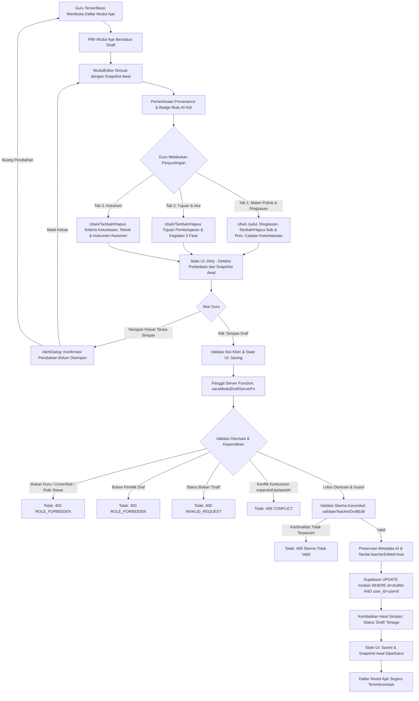

# Dokumentasi Alur Peninjauan & Penyempurnaan Draf Modul Ajar oleh Guru (AI-3B)

## 1. Ringkasan Eksekutif

Tahap **AI-3B: Modul Ajar Draft Refinement & Teacher Review Flow** mewujudkan alur peninjauan guru yang aman, terverifikasi, dan terstruktur atas draf Modul Ajar Kurikulum Merdeka yang sebelumnya disusun oleh mesin kecerdasan buatan tergrounding (AI-2C/AI-2D/AI-3A).

Guru tidak sekadar menerima teks statis tanpa kendali; guru memegang otoritas pedagogis penuh untuk memeriksa, menambah, mengubah, merapikan, atau menghapus komponen modul ajar secara granular sebelum draf disimpan. Seluruh proses menjaga rekam jejak asal (*provenance*), integritas skema kanonikal, batasan kardinalitas minimal, dan invarian draf yang ketat.

---

## 2. Arsitektur Alur Kerja End-to-End

---

## 3. Komponen Inti Sistem

### 3.1 Kontrak Kanonikal & Validasi Skema (`src/lib/ai/modul-contract.ts`)
- **Metadata Preservasi AI**: `ModulAiMetadata` diperluas dengan field:
  - `teacherEdited?: boolean`
  - `editedAt?: string`
  - `lastEditedBy?: string`
  - `originalQualityValidation?: ModulQualityValidationSummary`
- **Skema Validasi Draf Guru (`TeacherDraftEditSchema`)**:
  - Judul modul minimal 3 karakter.
  - Ringkasan materi string terdefinisi.
  - Capaian/Tujuan Pembelajaran: minimal 1 tujuan pembelajaran ($\ge 1$).
  - Bab materi pokok (`sections`): minimal 1 bab materi pokok ($\ge 1$), tiap bab memiliki judul dan minimal 1 poin isi ($\ge 1$).
  - Kegiatan Pembelajaran 3 Fase: minimal 1 kegiatan pendahuluan, inti, dan penutup dengan alokasi waktu integer positif.
  - Asesmen Pembelajaran: minimal 1 kriteria ketuntasan tujuan pembelajaran ($\ge 1$).

### 3.2 Fungsi Server Aman (`src/lib/ai.functions.ts` - `saveModulDraftServerFn`)
- **Otorisasi Ketat**: Memanfaatkan `requireTeacherAiAuth` untuk memastikan pengguna adalah guru aktif dan terverifikasi.
- **Pengecekan Kepemilikan (*Tenant & Ownership Isolation*)**: Memastikan `existing.user_id === authResult.user.id`. Guru lain dilarang keras mengubah draf milik kolega.
- **Proteksi Konkurensi (*Stale Data Protection*)**: Membandingkan `data.expectedUpdatedAt` dengan `existing.updated_at`. Jika draf telah diperbarui di sesi lain lebih baru dari snapshot editor, permintaan ditolak demi mencegah *data overwrite*.
- **Invarian Draf Ketat**: Draf modul yang diedit dipastikan tetap berstatus `'Draft'`. Server mengesampingkan status apapun yang dikirim klien menjadi `'Draft'`.
- **Anti-Fake-Validation**: Rekam jejak validasi asli (`originalQualityValidation`) dipertahankan tanpa klaim palsu bahwa AI telah memvalidasi ulang materi hasil edit guru secara otomatis.

### 3.3 Antarmuka Editor Terstruktur (`src/components/modul-editor.tsx`)
- **Multi-Tab Ergonomis Berdasarkan Komponen Pedagogis**:
  1. *Materi Pokok & Ringkasan*: Judul modul, deskripsi ringkas, manajemen bab materi pokok (tambah/hapus bab, tambah/hapus poin materi), dan catatan keterbatasan.
  2. *Tujuan & Alur Pembelajaran*: Pengelolaan tujuan pembelajaran Kurikulum Merdeka (tambah/hapus butir tujuan) serta alur kegiatan 3 fase (Pendahuluan, Inti, Penutup) dengan pengatur durasi menit.
  3. *Asesmen Pembelajaran*: Pengelolaan kriteria ketuntasan tujuan pembelajaran (KKTP), teknik asesmen, dan instrumen asesmen.
  4. *Ilustrasi AI & PPT Otomatis*: Tab generator lanjutan tetap dipertahankan utuh dan tidak terganggu.
- **Kartu Provenance & Rekam Jejak Mutu**:
  Menampilkan identitas materi rujukan asal, status AI-generated, status hasil evaluasi gerbang mutu AI asli (PASS/REVISE), status peninjauan guru, serta waktu simpan terakhir.
- **Mesin Status Perubahan (*Dirty State Machine*)**:
  - `clean`: Konten editor identik dengan snapshot yang tersimpan di server.
  - `dirty`: Terdeteksi perubahan yang belum disimpan; tombol "Simpan Draf" aktif dan muncul badge indikator peringatan kuning.
  - `saving`: Proses pengiriman data ke server sedang berlangsung; tombol dinonaktifkan untuk mencegah klik ganda.
  - `saved`: Draf berhasil disimpan ke basis data; muncul badge hijau konfirmasi.
  - `error`: Terjadi kegagalan jaringan atau validasi; pesan kesalahan spesifik disajikan kepada guru.
- **Dialog Konfirmasi Navigasi Keluar**:
  Saat guru mencoba kembali ke daftar modul ketika status masih `dirty`, sistem memunculkan `AlertDialog` untuk meminta konfirmasi apakah ingin tetap berada di editor atau membuang perubahan yang belum disimpan.

---

## 4. Invarian-Invarian Kunci Sistem

| No | Nama Invarian | Ketentuan Sistem |
| :---: | :--- | :--- |
| 1 | **Strict Draft Invariant** | Modul ajar yang disimpan melalui alur penyuntingan guru **selalu dan mutlak** disimpan dengan `status: 'Draft'`. Sistem tidak pernah mengubahnya menjadi `'Terbit'` tanpa aksi publikasi formal. |
| 2 | **Provenance Integrity** | Saat guru menyimpan draf yang telah diubah, metadata mencatat `teacherEdited: true`, `editedAt: ISO string`, dan `lastEditedBy: userId`. Hasil validasi mutu AI awal (`originalQualityValidation`) tetap disimpan di dalam metadata sebagai rekam jejak sejarah tanpa diubah secara sewenang-wenang. |
| 3 | **Anti-Fake-Validation** | Sistem dilarang memalsukan klaim bahwa draf yang telah diedit oleh guru telah divalidasi ulang secara otomatis oleh AI jika tidak ada proses evaluasi gerbang mutu ulang yang nyata. |
| 4 | **Minimum Cardinality Guard** | Guru dilarang menghapus komponen hingga kosong total. Sistem mewajibkan minimal 1 tujuan pembelajaran, minimal 1 bab materi pokok dengan minimal 1 poin isi, minimal 1 kegiatan tiap fase, dan minimal 1 kriteria asesmen. |
| 5 | **Ownership & Concurrency Safety** | Guru hanya dapat menyunting draf modul miliknya sendiri. Penyuntingan terhadap modul milik akun lain atau penyuntingan dengan timestamp usang (*stale concurrency*) langsung ditolak oleh server. |

---

## 5. Ringkasan Pengujian & Verifikasi

Suite pengujian khusus `tests/ai/modul-teacher-review.test.mjs` mengevaluasi 14 skenario ketat:
1. **Schema Validation**: Validasi edit draf guru mematuhi kontrak kanonikal.
2. **Schema Guard - Judul**: Penolakan judul kurang dari 3 karakter.
3. **Schema Guard - Kardinalitas Bab**: Penolakan jika bab materi kosong (`sections: []`).
4. **Schema Guard - Kardinalitas Poin Bab**: Penolakan bab tanpa poin isi.
5. **Save Draft**: Guru terverifikasi berhasil menyimpan perubahan terstruktur.
6. **Persistence & Reload**: Muat ulang dari basis data mencerminkan persis data hasil penyuntingan guru.
7. **Strict Draft Invariant**: Status draf tetap `'Draft'` dan tidak pernah menjadi `'Terbit'`.
8. **Provenance Preservation**: Metadata AI dan ringkasan validasi mutu asli tetap terpelihara, `teacherEdited: true` tercatat.
9. **Authorization - Non-Owner**: Guru lain yang mencoba mengedit draf ditolak dengan status 403.
10. **Authorization - Unverified Guru**: Guru belum terverifikasi ditolak dengan status 403.
11. **Authorization - Siswa**: Akun bersiswa ditolak dengan status 403.
12. **Authorization - Unauthenticated**: Pengguna tanpa sesi otentikasi ditolak.
13. **Concurrency Protection**: Penolakan penyimpanan jika timestamp basis data lebih baru daripada snapshot draf guru.
14. **Status Invariant Guard**: Penolakan jika modul sasaran bukan bertipe `'Draft'`.

Seluruh 14 pengujian lulus 100% tanpa kegagalan, dan seluruh 26 rangkaian uji GuruPro lulus tanpa ada regresi.
