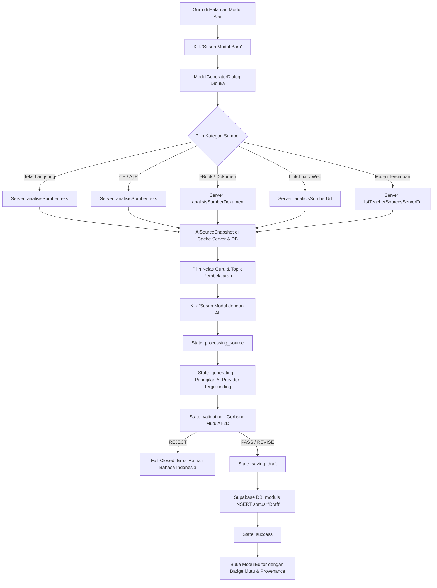

# Dokumentasi Alur Integrasi UI & Mesin Penyusun Modul Ajar AI (AI-3A)

## 1. Ringkasan Eksekutif

Tahap **AI-3A** menghubungkan antarmuka pengguna (UI) GuruPro Modul Ajar dengan pipa backend kecerdasan buatan terverifikasi yang telah dibangun pada tahap AI-0, AI-1, AI-2A, AI-2B, AI-2C, dan AI-2D.

Integrasi ini memastikan bahwa guru yang terautentikasi dapat menyusun draf Modul Ajar Kurikulum Merdeka secara faktual dari berbagai format sumber rujukan asli guru, divalidasi mutunya oleh gerbang semantik deterministik, dan disimpan ke basis data Supabase sebagai draf yang siap ditinjau guru sebelum dipublikasikan kepada siswa.

---

## 2. Arsitektur Alur Kerja End-to-End

---

## 3. Mesin Status UI (UI State Machine)

Penyusunan modul diatur oleh status eksplisit (`GenerationStage`) untuk menjaga transparansi proses kepada guru dan mencegah klik ganda (*double-submission*):

| Status UI | Deskripsi | Perilaku Tombol & Indikator |
| :--- | :--- | :--- |
| `idle` | Formulir siap diisi guru | Tombol aktif, form input interaktif |
| `processing_source` | Server menyerap teks, dokumen, atau link luar ke `AiSourceSnapshot` | Tombol dinonaktifkan (`disabled`), spinner aktif |
| `generating` | Pemanggilan server function AI tergrounding dan terikat bukti sumber | Tombol dinonaktifkan, indikator proses generasi |
| `validating` | Evaluasi gerbang mutu deterministik AI-2D (cakupan klaim & anti-halusinasi) | Tombol dinonaktifkan, indikator validasi mutu |
| `saving_draft` | Penyimpanan draf ke tabel `moduls` Supabase | Tombol dinonaktifkan, indikator penyimpanan |
| `success` | Draf berhasil disimpan, dialog tertutup otomatis, editor dibuka | Notifikasi sukses Sonner, modul dimuat di editor |
| `error` | Terjadi kegagalan validasi atau jaringan | Pesan error ramah guru ditampilkan di dalam dialog |

---

## 4. Kategori Sumber Rujukan yang Didukung

1. **Teks / Catatan Guru**:
   - Guru menempelkan catatan, ringkasan, atau materi ajar langsung (minimal 50 karakter).
   - Diserap melalui fungsi server `analisisSumberTeks`.
2. **CP / ATP (Capaian & Alur Tujuan Pembelajaran)**:
   - Guru menempelkan teks capaian atau alur tujuan Kurikulum Merdeka.
   - Diserap melalui fungsi server `analisisSumberTeks`.
3. **eBook / Dokumen**:
   - Guru mengunggah file materi pelajaran (format PDF, Word, DOCX, TXT, HTML).
   - Diserap melalui fungsi server `analisisSumberDokumen`.
4. **Link Luar / Artikel Edukasi**:
   - Guru memasukkan URL rujukan pembelajaran publik.
   - Diproses dengan proteksi SSRF (blokir IP privat/link-local) melalui `analisisSumberUrl`.
5. **Materi Tersimpan**:
   - Guru dapat memilih materi sumber yang sebelumnya telah diserap oleh akun guru tersebut tanpa perlu mengunggah ulang.
   - Dimuat secara terisolasi melalui fungsi server `listTeacherSourcesServerFn`.

---

## 5. Invarian Ketat Sistem

### Invarian 1: Strict Draft Invariant (Tidak Pernah Publikasi Otomatis)
- Modul yang dihasilkan AI **selalu dan mutlak** disimpan dengan `status: 'Draft'`.
- Modul AI tidak pernah langsung berstatus `'Terbit'` tanpa peninjauan eksplisit dan aksi publikasi manual oleh guru.
- Menjamin tanggung jawab pedagogis penuh tetap berada di tangan pendidik.

### Invarian 2: Fail-Closed & Anti-Halusinasi
- Jika sumber rujukan tidak mencukupi, topik tidak didukung bukti rujukan, atau gerbang mutu menghasilkan keputusan `REJECT`, sistem **gagal tertutup (*fail-closed*)**.
- Sistem **dilarang keras** memalsukan atau mengarang materi ajar fallback fiktif saat AI gagal atau tidak memiliki rujukan.
- Kesalahan dilaporkan secara jelas dalam Bahasa Indonesia agar guru dapat melengkapi materi sumbernya.

### Invarian 3: Resolusi Fase Kurikulum Merdeka Otomatis
- Dialog memilihkan fase Kurikulum Merdeka target secara deterministik berdasarkan tingkat kelas guru:
  - Kelas **X (10)**: Fase **E**
  - Kelas **XI (11)** dan **XII (12)**: Fase **F**
  - Kelas **VII, VIII, IX (SMP)**: Fase **D**

---

## 6. Integrasi Gerbang Mutu AI-2D pada Antarmuka

Setiap modul yang disusun oleh AI menyimpan rekam jejak validasi mutu di dalam kolom `ai_metadata`:

- **Badge pada Daftar Modul (`/modul-ajar`)**:
  - Badge `AI Grounded`: Menandakan modul dihasilkan dari bukti sumber terverifikasi.
  - Badge `Mutu: PASS`: Menandakan seluruh klaim didukung bukti sumber dengan cakupan tinggi.
  - Badge `Mutu: REVISE`: Menandakan ada butir materi yang disarankan untuk ditinjau guru.
- **Kartu Informasi Grounding pada Editor (`ModulEditor`)**:
  - Menampilkan persentase cakupan bukti rujukan (*Evidence Coverage Ratio*).
  - Menampilkan catatan keterbatasan rujukan (*catatanKeterbatasan*) jika ada topik yang kurang dibahas dalam sumber.
  - Menampilkan peringatan tinjauan jika modul berstatus `REVISE`.

---

## 7. Kamus Terjemahan Kode Kesalahan AI ke Bahasa Indonesia

| Kode Kesalahan Teknis | Pesan Ramah Guru di Antarmuka |
| :--- | :--- |
| `AUTH_REQUIRED` | Sesi login Anda berakhir. Silakan masuk kembali. |
| `ROLE_FORBIDDEN` | Akses ditolak: Anda tidak memiliki akses ke kelas atau materi ini. |
| `INVALID_REQUEST` | Data permintaan modul ajar tidak lengkap atau tidak valid. |
| `SOURCE_UNAVAILABLE` | Materi sumber tidak ditemukan atau belum diserap server. |
| `INSUFFICIENT_EVIDENCE` | Materi sumber terlalu minim atau tidak relevan dengan topik yang dipilih. |
| `UNSUPPORTED_TOPIC` | Topik yang diminta tidak didukung oleh isi materi sumber yang diberikan. |
| `AI_RATE_LIMIT` | Batas permintaan AI tercapai. Mohon tunggu beberapa saat sebelum mencoba lagi. |
| `AI_QUOTA_EXCEEDED` | Kuota pembuatan modul AI harian Anda telah habis. |
| `AI_PROVIDER_ERROR` | Layanan AI sedang mengalami gangguan sementara. Silakan coba lagi. |
| `PROVIDER_TIMEOUT` | Waktu tunggu pembuatan modul AI habis. Silakan coba materi yang lebih ringkas. |
| `PROVIDER_MALFORMED_OUTPUT` | Format keluaran AI tidak sesuai spesifikasi. Silakan coba lagi. |
| `GROUNDING_FAILED` | Modul AI gagal divalidasi dengan sumber rujukan (anti-halusinasi). |
| `QUALITY_REJECTED` | Modul AI tidak memenuhi standar mutu Kurikulum Merdeka atau terlalu banyak kontradiksi. |
| `PERSISTENCE_ERROR` | Draf modul berhasil disusun tetapi gagal disimpan ke basis data. |

---

## 8. Verifikasi Pengujian

Kestabilan dan kepatuhan sistem dibuktikan melalui test suite dedicated `tests/ai/modul-ui-flow.test.mjs` yang mencakup 14 skenario uji kritis, serta seluruh 25 test suite regresi aplikasi yang lulus 100%.
