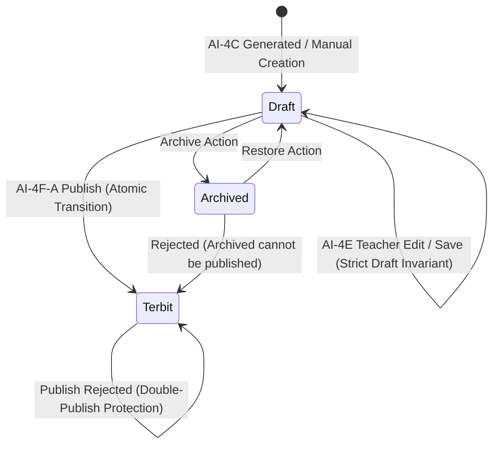

# GuruPro AI-4F-A: Question Bank Publish Foundation

## 1. Overview & Purpose
GuruPro **AI-4F-A** establishes the authoritative server-side foundation and state transition contract for publishing a reviewed question package into the school-wide Question Bank:

$$\text{AI-4C Gen} \longrightarrow \text{AI-4D Quality} \longrightarrow \text{AI-4E Teacher Review \& Edit} \longrightarrow \mathbf{AI\text{-}4F\text{-}A\text{ Publish Foundation}} \longrightarrow \mathbf{Status:\text{ 'Terbit'}}$$

This stage formalizes the transition:
$$\mathbf{Draft\ Question\ Package} \longrightarrow \mathbf{Published\ Question\ Bank\ Package}$$

It enforces strict server-side invariants, teacher ownership, multi-tenant isolation, AI-4D quality non-rejection, evidence grounding integrity, anti-stale concurrency guards, student-safe data segregation, and audit metadata persistence.

---

## 2. Question Package Lifecycle & State Model

### 2.1 State Transitions


- **`Draft`**: The working state where teachers can review and edit questions (AI-4E). Paket soal in this state is completely invisible to students.
- **`Terbit`**: The authoritative published state in the Question Bank. Only packages in this state can be assigned to classes or visible to eligible students.
- **`Archived`**: State where `is_archived: true`. Cannot be published unless restored first.

---

## 3. Canonical Publish Eligibility Rules

A question package may be published **ONLY** when all server-side invariants are satisfied simultaneously via `validateQuestionPackagePublishEligibility(pkg, options)`:

### 3.1 Ownership & Teacher Verification
- The calling user must be authenticated.
- User role must be `guru` in `profiles.role`.
- Teacher verification status must be `terverifikasi` in `profiles.status_verifikasi` (rejects `menunggu`, `ditolak`, `nonaktif`).
- Package ownership check: `existing.user_id === userId`. Non-owners receive `ROLE_FORBIDDEN`.

### 3.2 Package State & Double-Publish Protection
- Package status must strictly be `"Draft"`.
- If package is already `"Terbit"`, publication is rejected with `AI_ERROR_CODES.INVALID_REQUEST` ("Paket soal ini sudah berstatus Terbit.").
- If package status is anything other than `"Draft"`, publication is rejected.

### 3.3 Archive Integrity
- Archived packages cannot be published: if `is_archived === true`, rejects with `AI_ERROR_CODES.INVALID_REQUEST` ("Paket soal yang diarsipkan tidak dapat dipublikasikan.").

### 3.4 Minimum Cardinality
- Package must contain at least 1 valid question (`soal.length >= 1`). Empty packages fail with `AI_ERROR_CODES.QUESTION_SCHEMA_INVALID`.

### 3.5 AI-4D Quality Invariant
- **Non-Rejection Invariant**: A package with an AI-4D `REJECT` decision cannot be published:
  - If `qualityResult?.decision === "REJECT"` or `originalQualityValidation?.decision === "REJECT"`, publication fails closed with `AI_ERROR_CODES.QUESTION_QUALITY_VALIDATION_FAILED`.
  - The server **never fabricates** a new validation result to bypass rejection.
  - The server **never silently converts** `REJECT` into `PASS`.
- **Approved / Curated States**: Packages with `PASS`, or `REVISE` curated by the teacher during AI-4E, are eligible provided all structural and grounding rules pass.

### 3.6 Structural Question Integrity (Canonical Zod Schemas)
- **Multiple Choice Questions**:
  - Teks pertanyaan minimal 5 karakter.
  - Tepat 4 opsi (A, B, C, D), tidak boleh kosong.
  - Opsi wajib unik (tidak ada duplikasi teks, case-insensitive).
  - Kunci jawaban wajib huruf `"A" | "B" | "C" | "D"`.
  - Kunci jawaban wajib menunjuk indeks opsi yang valid (0..3).
  - Penjelasan rasional valid jika disertakan.
- **Essay Questions**:
  - Teks pertanyaan minimal 5 karakter.
  - Opsi wajib array kosong `[]` (invarian esai).
  - Rubrik jawaban ideal (`kunci`) minimal 10 karakter.
  - Penjelasan dan pedoman penskoran valid jika disertakan.

### 3.7 Evidence & Grounding Integrity
- All `evidenceIds` referenced by questions must exist in `allowedEvidenceIds` from `evidenceRefs`.
- Dangling evidence references fail with `AI_ERROR_CODES.QUESTION_GROUNDING_FAILED`.
- Cross-tenant evidence references are strictly rejected.
- Anti-promotion: items referencing `NOT_FOUND` evidence cannot be published as `SUPPORTED`.

---

## 4. Server-Side State Transition (`publishQuestionPackageServerFn`)

The publication transition is executed via an authoritative TanStack Start server function:
```typescript
export const publishQuestionPackageServerFn = createServerFn({ method: "POST" })
  .middleware([requireTeacherAiAuth])
  .validator((input: PublishQuestionPackageInput) => input)
  .handler(async ({ context, data }): Promise<PublishQuestionPackageResult> => { ... });
```

### Execution Pipeline:
1. **Re-Authentication & Middleware**: `requireTeacherAiAuth` verifies active session, `role = 'guru'`, and `status_verifikasi = 'terverifikasi'`.
2. **Authoritative DB Lookup**: Fetches fresh record from `public.paket_soal` by `data.paketId`.
3. **Ownership Verification**: Enforces `existing.user_id === userId`.
4. **Stale Concurrency Check**: Compares `data.expectedUpdatedAt` with `existing.updated_at`. If `dbTime > clientTime`, rejects with `INVALID_REQUEST`.
5. **Eligibility Execution**: Invokes `validateQuestionPackagePublishEligibility(existing)`.
6. **Provenance & Publication Metadata Attachment**:
   - Preserves `promptVersion`, `schemaVersion`, `sourceSnapshotIds`, `evidenceRefs`, `generatedAt`.
   - Preserves `originalQualityValidation` and `originalQualityFindings`.
   - Preserves `teacherEdited`, `editedAt`, `lastEditedBy`.
   - Attaches `publishedAt: new Date().toISOString()` and `publishedBy: userId`.
7. **Atomic State Mutation**: Updates `paket_soal` with `status: "Terbit"`, `ai_metadata: updatedAiMetadata`, `updated_at: nowIso`.
8. **Student-Safe Projection Return**: Generates and returns `studentSafeQuestions` via `toStudentSafeQuestion`.

---

## 5. Provenance Preservation

Publishing **never destructively rewrites or erases** existing AI or teacher provenance:
- Original AI generation parameters (`promptVersion`, `schemaVersion`, `generatedAt`, `sourceSnapshotIds`) are preserved.
- AI-4D quality assessment results (`originalQualityValidation`, `originalQualityFindings`) remain intact.
- AI-4E teacher editing flags (`teacherEdited: true`, `editedAt`, `lastEditedBy`) are preserved.
- Publication audit trail (`publishedAt`, `publishedBy`) is cleanly added to `ai_metadata` and mapped to `PaketSoal`.

---

## 6. Student Security & Answer-Key Segregation

Publishing a package into the Question Bank makes it eligible for future student assignment, but **never compromises answer key confidentiality**.

Projection using `toStudentSafeQuestion`:
```typescript
export function toStudentSafeQuestion(question: CanonicalQuestion | Soal): StudentSafeQuestion {
  return {
    id: String(question.id),
    pertanyaan: String(question.pertanyaan || ""),
    jenis: question.jenis === "Esai" ? "Esai" : "Pilihan Ganda",
    opsi: Array.isArray(question.opsi) ? [...question.opsi] : [],
  };
}
```
- **Strictly Omitted from Student View**:
  - `kunci` (Multiple choice correct letter or essay rubric)
  - `penjelasan` (Teacher rationales and answer analysis)
  - `pedoman_penskoran` (Scoring criteria)
  - `evidenceIds` / `ai_metadata` (Source chunks and grounding metadata)
  - `teacherEdited` / `publishedBy` (Internal teacher audit flags)

---

## 7. Concurrency & Stale Data Protection

To prevent lost updates or publishing over concurrent modifications:
- Client supplies `expectedUpdatedAt`.
- Server checks:
  ```typescript
  const dbTime = new Date(existing.updated_at).getTime();
  const clientTime = new Date(data.expectedUpdatedAt).getTime();
  if (dbTime > clientTime) {
    throw new AiServiceError(
      AI_ERROR_CODES.INVALID_REQUEST,
      "Draf paket soal telah diperbarui oleh sesi lain. Muat ulang halaman untuk meninjau versi terbaru sebelum mempublikasikan."
    );
  }
  ```

---

## 8. Database & Row Level Security (RLS) Policies

GuruPro enforces security at both the database layer and server function layer:
- `guru_select_own_paket_soal`: Gurus can only read their own packages.
- `guru_update_own_paket_soal`: Gurus can only modify their own packages.
- `siswa_select_assigned_paket_soal`: Students can only read packages that have `status = 'Terbit'` AND are assigned to their enrolled classes via `public.penugasan`.
- `publishQuestionPackageServerFn`: Server-side endpoint requiring verified teacher authentication.

---

## 9. Verified Test Coverage (`tests/ai/question-bank-publishing.test.mjs`)

The dedicated AI-4F-A test suite verifies 23 distinct scenarios:
1. **Scenario 1 & 5**: Verified Guru publishes valid Draft package (PASS).
2. **Scenario 2**: Unauthenticated user cannot publish (`AUTH_ERROR`) (PASS).
3. **Scenario 3**: Student cannot publish (`ROLE_FORBIDDEN`) (PASS).
4. **Scenario 4**: Unverified Guru cannot publish (`ROLE_FORBIDDEN`) (PASS).
5. **Scenario 6**: Guru cannot publish another Guru's package (`ROLE_FORBIDDEN`) (PASS).
6. **Scenario 22**: Client-side identity spoofing rejected (PASS).
7. **Scenario 7**: Already-published package cannot be published again (PASS).
8. **Scenario 21**: Double-publish race condition rejected (PASS).
9. **Scenario 8**: Archived package cannot be published (PASS).
10. **Scenario 9**: Package with AI-4D REJECT status rejected (PASS).
11. **Scenario 10a**: MC with fewer than 4 options rejected (PASS).
12. **Scenario 10b**: MC with duplicate options rejected (PASS).
13. **Scenario 10c**: MC with empty option string rejected (PASS).
14. **Scenario 11a**: Essay with non-empty options array rejected (PASS).
15. **Scenario 11b**: Essay with rubric shorter than 10 chars rejected (PASS).
16. **Scenario 12**: MC with invalid answer key letter rejected (PASS).
17. **Scenario 13**: Dangling evidence reference rejected (PASS).
18. **Scenario 14**: Cross-tenant evidence reference rejected (PASS).
19. **Scenario 15 & 16**: AI-4D and AI-4E provenance remain strictly preserved (PASS).
20. **Scenario 17**: Publication metadata (`publishedAt`, `publishedBy`) persists correctly (PASS).
21. **Scenario 18**: StudentSafeQuestion projection strips answer keys, rubrics, and internal evidence (PASS).
22. **Scenario 19**: Concurrency protection rejects stale timestamp (PASS).
23. **Scenario 20**: Persistence & DB reload reflects 'Terbit' status and publication metadata (PASS).

All 34 test suites in the complete GuruPro test suite pass with 100% success rate.

---

## 10. Known Limitations & Next Steps (Handoff to AI-4F-B)

- **AI-4F-A Scope**: Server-side publishing foundation only.
- **AI-4F-B (Next Step)**: Teacher Question Bank UI redesign, interactive Publish buttons, confirmation modals, and filter tabs (Draft vs Terbit).
- **AI-4F-C**: Assignment integration (attaching published question packages to class assignments).
- **AI-4F-D**: End-to-end Question Bank to Assignment gate verification.
