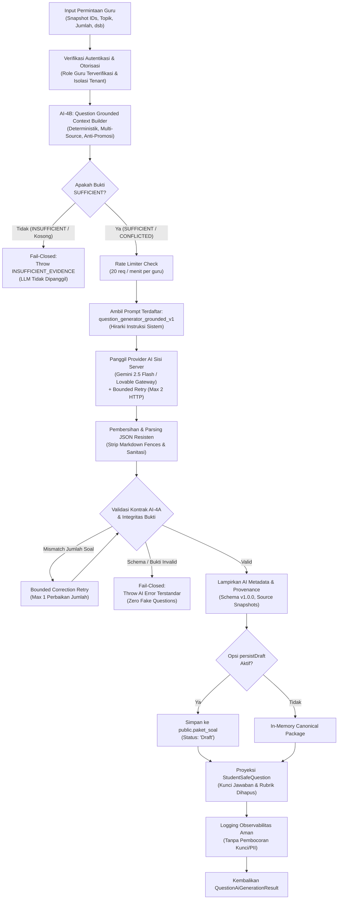

# GuruPro AI Foundation (AI-4C) — Real AI Question Generation Engine

## 1. Ringkasan Eksekutif & Tujuan AI-4C

Komponen **AI-4C: Real AI Question Generation Engine** adalah mesin generasi butir asesmen kurikulum merdeka berbasis kecerdasan buatan (*AI-powered assessment generation engine*) sisi server. Komponen ini dirancang dengan prinsip **grounding ketat (grounded-only)**, **anti-halusinasi**, **preservasi nilai eksak**, dan **pemisahan kunci jawaban (answer-key segregation)**.

Mesin ini mengonsumsi konteks terstruktur dari **AI-4B** (`GroundedQuestionContext`) dan menghasilkan paket butir soal kanonikal yang mematuhi kontrak **AI-4A** (`CanonicalQuestionPackage`).

### Prinsip Desain Kunci:
1. **Server-Side Execution Only**: Seluruh pemanggilan model AI (Gemini / Lovable Gateway) terjadi secara eksklusif di server melalui TanStack Start Server Function (`generateQuestionsServerFn`) yang dilindungi middleware `requireTeacherAiAuth`.
2. **Hard Dependency on AI-4B (Fail-Closed)**: Mesin memeriksa ketercukupan bukti (`hasUsableEvidence` & `evidenceSufficiency`). Jika bukti `INSUFFICIENT` atau tidak ditemukan, pipeline langsung membatalkan eksekusi dengan galat `INSUFFICIENT_EVIDENCE` tanpa memanggil LLM eksternal sama sekali.
3. **Pemisahan Kunci Jawaban (Answer-Key Segregation)**: Kunci jawaban, penjelasan pedagogis, dan pemetaan bukti internal hanya tersedia di server/akun guru. Untuk konsumsi siswa (misal ujian/penugasan), fungsi `toStudentSafeQuestion` melakukan proyeksi aman dengan membuang kunci, rubrik, dan bukti internal.
4. **Preservasi Nilai Eksak (Exact-Value Preservation)**: Parameter numerik, notasi teknis, subnetting IPv4/IPv6, port jaringan, sintaks CLI, rumus, dan unit besaran dijaga agar tidak dimodifikasi secara keliru oleh model.
5. **Kontrak Butir Soal Ketat (AI-4A Compliance)**:
   - **Pilihan Ganda**: Tepat 4 opsi unik (A-D) tanpa duplikasi, dan tepat 1 kunci jawaban valid yang menunjuk pada salah satu dari 4 opsi.
   - **Esai**: Opsi kosong `[]`, dengan rubrik penskoran minimal 10 karakter.
6. **Invarian Draft Status**: Paket soal yang disimpan otomatis ke tabel `public.paket_soal` selalu berstatus `'Draft'`. Sistem tidak pernah mempublikasikan soal secara otomatis ke siswa maupun bank soal tanpa peninjauan guru (AI-4E).
7. **Zero Fake Fallback Policy**: Jika pemanggilan model gagal atau format tidak valid setelah batas percobaan (*bounded retry*), sistem melempar galat terstandarisasi (`AiServiceError`) dan **tidak pernah mengembalikan soal tiruan/palsu**.

---

## 2. Diagram Alur Pipeline AI-4C



---

## 3. Hirarki Prompt & Registrasi Terpusat

Prompt didefinisikan secara deklaratif di [`src/lib/ai/prompts-registry.ts`](file:///c:/novara%20project/gurupro-ai-journal-main/src/lib/ai/prompts-registry.ts) dengan ID `question_generator_grounded_v1`:

### 3.1. Struktur Hirarki Instruksi
1. **SYSTEM (Prioritas Tertinggi)**: Peran ahli pedagogi dan pembuat soal profesional. Mengatur larangan halusinasi, kepatuhan kurikulum, dan larangan menyimpang dari bukti.
2. **RULES (Invarian Keras)**:
   - Larangan membuat fakta di luar `<GROUNDED_EVIDENCE_CONTEXT>`.
   - Larangan merujuk ID bukti yang tidak ada atau berstatus `NOT_FOUND`.
   - Kewajiban 4 opsi unik untuk Pilihan Ganda (A-D) dan 1 kunci yang tepat.
   - Kewajiban opsi kosong `[]` dan rubrik deskriptif untuk Esai.
   - Preservasi nilai eksak (IP, rumus, angka, istilah teknis).
   - Larangan membubuhkan teks di luar blok JSON murni.
3. **GROUNDED CONTEXT (Data Tak Tepercaya)**: Bukti teks dari AI-4B dibungkus dalam tag `<GROUNDED_EVIDENCE_CONTEXT>` dan setiap chunk dibatasi dengan `<SOURCE_CHUNK id="..." sourceId="...">`. Karakter berbahaya dan injeksi prompt disanitasi.
4. **QUESTION PARAMETERS**: Spesifikasi jumlah butir, jenis (Pilihan Ganda/Esai/Campuran), tingkat kesulitan (Mudah/Sedang/Sulit), dan instruksi pedagogis khusus dari guru.
5. **OUTPUT SCHEMA**: Format JSON murni yang merefleksikan skema `CanonicalQuestionPackage`.

---

## 4. Validasi Integritas Bukti & Anti-Promosi

Engine melakukan validasi referensial terhadap butir soal yang dihasilkan:
```typescript
function performEvidenceIntegrityCheck(
  pkg: CanonicalQuestionPackage,
  context: GroundedQuestionContext,
): void
```
- **Referential Integrity**: Setiap `evidenceId` pada soal harus ada dalam daftar `context.evidenceItems`. Jika LLM mengarang ID bukti yang tidak ada, galat `QUESTION_GROUNDING_FAILED` langsung dilempar.
- **Anti-Promotion Invariant**: Bukti berstatus `NOT_FOUND` tidak boleh diklaim sebagai `SUPPORTED`.
- **Status Grounding**: Paket soal mencatat `evidenceRefs` yang menghubungkan setiap snapshot sumber dengan status ketercakupan materi.

---

## 5. Pemisahan Kunci Jawaban (*Answer-Key Segregation*)

Untuk mencegah kebocoran kunci jawaban pada antarmuka siswa:
- **`CanonicalQuestion` (Internal / Guru)**:
  - Pilihan Ganda: Berisi properti `kunci: "A" | "B" | "C" | "D"`, `penjelasan`, `evidenceIds`, `status`.
  - Esai: Berisi properti `rubrik: string`, `penjelasan`, `evidenceIds`, `status`.
- **`StudentSafeQuestion` (Siswa / Ujian)**:
  - Menghapus sepenuhnya `kunci`, `rubrik`, `penjelasan`, `evidenceIds`, dan metadata internal.
  - Sesuai dengan format proyeksi RPC Supabase `get_penugasan_soal_for_siswa`.

---

## 6. Penanganan Galat & Kebijakan Retry

Engine mengimplementasikan kebijakan toleransi kesalahan berbatas (*bounded resilience*):
1. **Transient Network / HTTP 5xx Errors**: Maksimal 2x percobaan ulang otomatis dengan *exponential backoff* dan *jitter*.
2. **Malformed JSON Output**: Pembersihan markdown fences (````json ... ````), penghapusan karakter kontrol ilegal, pencarian blok JSON terluar (`{ ... }`), dan parsing aman.
3. **Question Count Mismatch**: Jika model menghasilkan jumlah butir soal yang berbeda dari target (misal minta 5 keluar 3), engine mencoba 1x koreksi terarah (*prompt repair*). Jika tetap tidak sesuai, operasi gagal dengan kode `QUESTION_COUNT_MISMATCH`.
4. **Fail-Closed Invariant**: Tidak ada soal buatan/dummy yang dikembalikan jika proses gagal. Sistem melempar `AiServiceError` dengan kode terstandarisasi.

---

## 7. Taksonomi Galat Asesmen

Galat yang didaftarkan di [`src/lib/ai/error-taxonomy.ts`](file:///c:/novara%20project/gurupro-ai-journal-main/src/lib/ai/error-taxonomy.ts):
- `QUESTION_GENERATION_FAILED` (422 Unprocessable Entity): Terjadi jika model gagal mematuhi format atau menghasilkan output yang tidak dapat diproses.
- `QUESTION_COUNT_MISMATCH` (422 Unprocessable Entity): Terjadi jika jumlah butir yang dihasilkan tidak sesuai dengan permintaan setelah upaya koreksi.
- `INSUFFICIENT_EVIDENCE` (422 Unprocessable Entity): Terjadi jika materi sumber tidak memadai untuk topik asesmen yang diminta.
- `QUESTION_GROUNDING_FAILED` (422 Unprocessable Entity): Terjadi jika butir soal merujuk bukti palsu atau tidak terdaftar.
- `QUESTION_SCHEMA_INVALID` (422 Unprocessable Entity): Terjadi jika skema JSON melanggar aturan kanonikal AI-4A (misal opsi duplikat, kunci di luar rentang A-D, esai memiliki opsi).

---

## 8. Verifikasi & Pengujian Otomatis

Suite pengujian komprehensif diimplementasikan di [`tests/ai/question-generation.test.mjs`](file:///c:/novara%20project/gurupro-ai-journal-main/tests/ai/question-generation.test.mjs) dengan **28 pengujian** yang mencakup 14 seksi:
- **Seksi A**: Batas Otorisasi & Isolasi Multi-Tenant (Guru terverifikasi, penolakan siswa, penolakan unverified, penolakan akses lintas tenant).
- **Seksi B**: Prakondisi Grounding AI-4B (Anti-Halusinasi fail-closed, konsumsi langsung `GroundedQuestionContext`).
- **Seksi C**: Invarian Pilihan Ganda (Tepat 4 opsi unik, penolakan opsi duplikat, penolakan kunci 'E').
- **Seksi D**: Invarian Esai (Opsi kosong `[]`, rubrik penskoran memadai, penolakan opsi terisi).
- **Seksi E**: Integritas Bukti & Anti-Promosi (Penolakan ID bukti palsu, penolakan klaim bukti `NOT_FOUND`).
- **Seksi F**: Structured Output & JSON Parsing (Pembersihan format markdown, penolakan JSON rusak).
- **Seksi G**: Penegakan Jumlah Soal (Kesesuaian jumlah butir, penolakan jumlah tidak cocok).
- **Seksi H**: Preservasi Nilai Eksak (IP subnets, gateway, sintaks CLI Mikrotik/Cisco tidak terdistorsi).
- **Seksi I**: Keamanan Kunci Jawaban (Penyimpanan kunci pada akun guru, pembersihan 100% pada proyeksi siswa).
- **Seksi J**: Provenance & AI Metadata (Versi skema v1.0.0, prompt version, ID snapshot sumber, timestamps).
- **Seksi K**: Draf Persistensi (Penyimpanan opsi draf, status eksklusif `'Draft'`).
- **Seksi L**: Kebijakan Retry (Penanganan error sementara dan fail-closed terarah).
- **Seksi M**: Invarian Fail-Closed (Zero fake fallback questions saat model gagal).
- **Seksi N**: Kompatibilitas Sistem (Konversi dua arah dengan model `Soal` lama, registrasi prompt, generasi multi-sumber Routing + VLAN).

### Hasil Pengujian Regresi:
- **Dedicated Test Suite**: 28 / 28 Tests Passed (100%).
- **Full Test Suite**: 31 / 31 Test Suites Passed (100%).
- **Production Build**: Nitro & Vite compilation berhasil dalam ~960ms.

---

## 9. Batasan Cakupan & Tahapan Selanjutnya

Sesuai spesifikasi proyek, implementasi **AI-4C** telah selesai secara penuh:
- ❌ **Tidak ada implementasi AI-4D** (Question Quality Validation / Scoring Rubric Validator).
- ❌ **Tidak ada implementasi AI-4E** (Teacher Question Review/Edit UI).
- ❌ **Tidak ada publikasi otomatis ke Bank Soal**.
- 🛑 **STRICT STOP SETELAH AI-4C**.
