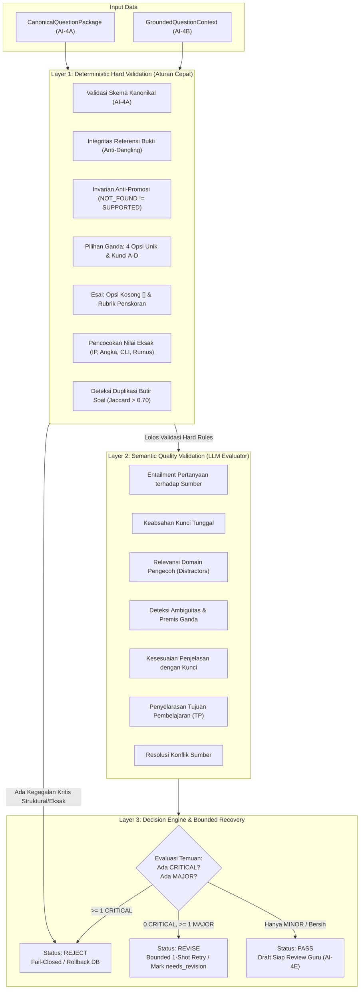

# GuruPro AI Foundation (AI-4D) — Question Quality Validation

## 1. Ringkasan Eksekutif & Tujuan AI-4D

Komponen **AI-4D: Question Quality Validation** adalah gerbang kendali mutu semantik (*semantic quality gate*) sisi server dalam pipeline generasi butir asesmen GuruPro. Komponen ini ditempatkan tepat setelah generasi butir soal **AI-4C** dan validasi struktural kanonikal **AI-4A**:

$$\text{AI-4B Grounded Context} \longrightarrow \text{AI-4C Generation} \longrightarrow \text{AI-4A Structural Validation} \longrightarrow \mathbf{AI\text{-}4D\text{ Semantic Quality Gate}} \longrightarrow \begin{cases} \mathbf{PASS} \\ \mathbf{REVISE} \\ \mathbf{REJECT} \end{cases}$$

Komponen ini dirancang untuk:
1. **Memastikan Ketepatan Kunci Jawaban (Answer-Key Correctness)**: Menjamin bahwa kunci jawaban yang ditunjuk didukung 100% oleh bukti materi sumber (`GroundedQuestionContext`), tidak ada kunci ganda, tidak ada ketiadaan kunci benar, dan penjelasan mendukung kunci yang sama.
2. **Menolak Halusinasi & Nilai Palsu (Anti-Hallucination & Exact-Value Matching)**: Memverifikasi angka teknis, port jaringan, subnet/IP, sintaks perintah CLI, dan istilah spesifikasi secara mekanikal terhadap teks chunk sumber yang dirujuk.
3. **Mendeteksi Ambiguitas & Soal Cacat (Ambiguity & Distractor Quality Gate)**: Menolak soal yang memiliki distractor yang sama-sama benar, pengecoh yang tidak relevan, atau pertanyaan yang terlalu ambigu tanpa konteks yang cukup.
4. **Keputusan Non-Numerik Terstruktur (Audit Findings & Decision Engine)**: Menggunakan taksonomi temuan kualitatif bertingkat (`CRITICAL`, `MAJOR`, `MINOR`) tanpa sistem skor angka sembarangan, menghasilkan status keputusan definitif: `PASS`, `REVISE`, atau `REJECT`.
5. **Fail-Closed & Invarian Penyimpanan (Persistence Safety)**: Paket berstatus `REJECT` tidak pernah disimpan ke database. Paket berstatus `REVISE` hanya disimpan jika ditandai `needs_revision`. Paket `PASS` disimpan sebagai draf (`Draft`) yang siap ditinjau oleh guru pada AI-4E.
6. **Pemisahan Kunci Jawaban (Answer-Key Segregation)**: Kunci jawaban, penjelasan, dan rubrik penskoran dilindungi di sisi server guru dan tidak pernah dibocorkan ke proyeksi siswa (`StudentSafeQuestion`).

---

## 2. Arsitektur Berlapis (Layered Quality Gate)

AI-4D mengadopsi pendekatan 3 lapis untuk efisiensi komputasi, keandalan deterministik, dan keamanan semantik:



### 2.1. Layer 1: Deterministic Hard Validation
- **Tanpa Biaya Token LLM**: Dijalankan secara lokal menggunakan algoritma deterministik.
- **Pencocokan Nilai Eksak (`validateExactValuesInQuestion`)**: Mengekstrak token kompleks (IP/CIDR, perintah CLI, spesifikasi teknis, angka signifikan) dari pertanyaan dan kunci jawaban, lalu memverifikasi keberadaannya di dalam teks chunk sumber yang dirujuk.
- **Deteksi Duplikasi (`detectDuplicateQuestions`)**: Menghitung koefisien kemiripan token Jaccard (setelah normalisasi dan *stopword removal*). Jika teks identik $\to$ `EXACT_DUPLICATE_QUESTION` (`CRITICAL`). Jika overlap $\ge 70\% \to$ `NEAR_DUPLICATE_QUESTION` (`MAJOR`).
- **Prinsip Fail-Closed Cepat**: Jika Layer 1 mendeteksi pelanggaran kritis (seperti nilai eksak palsu atau klaim anti-promosi), Layer 2 tidak akan dipanggil dan validator langsung mengembalikan `REJECT`.

### 2.2. Layer 2: Semantic Quality Validation
- **Model Evaluator Sisi Server**: Memanggil model penalaran dengan prompt terdaftar `question_quality_validator_v1`.
- **Isolasi Data Tak Tepercaya**: Teks bukti sumber dibungkus dalam tag `<GROUNDED_EVIDENCE_CONTEXT>` dan diperlakukan sebagai data tak tepercaya guna menangkal *prompt injection*.
- **Penanganan Ketidakpastian Konservatif (Conservative Uncertainty)**: Jika evaluator menghasilkan status `"UNCERTAIN"`, sistem memperlakukannya secara konservatif sebagai kegagalan validasi (`REJECT`) untuk melindungi mutu penilaian.

### 2.3. Layer 3: Decision Engine
- **Aturan Pemetaan Keputusan**:
  - Jika terdapat **$\ge 1$ temuan `CRITICAL`** $\implies$ Keputusan: **`REJECT`**.
  - Jika terdapat **$0$ `CRITICAL`** dan **$\ge 1$ temuan `MAJOR`** $\implies$ Keputusan: **`REVISE`**.
  - Jika hanya terdapat temuan `MINOR` atau tidak ada temuan sama sekali $\implies$ Keputusan: **`PASS`**.

---

## 3. Taksonomi Temuan Kualitas (Audit Findings Taxonomy)

Setiap butir soal yang diaudit menghasilkan daftar temuan `QuestionQualityFinding` dengan skema terstruktur:

| Kode Temuan (`code`) | Komponen | Tingkat Keparahan (`severity`) | Dampak Keputusan | Deskripsi Singkat |
| :--- | :--- | :--- | :--- | :--- |
| `EXACT_VALUE_MISMATCH` | `answer` / `factual` | **CRITICAL** | `REJECT` | Nilai IP, port, angka, atau sintaks perintah pada soal/kunci tidak ada dalam bukti sumber. |
| `ANSWER_KEY_UNSUPPORTED` | `answer` | **CRITICAL** | `REJECT` | Kunci jawaban yang ditunjuk bertentangan atau tidak didukung sama sekali oleh bukti sumber. |
| `MULTIPLE_CORRECT_OPTIONS` | `distractor` | **CRITICAL** | `REJECT` | Terdapat lebih dari satu opsi jawaban yang benar pada soal pilihan ganda berjawaban tunggal. |
| `NO_CORRECT_OPTION` | `answer` | **CRITICAL** | `REJECT` | Tidak ada satupun opsi jawaban yang benar berdasarkan materi sumber. |
| `EXPLANATION_CONTRADICTS_KEY` | `explanation` | **CRITICAL** | `REJECT` | Penjelasan yang diberikan justru mendukung opsi lain yang berbeda dari kunci jawaban. |
| `EXACT_DUPLICATE_QUESTION` | `duplicate` | **CRITICAL** | `REJECT` | Terdapat butir soal yang sama persis (duplikat) di dalam paket yang sama. |
| `ANTI_PROMOTION_VIOLATION` | `structural` | **CRITICAL** | `REJECT` | Butir soal mengklaim status `SUPPORTED` pada bukti yang berstatus `NOT_FOUND`. |
| `DANGLING_EVIDENCE_ID` | `structural` | **CRITICAL** | `REJECT` | ID bukti yang dirujuk tidak ditemukan dalam konteks atau milik tenant/guru lain. |
| `SEMANTIC_EVALUATION_UNCERTAIN` | `semantic` | **CRITICAL** | `REJECT` | Evaluator semantik tidak yakin akan ketepatan kunci jawaban; sistem gagal aman. |
| `NEAR_DUPLICATE_QUESTION` | `duplicate` | **MAJOR** | `REVISE` | Dua butir soal memiliki kemiripan redaksional sangat tinggi ($\ge 70\%$). |
| `OBJECTIVE_MISALIGNMENT` | `objective` | **MAJOR** | `REVISE` | Materi butir soal menyimpang dari Tujuan Pembelajaran (TP) yang ditargetkan. |
| `WEAK_DISTRACTOR` | `distractor` | **MAJOR** | `REVISE` | Opsi pengecoh tidak masuk akal atau keluar dari domain mata pelajaran. |
| `UNQUALIFIED_AMBIGUITY` | `ambiguity` | **MAJOR** | `REVISE` | Kalimat tanya ambigu dan multitafsir tanpa konteks yang memadai. |
| `UNRESOLVED_SOURCE_CONFLICT` | `conflict` | **MAJOR** | `REVISE` | Terdapat kontradiksi antar sumber yang dirujuk tanpa penjelasan resolusi. |
| `SUPERFICIAL_EXPLANATION` | `explanation` | **MINOR** | `PASS` / `REVISE` (strict) | Penjelasan terlalu singkat atau hanya mengulang pernyataan opsi. |
| `MINOR_FORMATTING_ISSUE` | `structural` | **MINOR** | `PASS` / `REVISE` (strict) | Kekurangan tanda baca minor yang tidak mempengaruhi makna soal. |

---

## 4. Mekanisme Percobaan Ulang Berbatas (*Bounded Correction Retry*)

Ketika validasi mutu menghasilkan status **`REVISE`** pada saat proses generasi:
1. Engine secara otomatis merangkai umpan balik perbaikan (*actionable revision prompt*) yang memuat daftar temuan `MAJOR`.
2. Model dipanggil kembali untuk **maksimal 1 kali percobaan perbaikan (1-shot retry)** dengan menyertakan instruksi koreksi spesifik.
3. Paket hasil revisi divalidasi ulang melalui 3 lapis validasi mutu.
4. Jika hasil perbaikan berstatus `PASS`, paket baru digunakan dan disimpan dengan status `valid`.
5. Jika hasil perbaikan tetap berstatus `REVISE`, paket disimpan dengan metadata `validationStatus: "needs_revision"`, sehingga guru dapat meninjaunya secara eksplisit di AI-4E.
6. Jika hasil perbaikan berstatus `REJECT`, seluruh paket dibatalkan (*fail-closed*) dan galat dilempar.

---

## 5. Invarian Penyimpanan & Keamanan Data

| Status Mutu | Perilaku Database (`public.paket_soal`) | `validationStatus` pada Metadata | Visibilitas Guru (AI-4E) |
| :--- | :--- | :--- | :--- |
| **`PASS`** | Disimpan sebagai draf (`status: 'Draft'`) | `"valid"` | Ditampilkan sebagai draf valid siap pakai. |
| **`REVISE`** | Disimpan sebagai draf (`status: 'Draft'`) | `"needs_revision"` | Ditampilkan dengan lencana peringatan butuh perbaikan. |
| **`REJECT`** | **TIDAK PERNAH DISIMPAN** (Rollback / Batal) | `"invalid"` | Tidak muncul di antarmuka guru; galat dilaporkan. |

### Pemisahan Kunci Jawaban (*Answer-Key Segregation*):
- Objek `QuestionPackageQualityResult` dan `CanonicalQuestionPackage` memuat data lengkap (kunci jawaban, penjelasan, rubrik) untuk peninjauan guru di server.
- Fungsi proyeksi `toStudentSafeQuestion` secara ketat membuang kunci, penjelasan, rubrik, dan ID bukti sebelum disajikan ke siswa, mencegah pembocoran kunci jawaban secara absolut.

---

## 6. Antarmuka Server Function TanStack Start

Fungsi server diekspor melalui [`src/lib/ai.functions.ts`](file:///c:/novara%20project/gurupro-ai-journal-main/src/lib/ai.functions.ts):

```typescript
export const validateQuestionQualityServerFn = createServerFn({ method: "POST" })
  .middleware([requireTeacherAiAuth])
  .validator((input: unknown) => input)
  .handler(async ({ context, data }): Promise<QuestionPackageQualityResult> => {
    // 1. Verifikasi peran guru terverifikasi
    // 2. Validasi format paket soal kanonikal dan konteks grounding
    // 3. Jalankan pipeline validasi mutu berlapis (Layer 1 -> Layer 2 -> Layer 3)
    // 4. Kembalikan hasil audit terstruktur
  });
```

---

## 7. Rangkuman Verifikasi Pengujian

Uji regresi penuh dijalankan melalui skrip pengujian khusus [`tests/ai/question-quality-validation.test.mjs`](file:///c:/novara%20project/gurupro-ai-journal-main/tests/ai/question-quality-validation.test.mjs):
- **Jumlah Pengujian**: **30 Uji Mutu** melingkupi 15 seksi (Seksi A hingga O).
- **Hasil Pengujian Dedicated**: **30 / 30 PASSED (100%)**.
- **Hasil Pengujian Regresi Keseluruhan**: **32 Test Suites PASSED (100%)** tanpa regresi pada modul autentikasi, isolasi tenant, Modul Ajar, AI-4A, AI-4B, maupun AI-4C.
- **Hasil Kompilasi Produksi**: `npm run build` berhasil diselesaikan dalam **927ms** tanpa galat TypeScript maupun bundler Vite/Nitro.

---

## 8. Kontrak Serah Terima ke AI-4E (Handoff Contract)

Modul **AI-4E: Teacher Question Review/Edit UI** akan mengonsumsi artefak ini:
1. Mengakses `qualityResult` dari `QuestionAiGenerationResult` untuk menampilkan daftar temuan audit mutu (`CRITICAL`, `MAJOR`, `MINOR`) per butir soal.
2. Menyajikan antarmuka editor butir soal dengan penyorotan kesalahan (*issue highlighting*) berdasarkan `component` (`answer`, `factual`, `distractor`, `ambiguity`, `explanation`).
3. Mengizinkan guru mengubah pilihan opsi, membetulkan kunci jawaban, memperkaya rubrik esai, atau meregenerasi butir spesifik.
4. Menjaga paket tetap berstatus `'Draft'` sampai guru secara manual menekan tombol publikasi atau ekspor bank soal.
