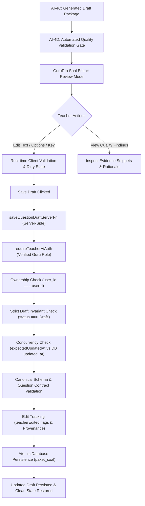

# GuruPro AI-4E: Teacher Question Review / Edit / Save

## 1. Overview & Purpose
GuruPro **AI-4E** bridges the gap between automated question quality validation (**AI-4D**) and final question bank publishing (**AI-4F**). It provides an authoritative, human-in-the-loop review interface for teachers to inspect, edit, and safely persist AI-generated question packages while enforcing strict data integrity, structural validation, and multi-tenant security boundaries.

### End-to-End Workflow Flow:


---

## 2. Existing UI Reuse (`src/routes/soal.tsx`)
Rather than creating duplicate routing or redundant pages, AI-4E extends the existing review mode (`mode === "review"`) in `src/routes/soal.tsx`:
- **Direct Integration**: The review drawer/view in `src/routes/soal.tsx` connects to `saveQuestionDraftServerFn` using TanStack Start's `useServerFn`.
- **Badging & Provenance Header**: Displays authoritative status badges:
  - Package Status: `Draft` (gray outline).
  - Provenance: `GuruPro AI Generated` (indigo/sparkles badge).
  - AI-4D Quality Result: `Lolos (PASS)` (green), `Perlu Revisi` (yellow), or `Ditolak` (red).
  - Teacher Edited Indicator: `Diedit Guru` (cyan badge with timestamp).
  - Source Context: Modul Ajar source title, topic, and total questions.
- **Publish Button Removal**: The `"Publikasikan Soal"` action was intentionally removed from review mode to enforce the strict separation of AI-4E (review/edit/save draft) from AI-4F (publishing).

---

## 3. Strict Draft Invariant
- **Permanent Draft State**: Any question package saved during AI-4E **strictly retains `status: "Draft"`**. It is structurally impossible for the save draft operation to set `status: "Terbit"`.
- **Guard Against Editing Published Packages**: If a request attempts to save edits on a package whose database status is already `"Terbit"`, `saveQuestionDraftServerFn` immediately aborts with `AI_ERROR_CODES.INVALID_REQUEST`.

---

## 4. Concurrency & Stale Data Protection
- **Mechanism**: The client submits its currently loaded timestamp (`expectedUpdatedAt`).
- **Conflict Resolution**: The server compares `new Date(existing.updated_at).getTime()` against `new Date(data.expectedUpdatedAt).getTime()`.
- **Stale Rejection**: If `dbTime > clientTime`, the request is rejected with `AI_ERROR_CODES.INVALID_REQUEST` informing the teacher that the package was modified by another session and requesting a reload to prevent lost updates.

---

## 5. Canonical Question Contract & Schemas
AI-4E adheres strictly to the canonical Zod contracts defined in `src/lib/ai/question-contract.ts`:
- **`BaseMultipleChoiceQuestionSchema` / `CanonicalMultipleChoiceQuestionSchema`**:
  - `id`: Non-empty string.
  - `jenis`: `"Pilihan Ganda"`.
  - `pertanyaan`: String, min 5 chars.
  - `opsi`: Exactly 4 non-empty strings. No duplicate options allowed (case-insensitive invariant).
  - `kunci`: Letter `"A" | "B" | "C" | "D"`, pointing strictly to option indices `0..3`.
  - `penjelasan`: Optional string, min 5 chars.
  - `evidenceIds`: Array of evidence chunk IDs, min 1.
  - `teacherEdited`: Optional boolean flag.
- **`BaseEssayQuestionSchema` / `CanonicalEssayQuestionSchema`**:
  - `id`: Non-empty string.
  - `jenis`: `"Esai"`.
  - `pertanyaan`: String, min 5 chars.
  - `opsi`: Strictly empty array `[]` (options invariant for essays).
  - `kunci`: Rubric / ideal answer, min 10 chars.
  - `pedoman_penskoran`: Optional scoring guidance string.
  - `penjelasan`: Optional explanation string.
  - `evidenceIds`: Array of evidence chunk IDs, min 1.
  - `teacherEdited`: Optional boolean flag.
- **`SaveQuestionDraftInputSchema`**:
  - `paketId`: string.
  - `judul`: string, min 3 chars.
  - `topik`: string, min 3 chars.
  - `modulId`: optional string.
  - `questions`: array of `CanonicalQuestion`, min 1.
  - `expectedUpdatedAt`: optional ISO timestamp string.

---

## 6. Multiple Choice Editing & Safety
In `src/routes/soal.tsx` and on the server:
- **4 Distinct Options**: The UI presents 4 explicit option inputs (`A`, `B`, `C`, `D`).
- **Answer Key Selection**: Clicking an option letter button directly sets `kunci` to that letter and marks the question as `teacherEdited`.
- **Duplicate & Empty Detection**: Real-time validation warns the teacher if options are empty or duplicated, preventing premature or invalid save submissions.

---

## 7. Essay Editing & Safety
- **Rubric & Scoring Guide**: Teachers can edit the detailed grading rubric (`kunci`) and the scoring guide (`pedoman_penskoran`).
- **Minimum Length**: Rubrics must be at least 10 characters long to guarantee objective grading criteria.
- **Empty Options Invariant**: Options for essay questions are strictly omitted and verified to be `[]`.

---

## 8. Package-Level Data Integrity
- **Stable IDs**: Question IDs (`q.id`) are preserved across edit and save operations.
- **Stable Ordering**: The order of questions in `questions` is preserved deterministically.
- **Untouched Items**: Any question untouched by the teacher retains its original content, evidence IDs, and flags without regression.

---

## 9. Question-Level Edit Tracking
- When a teacher modifies a question's text, options, key, rubric, or explanation, that specific question receives `teacherEdited: true`.
- Untouched questions remain `teacherEdited: false` or untouched, enabling precise granular diffing and audit history.

---

## 10. Package-Level Edit Tracking
When any question or package-level field (such as `judul` or `topik`) is modified:
- `ai_metadata.teacherEdited` is set to `true`.
- `ai_metadata.editedAt` records the ISO timestamp of the modification.
- `ai_metadata.lastEditedBy` records the verified teacher's `userId`.

---

## 11. AI Provenance Preservation
AI generation metadata is never discarded during teacher review:
- `promptVersion`: Preserved (e.g., `question_generator_grounded_v1`).
- `schemaVersion`: Preserved (e.g., `1.0.0`).
- `generatedAt`: Original AI generation timestamp preserved.
- `sourceSnapshotIds`: Source document snapshot IDs preserved.
- `evidenceRefs`: Complete array of grounding evidence references and snippets preserved.

---

## 12. AI-4D Quality Result Retention
The original AI-4D automated validation decision and findings are securely retained in `ai_metadata`:
- `originalQualityValidation`: Retains the original `PASS`, `REVISE`, or `REJECT` decision, coverage ratio, and issue counts.
- `originalQualityFindings`: Retains the detailed item-level findings and recommendations produced during validation.

---

## 13. Anti-Fake-Validation Invariant
Saving teacher edits **does not fabricate or claim** that the modified content was revalidated by the AI validator. The system preserves the original AI-4D quality assessment in `originalQualityValidation` while explicitly tagging human edits with `teacherEdited: true`, `editedAt`, and `lastEditedBy`.

---

## 14. Grounding & Evidence Integrity
- During draft save, all referenced `evidenceIds` are verified against `allowedEvidenceIds` from the existing package's `evidenceRefs` and initial questions.
- Attempts to inject dangling, ungrounded, or cross-tenant evidence IDs are rejected with `AI_ERROR_CODES.QUESTION_GROUNDING_FAILED`.

---

## 15. Student Security (Answer-Key Segregation Invariant)
The projection function `toStudentSafeQuestion` guarantees that student clients never receive sensitive teacher or AI metadata:
```typescript
export function toStudentSafeQuestion(question: CanonicalQuestion | Soal): StudentSafeQuestion {
  return {
    id: String(question.id),
    pertanyaan: String(question.pertanyaan || ""),
    jenis: question.jenis === "Esai" ? "Esai" : "Pilihan Ganda",
    opsi: Array.isArray(question.opsi) ? [...question.opsi] : [],
  };
}
```
- **Omitted from Student Payloads**:
  - `kunci` (answer keys and essay rubrics)
  - `penjelasan` (explanations and rationales)
  - `pedoman_penskoran` (scoring guidelines)
  - `evidenceIds` / `ai_metadata` (internal grounding data)
  - `teacherEdited` (audit metadata)

---

## 16. Editor Dirty State Machine
The client-side editor in `src/routes/soal.tsx` implements a robust state machine:
- **`clean`**: Initial state upon loading or after successful save.
- **`dirty`**: Triggered immediately upon user modification of any title, topic, or question field. Displays an orange "Ada perubahan belum disimpan" badge and enables the "Simpan Perubahan Draf" button.
- **`saving`**: Active while the server function request is in-flight. Disables duplicate submissions and shows a loading spinner.
- **`saved`**: Shown momentarily upon successful server response before returning to `clean`.
- **`error`**: Triggered on server or network error. Crucially, **unsaved teacher edits are preserved in component state** and are never wiped on failure.
- **Navigation Guard**: An `AlertDialog` prompts the teacher for confirmation if they attempt to navigate away or close the review drawer while in a `dirty` state.

---

## 17. Authorization & Multi-Tenant Boundaries
Enforced strictly at the server boundary:
- **Verified Guru Role**: Only authenticated users with `role: "guru"` and `status_verifikasi: "terverifikasi"` can execute `saveQuestionDraftServerFn`.
- **Tenant Ownership**: `existing.user_id === userId` is verified. Non-owners receive `ROLE_FORBIDDEN`.
- **Unverified Teachers**: Receive `ROLE_FORBIDDEN`.
- **Students**: Receive `ROLE_FORBIDDEN`.
- **Unauthenticated Users**: Receive `AUTH_ERROR`.
- **Anti-Spoofing**: The server derives user identity and verification status exclusively from the verified auth session context; client-provided user IDs in the request body are disregarded.

---

## 18. Handoff to AI-4F (Question Bank Publishing)
AI-4E completes the editing lifecycle and leaves the package in an authoritative, structurally validated, persisted `Draft` state ready for AI-4F:
- **Status at Rest**: `"Draft"`.
- **Storage Target**: `paket_soal` table.
- **Compatibility**: 100% backward and forward compatible with `paket_soal.soal` JSONB and canonical question contracts.
- **AI-4F Next Step**: AI-4F will implement final publication to the school-wide question bank, assignment association, and status transition from `Draft` to `Terbit`.

---

## 19. Verified Test Coverage & Traceability
The AI-4E test suite (`tests/ai/question-teacher-review.test.mjs`) contains 26 targeted automated tests covering Sections A through L:
- **Section A**: Loading Authoritative Draft (MC & Essay, Draft status, AI-4D results) — PASS
- **Section B**: Multiple Choice Question Editing & Guards (text, 4 options, key C, explanations, duplicate guard, empty guard, invalid key guard) — PASS
- **Section C**: Essay Question Editing & Guards (text, rubric >= 10 chars, empty options guard) — PASS
- **Section D**: Package-Level Integrity (stable IDs, ordering, untouched questions intact) — PASS
- **Section E**: Provenance Preservation & Anti-Fake-Validation (package and question teacherEdited flags, original AI quality intact) — PASS
- **Section F**: Persistence & Reload Verification (save -> reload -> exact values persist) — PASS
- **Section G**: Concurrency & Stale Data Protection (stale expectedUpdatedAt rejected, matching accepted) — PASS
- **Section H**: Authorization Boundaries & Security (non-owner, unverified, student, anonymous, spoofing denied) — PASS
- **Section I**: Grounding Integrity (valid evidence retained, dangling evidence rejected) — PASS
- **Section J**: Student Security (toStudentSafeQuestion strictly omits answer keys, rubrics, explanations, evidence) — PASS
- **Section K**: Dirty State Machine Transitions (clean -> dirty -> saving -> saved/error) — PASS
- **Section L**: Strict Draft Invariant (status strictly remains 'Draft', editing 'Terbit' rejected) — PASS

All 33 test suites in the GuruPro test suite pass with 100% success rate.
