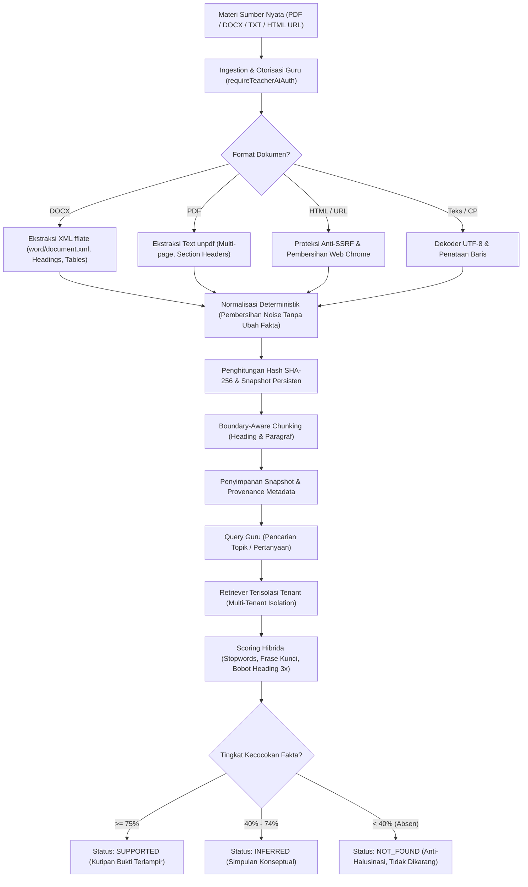

# GuruPro AI Source Grounding & Retrieval Pipeline (AI-1)

Dokumen ini mendokumentasikan arsitektur, implementasi, dan hasil validasi pipeline **AI-1: Real Source Ingestion & Grounded Retrieval Validation** pada GuruPro. 

Tahap ini memvalidasi seluruh alur pemrosesan materi sumber dari dokumen nyata hingga evaluasi bukti retrieval di sisi server, sebelum memasuki implementasi pembuatan Modul Ajar dan Generator Soal pada tahap selanjutnya.

---

## 1. Alur Pipeline Utama (End-to-End)



---

## 2. Format Dokumen yang Didukung & Perilaku Ekstraksi

| Format | Library Parser | Karakteristik Ekstraksi & Struktur |
| :--- | :--- | :--- |
| **DOCX** | `fflate` (unzip bawaan) | Membaca `word/document.xml`. Mengonversi gaya `<w:pStyle>` (`Heading1`, `Heading2`, `Title`) menjadi heading Markdown (`#`, `##`), poin nomor `<w:numPr>` menjadi daftar `-`, dan elemen tabel `<w:tbl>` menjadi tabel Markdown `\| kol \| kol \|`. |
| **PDF** | `unpdf` (dari unjs) | Mengekstrak teks tiap halaman secara berurutan. Mengenali heading berdasarkan baris bab/modul/penomoran (`BAB`, `1. Pendahuluan`), mempertahankan format daftar (`-`, `*`), serta memelihara angka, formula, dan istilah teknis secara presisi. |
| **Plain Text / MD** | Native Node.js UTF-8 | Mendekode teks secara langsung dan mendeteksi judul utama `#` atau `Title:`. |
| **HTML / Web URL** | HTML Normalizer | Memeriksa Anti-SSRF (DNS lookup, blok range privat, loopback, cloud metadata `169.254.169.254`), mengunduh dengan batas 2MB dan timeout 10 detik, lalu membersihkan navigasi, footer, script, dan banner persetujuan. |

---

## 3. Aturan Preservasi Integritas Fakta (Source Fidelity)

Sesuai aturan ketat AI-1, proses normalisasi:
- **DILARANG** memparafrasekan atau menulis ulang pernyataan faktual pada tahap penyerapan.
- **DILARANG** mengubah angka, formula matematika, tanggal, atau definisi teknis.
- **DILARANG** menghapus istilah teknis penting (contoh: *administrative distance*, *802.1Q*, *MAF*, *TPS*, *matching principle*).
- **HANYA DIIZINKAN** membersihkan *noise* struktural web (*ads*, navigasi, banner cookie, *footer copyright*).
- Menghasilkan representasi yang 100% deterministik dan dapat ditelusuri ke sumber aslinya.

---

## 4. Mesin Retrieval & Pembobotan Relevansi (`retriever.ts`)

Retriever menggunakan algoritma skoring hibrida leksikal-semantik yang dioptimalkan untuk materi edukatif:

1. **Regex Safety**: Semua karakter khusus regex (`?`, `+`, `*`, `(`, `)`, `[`, `]`) di-escape secara aman sehingga kueri dengan formula matematika atau tanda baca tidak menimbulkan *SyntaxError*.
2. **Indonesian Educational Stopword Pruning**: Kata tugas dan partikel tanya umum bahasa Indonesia (*apa, apakah, bagaimana, jelaskan, sebutkan, yang, pada, dalam, untuk, dengan*) dipangkas dari pembobotan utama agar istilah inti kurikulum mendominasi skoring.
3. **Section Title Boost (Bobot 3x)**: Istilah yang cocok pada judul bagian (`#`, `##`, `###`) mendapat skor tambahan signifikan (+6 per istilah).
4. **Exact Phrase Match Bonus**: Frase multi-kata yang cocok persis secara berurutan (contoh: *"routing statis"*, *"jurnal penyesuaian"*, *"topologi star"*) mendapatkan bonus besar (+10 hingga +15).
5. **Saturation-Weighted Body Matching**: Pencocokan kata pada badan teks dibatasi (*cap*) maksimal 5 kemunculan per kata untuk mencegah potongan teks panjang mendominasi potongan teks ringkas yang lebih presisi.
6. **Tie-Breaking Deterministik**: Jika skor potongan teks sama, diurutkan berdasarkan `chunk.index` sehingga urutan retrieval 100% konsisten pada pengujian berulang.
7. **Isolasi Kepemilikan (Multi-Tenant)**: Memeriksa `snapshot.userId === query.userId`. Akses silang guru langsung memicu error `ROLE_FORBIDDEN`.

---

## 5. Perilaku Grounding Negatif (Anti-Halusinasi)

Apabila informasi yang ditanyakan guru tidak terdapat pada materi sumber acuan:
1. Retriever menandai `hasRelevantMatch: false` jika kueri tidak memiliki kecocokan leksikal sama sekali.
2. Evaluator grounding (`evaluateGroundingAgainstSource`) menghitung rasio kecocokan istilah kunci:
   - Jika rasio kecocokan `< 40%`, status kueri **WAJIB** diklasifikasikan sebagai **`NOT_FOUND`**.
   - Sistem **TIDAK MENGARANG JAWABAN** atau berspekulasi di luar dokumen rujukan guru.
3. Kasus uji nyata membuktikan:
   - Kueri kebijakan enkapsulasi VLAN pada materi routing statis $\to$ `NOT_FOUND`.
   - Kueri akuntansi aset kripto pada jurnal perusahaan jasa $\to$ `NOT_FOUND`.
   - Kueri pendingin baterai mobil listrik pada sistem injeksi bensin EFI $\to$ `NOT_FOUND`.

---

## 6. Model Bukti & Provenansi (`GroundingEvidenceRef`)

Setiap item bukti retrieval memuat metadata terstruktur lengkap untuk auditabilitas:

```ts
export interface GroundingEvidenceRef {
  sourceId: string;        // ID unik snapshot sumber (UUID/src_hash)
  chunkId?: string;        // ID unik potongan materi asal (chunk_hash)
  sourceTitle?: string;    // Judul bab atau nama file dokumen
  snippet?: string;        // Potongan kalimat spesifik yang menjadi bukti faktual
  status: GroundingStatus; // "SUPPORTED" | "INFERRED" | "NOT_FOUND"
  relevanceScore?: number; // Skor relevansi terhitung (0.0 - 1.0)
}
```

---

## 7. Fixture Materi & Golden Retrieval Dataset

Fixture nyata tersimpan di [`tests/fixtures/`](file:///c:/novara%20project/gurupro-ai-journal-main/tests/fixtures/):

1. **`educational-network-routing.txt`**: Materi Teknik Jaringan Komputer SMK (Routing Statis, RouterOS CLI, tabel perutean, troubleshooting).
2. **`educational-web-vlan.html`**: Halaman web edukatif dengan struktur artikel VLAN 802.1Q, port access vs trunk, dan noise iklan/navigasi.
3. **`educational-accounting-journal.docx`**: Dokumen biner DOCX nyata berisi Jurnal Penyesuaian Akuntansi, asuransi dibayar di muka, metode garis lurus, dan tabel akun.
4. **`educational-automotive-injection.pdf`**: Dokumen biner PDF nyata multi-halaman berisi Pemeliharaan Sistem Bahan Bakar EFI, sensor MAF/TPS/IAT, dan scanner OBD-II DTC.

### Matriks Kategori Pengujian Golden Dataset (A - M)
Definisi pengujian berada di [`tests/fixtures/golden-retrieval-dataset.json`](file:///c:/novara%20project/gurupro-ai-journal-main/tests/fixtures/golden-retrieval-dataset.json):

| Kategori | Nama Pengujian | Target Fixture | Ekspektasi Retrieval | Status Grounding |
| :--- | :--- | :--- | :--- | :--- |
| **A** | Exact factual query | `network-routing.txt` | Nilai default administrative distance = 1 | `SUPPORTED` |
| **B** | Natural-language query | `accounting-journal.docx` | Perhitungan beban asuransi Rp 3.000.000 | `SUPPORTED` |
| **C** | Terminology query | `automotive-injection.pdf` | Fungsi sensor MAF & TPS pada mesin EFI | `SUPPORTED` |
| **D** | Equivalent wording | `network-routing.txt` | Keunggulan perutean manual vs dinamis | `SUPPORTED` |
| **E** | Specific section query | `web-vlan.html` | Standar protokol IEEE 802.1Q & tag TPID | `SUPPORTED` |
| **F** | Distant chunk query | `network-routing.txt` | Flag status rute Active Static (AS) & Unreachable | `SUPPORTED` |
| **G** | Multiple chunks query | `web-vlan.html` | Mode Access & Trunk serta nomor VLAN ID | `SUPPORTED` |
| **H** | Nearby irrelevant query | `automotive-injection.pdf` | Interval ganti saringan bensin 40.000 km | `SUPPORTED` |
| **I** | Negative query (absent) | `network-routing.txt` | Pertanyaan aturan VLAN encapsulation | `NOT_FOUND` |
| **I2** | Negative query (absent) | `accounting-journal.docx` | Pertanyaan aset kripto Bitcoin | `NOT_FOUND` |
| **I3** | Negative query (absent) | `automotive-injection.pdf` | Pertanyaan pendingin baterai lithium EV | `NOT_FOUND` |
| **J** | Cross-user attempt | `network-routing.txt` | Akses Guru B ke sumber Guru A | Ditolak `ROLE_FORBIDDEN` |
| **K** | Empty query fallback | `network-routing.txt` | Kueri spasi kosong | Sekuensial aman (index 0) |
| **L** | Very long query | `accounting-journal.docx` | Kueri paragraf panjang (> 200 karakter) | Penyusutan Rp 10.000.000 |
| **M** | Reproducibility | `automotive-injection.pdf` | Tekanan bensin fuel rail (2.5 - 3.0 bar) | 100% identik di 10 iterasi |

---

## 8. Ringkasan Eksekusi Pengujian (19 Test Suites)

Seluruh suite pengujian dijalankan melalui `npm test`:

```
1.  tests/security/security.test.mjs                  PASSED
2.  tests/security/remediation.test.mjs               PASSED
3.  tests/ai/ai-core.test.mjs                         PASSED
4.  tests/auth/auth-role.test.mjs                     PASSED
5.  tests/kelas/kelas-membership.test.mjs             PASSED
6.  tests/kelas/mapel-kelas-sync.test.mjs             PASSED
7.  tests/kelas/tahun-ajaran-context.test.mjs         PASSED
8.  tests/penugasan/penugasan.test.mjs                PASSED
9.  tests/penugasan/kkm-remedial.test.mjs             PASSED
10. tests/submission/submission.test.mjs              PASSED
11. tests/penilaian/penilaian.test.mjs                PASSED
12. tests/dashboard/dashboard-roles.test.mjs          PASSED
13. tests/dashboard/admin-operations.test.mjs         PASSED
14. tests/rekap/rekap-nilai.test.mjs                  PASSED
15. tests/persistence/persistence-integrity.test.mjs  PASSED
16. tests/export/export-archive.test.mjs              PASSED
17. tests/core-gate/core-system-gate.test.mjs (21/21) PASSED
18. tests/ai/ai-foundation.test.mjs (42/42)           PASSED
19. tests/ai/ai-retrieval-validation.test.mjs (30/30) PASSED
================================================================================
  HASIL KESELURUHAN: 19/19 SUITE LULUS (0 FAILURES)
================================================================================
```

---

## 9. Perintah Validasi Cepat

```bash
# Menjalankan pengujian spesifik AI-1 Ingestion & Retrieval
npx tsx tests/ai/ai-retrieval-validation.test.mjs

# Menjalankan seluruh pengujian regresi & AI
npm test

# Melakukan kompilasi build produksi
npm run build
```
