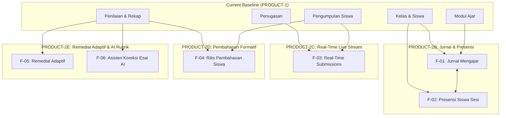

# GuruPro — PRODUCT-2 Feature Roadmap & Prioritization Specification

## 1. Executive Summary & Vision Alignment
**Phase**: PRODUCT-2 (New Feature Expansion & Roadmap Implementation)  
**Stage**: PRODUCT-2A (Feature Roadmap & Prioritization)  
**Parent Pipeline**: Foundation → Auth → Kelas → AI Modul Ajar → AI Generator Soal → Penugasan → Student Submission → Penilaian → PPT/Illustration Pipeline → QA → GO-LIVE-1 → OPS-1 → OPS-2 → PRODUCT-1A–1E → **PRODUCT-2A**  
**Core Value Proposition**:
> **“Guru fokus mengajar, GuruPro urus adminnya.”**  
> *(Teachers focus on teaching; GuruPro handles the administration.)*

PRODUCT-1 successfully optimized and unified the core educational cycle (Modul Ajar, Generator Soal, Penugasan, Pengerjaan Siswa, Penilaian, Rekap Nilai, dan Presentasi PPTX).  
The objective of **PRODUCT-2** is to expand platform capabilities into high-value administrative and pedagogical workflows—specifically daily teaching journals, classroom attendance, real-time submission streams, post-grading formative feedback, and diagnostic remedial intelligence—without compromising multi-tenant security, zero answer key leakage, or system stability.

---

## 2. Current Product Baseline (What Already Exists)

```text
Visitor
→ Landing Page (Grounded AI features & overview)
→ Register & Login (Role dispatch: Guru / Siswa / Admin)
→ Dashboard (Teacher metrics / Student pending assignments)
  ├── Kelas (Classroom lifecycle, 6-char join codes, membership approval)
  ├── Modul Ajar (Multi-source ingestion, grounding gate, full WYSIWYG, PDF export)
  ├── Generator Soal (Grounding, distractor hygiene, question package publishing)
  ├── Penugasan (Class distribution, KKM=75, deadlines, remedial configuration)
  ├── Pengerjaan Siswa (5-state lifecycle, question palette, autosave, pre-submit review)
  ├── Penilaian & Rekap (Auto PG scoring, manual essay grading, arithmetic mean recap)
  ├── Illustration & PPTX (Dual router, teacher approval, PPT-1F gate, secure download)
  ├── Arsip Data (Soft-delete & restore capabilities)
  ├── Analitik & Feedback (23 canonical events, privacy-safe scrubbing, feedback intake)
  └── Observability (Correlation IDs, health checks, zero-leak credential scrubbing)
```

### Intentionally Excluded / Out of Scope in PRODUCT-1:
- Open social networking or unstructured chat forums.
- Unsupervised autonomous grading without teacher review.
- Arbitrary non-grounded AI content generation.
- Client-side authoritative scoring or direct database mutations.

---

## 3. Product Gap Analysis & User Problems

### A. Teacher Gaps
1. **Beban Administrasi Jurnal Mengajar Harian (Daily Teaching Journal)**:  
   *Problem*: Guru diwajibkan oleh dinas pendidikan dan kepala sekolah untuk mengisi agenda/jurnal mengajar harian (tanggal, jam ke-, materi, catatan kelas, dan ketidakhadiran siswa). Saat ini guru harus mencatatnya secara terpisah di buku fisik atau Excel manual.
2. **Ketiadaan Pemantauan Submisi Real-Time (Live Classroom Stream)**:  
   *Problem*: Saat asesmen berlangsung di kelas/lab, guru harus me-refresh halaman berulang kali untuk melihat siswa yang sudah selesai mengumpulkan.
3. **Koreksi Esai dalam Jumlah Besar**:  
   *Problem*: Mengoreksi 35–40 lembar esai per kelas memerlukan waktu berjam-jam tanpa bantuan asisten rubrik awal.

### B. Student Gaps
1. **Ketiadaan Pembahasan Formatif Pasca-Penilaian**:  
   *Problem*: Demi keamanan ujian, kunci dan pembahasan disanitasi total saat pengerjaan. Namun setelah nilai dirilis, siswa belum dapat melihat pembahasan untuk mempelajari letak kesalahannya.
2. **Keterbatasan Visibilitas Remedial yang Terfokus**:  
   *Problem*: Siswa remedial sering kali harus mengerjakan ulang seluruh paket soal alih-alih fokus pada indikator materi yang belum tuntas.

### C. Educational & Platform Gaps
1. **Format Laporan Resmi Supervisi**:  
   *Problem*: Pengawas sekolah kerap meminta format dokumen Word (.docx) atau Excel (.xlsx) dengan kop surat dan kolom tanda tangan kepala sekolah/pengawas.
2. **Pustaka Berbagi Antar-Guru (MGMP Sekolah)**:  
   *Problem*: Guru di jurusan SMK yang sama belum memiliki opsi untuk saling membagikan modul ajar atau bank soal antar-rekan sejawat dalam satu sekolah.

---

## 4. Evidence Base (OPS-2 Telemetry & Operational Findings)

1. **Observed Production Evidence**:
   - `ASSIGNMENT_PUBLISHED` $\to$ `SUBMISSION_SUBMITTED` funnel menunjukkan konversi tinggi, namun guru sering mengakses menu Penugasan berulang kali dalam rentang waktu singkat saat jam pelajaran berlangsung (mengindikasikan kebutuhan pemantauan live).
   - Masukan pengguna pada kategori `suggestion` dan `usability` menanyakan integrasi administrasi harian (jadwal mengajar & agenda kelas) agar tidak perlu membuka aplikasi lain.
2. **Documented Hypotheses**:
   - Fitur Jurnal Mengajar yang terhubung langsung dengan Modul Ajar dan Kelas akan menghemat waktu administrasi guru hingga 3–5 jam per minggu.
   - Perilisan pembahasan pasca-penilaian akan meningkatkan kepuasan belajar siswa dan mengurangi pertanyaan berulang kepada guru.
3. **Future Opportunities**:
   - Integrasi PWA luring penuh untuk sekolah di daerah dengan konektivitas terbatas.
   - Pustaka bank soal tingkat MGMP (Musyawarah Guru Mata Pelajaran).

---

## 5. Candidate Features (11 Evaluated Candidates)

| ID | Feature Candidate | User Role | Proposed Capability | Complexity (1-5) | Risk (1-5) |
|:---:|---|:---:|---|:---:|:---:|
| **F-01** | **Jurnal Mengajar & Agenda Harian** | Guru | Catatan pelaksanaan pembelajaran harian terhubung ke Modul & Kelas dengan ekspor rekap semester. | 2 | 1 |
| **F-02** | **Presensi Siswa Sesi Kelas** | Guru | Pencatatan kehadiran cepat 1-ketukan (H/S/I/A) per sesi kelas, terintegrasi ke Jurnal Mengajar. | 2 | 1 |
| **F-03** | **Real-Time Live Submission Stream** | Guru | Pembaruan instan daftar pengumpulan tugas siswa via Supabase Realtime channel tanpa refresh. | 2 | 1 |
| **F-04** | **Pembahasan Formatif Pasca-Penilaian** | Siswa & Guru | Opsi guru merilis pembahasan soal ke siswa setelah penilaian selesai untuk refleksi belajar. | 2 | 2 |
| **F-05** | **Pembuatan Paket Remedial Adaptif** | Guru | Penurunan otomatis paket soal remedial dari butir-butir soal yang tidak tuntas oleh siswa. | 3 | 2 |
| **F-06** | **Asisten Rubrik Koreksi Esai AI** | Guru | Draf saran penilaian esai dan umpan balik kualitatif berbasis rubrik dengan persetujuan akhir guru. | 4 | 3 |
| **F-07** | **Ekspor Format Resmi Dokumen Sekolah** | Guru & Admin | Template Word (.docx) & Excel (.xlsx) untuk Modul dan Rekap Nilai dengan kop surat resmi. | 3 | 1 |
| **F-08** | **Importir Massal Bank Soal** | Guru | Pengunggah berkas tabel Excel/Word untuk impor butir soal otomatis ke Bank Soal. | 3 | 2 |
| **F-09** | **Kalender & Jadwal Tugas Siswa** | Siswa | Tampilan kalender batas waktu tugas lintas mata pelajaran bagi siswa. | 2 | 1 |
| **F-10** | **Pustaka Berbagi Modul/Soal Sekolah** | Guru & Admin | Opsi berbagi modul ajar dan paket soal antarguru dalam institusi sekolah yang sama. | 4 | 3 |
| **F-11** | **Sinkronisasi Pengerjaan PWA Luring** | Siswa | Penyimpanan lokal IndexedDB dan antrean pengiriman tugas saat koneksi terputus total. | 5 | 3 |

---

## 6. Prioritization Framework & Scoring

### 6.1 Formula Penilaian
$$\text{Priority Score} = (\text{User Value} + \text{Strategic Importance} + \text{Evidence}) - (\text{Complexity} + \text{Risk})$$
- **User Value (1–5)**: Dampak langsung terhadap penghematan waktu dan kemudahan kerja.
- **Strategic Importance (1–5)**: Keselarasan dengan visi "Guru fokus mengajar, GuruPro urus adminnya".
- **Evidence Backing (1–5)**: Bukti telemetri, masukan guru, regulasi kurikulum resmi.
- **Complexity (1–5)**: Kompleksitas arsitektur, kueri basis data, dan UI state.
- **Risk (1–5)**: Potensi risiko keamanan RLS, biaya token AI, kebocoran kunci jawaban.

### 6.2 Prioritization Ranking Table

| Rank | ID | Fitur | User Value | Strategic | Evidence | Complexity | Risk | Priority Score | Klasifikasi |
|:---:|:---:|---|:---:|:---:|:---:|:---:|:---:|:---:|:---:|
| **1** | **F-01** | Jurnal Mengajar & Agenda Harian | 5 | 5 | 5 | 2 | 1 | **12** | **P0 (Critical)** |
| **2** | **F-02** | Presensi Siswa Sesi Kelas | 4 | 5 | 4 | 2 | 1 | **10** | **P0 (Critical)** |
| **3** | **F-03** | Real-Time Live Submission Stream | 4 | 4 | 4 | 2 | 1 | **9** | **P1 (High)** |
| **4** | **F-04** | Pembahasan Formatif Pasca-Penilaian | 5 | 4 | 4 | 2 | 2 | **9** | **P1 (High)** |
| **5** | **F-05** | Pembuatan Paket Remedial Adaptif | 5 | 4 | 4 | 3 | 2 | **8** | **P1 (High)** |
| **6** | **F-07** | Ekspor Format Resmi Dokumen Sekolah | 4 | 4 | 3 | 3 | 1 | **7** | **P2 (Medium)** |
| **7** | **F-06** | Asisten Rubrik Koreksi Esai AI | 5 | 4 | 4 | 4 | 3 | **6** | **P2 (Medium)** |
| **8** | **F-09** | Kalender & Jadwal Tugas Siswa | 3 | 3 | 3 | 2 | 1 | **6** | **P2 (Medium)** |
| **9** | **F-08** | Importir Massal Bank Soal | 4 | 3 | 3 | 3 | 2 | **5** | **P2 (Medium)** |
| **10**| **F-10** | Pustaka Berbagi Modul/Soal Sekolah | 4 | 3 | 2 | 4 | 3 | **2** | **P3 (Future)** |
| **11**| **F-11** | Sinkronisasi Pengerjaan PWA Luring | 4 | 3 | 2 | 5 | 3 | **1** | **P3 (Future)** |

---

## 7. Dependency Graph



---

## 8. Data & Database Impact Analysis

Semua modifikasi skema basis data pada tahap mendatang **wajib menggunakan migrasi forward-only** tanpa memodifikasi berkas migrasi historis:

1. **Jurnal Mengajar & Presensi (`jurnal_mengajar`, `presensi_sesi`)**:
   - Tabel baru: `jurnal_mengajar` (`id`, `guru_id`, `kelas_id`, `modul_id`, `tanggal`, `jam_ke`, `materi`, `catatan`, `created_at`).
   - Tabel baru: `presensi_sesi` (`id`, `jurnal_id`, `siswa_id`, `status: hadir|sakit|izin|alpa`, `catatan`).
   - Kebijakan RLS: Guru hanya dapat mengelola jurnal kelas miliknya; siswa hanya dapat melihat status presensi pribadinya.
2. **Real-Time Submissions**:
   - Memanfaatkan tabel `penugasan_pengumpulan` yang sudah ada dengan mengaktifkan publikasi Supabase Realtime (`supabase_realtime` publication).
3. **Pembahasan Formatif**:
   - Kolom baru pada `penugasan`: `pembahasan_dirilis BOOLEAN DEFAULT FALSE`.
   - Update RPC `get_penugasan_soal_for_siswa` untuk menyertakan `pembahasan` dan `kunci` **hanya jika** `pembahasan_dirilis = TRUE` dan pengumpulan siswa berstatus `submitted`.
4. **Remedial Adaptif**:
   - Menggunakan tabel `paket_soal` dan `penugasan` yang sudah ada dengan menyematkan metadata referensi `remedial_source_penugasan_id`.

---

## 9. Security & AI Governance Invariants

- **Zero Early Leakage**: Pengerjaan tugas siswa tetap terisolasi 100% dari kunci jawaban dan pembahasan hingga guru mengaktifkan flag rilis secara eksplisit setelah tenggat waktu berakhir.
- **Sovereign Teacher Authority**: AI asisten koreksi esai hanya memberikan rekomendasi nilai dan catatan rubrik. Guru memegang kendali mutlak untuk menyetujui, mengedit, atau menolak sebelum nilai disimpan ke basis data.
- **Strict Tenant & Role Boundaries**: Data jurnal mengajar dan presensi terikat pada otentikasi guru (`guru_id = auth.uid()`). Guru lain dan siswa dari kelas berbeda diblokir oleh RLS.
- **Non-Blocking Telemetry**: Semua fitur baru merekam metrik adopsi tanpa menghalangi kelancaran transaksi pengguna.

---

## 10. PRODUCT-2 Phased Implementation Roadmap

```text
PRODUCT-2A: Feature Roadmap & Prioritization (Perencanaan & Baseline) [SELESAI]
      ↓
PRODUCT-2B: Jurnal Mengajar Harian & Presensi Siswa Sesi Kelas (Core Admin Relief)
      ↓
PRODUCT-2C: Real-Time Live Submissions & Classroom Activity Stream (Live Operations)
      ↓
PRODUCT-2D: Pembahasan Formatif Pasca-Penilaian & Refleksi Belajar Siswa (Pedagogy)
      ↓
PRODUCT-2E: Adaptive Remedial Intelligence & Diagnostic Derivation (Remediation)
      ↓
PRODUCT-2F: Asisten Rubrik Koreksi Esai AI & Final PRODUCT-2 Gate (Validation)
```

### Rincian Tahap Masa Depan

#### Tahap PRODUCT-2B — Jurnal Mengajar Harian & Presensi Sesi Kelas
- **Objektif**: Mengeliminasi beban administrasi buku agenda mengajar fisik dengan menyediakan modul pencatatan jurnal harian terintegrasi dengan Modul Ajar dan presensi siswa per pertemuan.
- **Ruang Lingkup**:
  - CRUD Jurnal Mengajar terhubung ke Kelas & Modul Ajar.
  - Pencatatan kehadiran cepat siswa (Hadir/Sakit/Izin/Alpa) per pertemuan.
  - Ekspor cetak/PDF rekapitulasi jurnal mengajar bulanan dan semesteran.
- **Kriteria Keberhasilan**: Guru dapat mencatat agenda mengajar dan presensi dalam waktu kurang dari 60 detik per sesi kelas.

#### Tahap PRODUCT-2C — Real-Time Live Submissions & Classroom Stream
- **Objektif**: Memberikan visibilitas langsung kepada guru terhadap aktivitas pengerjaan dan pengumpulan siswa secara real-time di ruang kelas/lab.
- **Ruang Lingkup**:
  - Integrasi Supabase Realtime WebSocket pada tabel `penugasan_pengumpulan`.
  - Indikator visual langsung saat siswa mulai mengerjakan, menyimpan progres, atau mengumpulkan tugas.
- **Kriteria Keberhasilan**: Penyerahan tugas siswa ter-update pada layar guru dalam waktu $<1$ detik tanpa muat ulang halaman.

#### Tahap PRODUCT-2D — Pembahasan Formatif Pasca-Penilaian
- **Objektif**: Memfasilitasi siklus belajar formatif dengan memungkinkan siswa menelaah pembahasan dan kunci jawaban setelah seluruh tugas selesai dinilai.
- **Ruang Lingkup**:
  - Tombol aksi guru "Rilis Pembahasan" pada penugasan yang telah dinilai.
  - Tampilan telaah jawaban siswa dengan pembahasan kontekstual dan analisis butir soal salah.
- **Kriteria Keberhasilan**: Siswa dapat membaca penjelasan edukatif tanpa membocorkan kunci pada siswa yang belum mengumpulkan.

#### Tahap PRODUCT-2E — Adaptive Remedial Intelligence
- **Objektif**: Menyederhanakan penyusunan asesmen remedial dengan menganalisis butir soal yang paling banyak gagal dijawab siswa.
- **Ruang Lingkup**:
  - Analisis butir soal di bawah KKM per penugasan.
  - Penurunan draf paket soal remedial berfokus materi tidak tuntas dengan AI grounding.
- **Kriteria Keberhasilan**: Waktu penyusunan paket remedial terpangkas dari 30 menit menjadi 2 menit.

#### Tahap PRODUCT-2F — Asisten Koreksi Esai AI & Verifikasi Final PRODUCT-2
- **Objektif**: Membantu guru memeriksa esai siswa berbasis rubrik secara objektif dan memvalidasi seluruh produk tahap 2.
- **Ruang Lingkup**:
  - Draf rekomendasi skor dan catatan evaluasi jawaban esai siswa oleh AI.
  - Gerbang validasi produk menyeluruh dan regresi penuh siklus PRODUCT-2.
- **Kriteria Keberhasilan**: Beban koreksi esai guru berkurang hingga 60% dengan tingkat akurasi penilaian sesuai rubrik materi.

---

## 11. MVP Scope Boundary for PRODUCT-2

| Status Rilis | Fitur yang Dicakup | Alasan Batasan |
|:---:|---|---|
| **Must Have** | • F-01 (Jurnal Mengajar)<br>• F-02 (Presensi Sesi Kelas)<br>• F-03 (Real-Time Submissions)<br>• F-04 (Pembahasan Formatif) | Menyelesaikan janji utama produk ("Urus adminnya"), memberikan dampak langsung harian, dan sangat aman secara teknis. |
| **Should Have** | • F-05 (Remedial Adaptif)<br>• F-06 (Asisten Koreksi Esai AI) | Nilai tambah edukatif tinggi, memerlukan integrasi AI terarah dengan kedaulatan guru. |
| **Later / Deferred** | • F-07 (Format Dokumen Resmi DOCX/XLSX)<br>• F-08 (Importir Massal Soal)<br>• F-09 (Kalender Siswa)<br>• F-10 (Perpustakaan MGMP)<br>• F-11 (PWA Offline Penuh) | Kompleksitas tinggi dan bukan merupakan hambatan operasional rilis utama saat ini. |

---

## 12. Success Metrics for Future Features

1. **Adopsi Administrasi Guru**: $\ge 80\%$ sesi kelas aktif memiliki catatan Jurnal Mengajar dan presensi mingguan.
2. **Efisiensi Waktu Guru**: Pengurangan waktu administrasi mingguan rata-rata 3 jam per guru.
3. **Ketepatan Real-Time**: Latensi notifikasi pengumpulan siswa $< 1000$ ms pada koneksi standar.
4. **Partisipasi Siswa**: Peningkatan akses telaah pembahasan siswa pasca-penilaian $\ge 65\%$ untuk evaluasi formatif.
5. **Zero Regression**: 100% pengujian mutu, RLS multi-tenant, dan pencegahan kebocoran kunci tetap lulus tanpa cacat.
