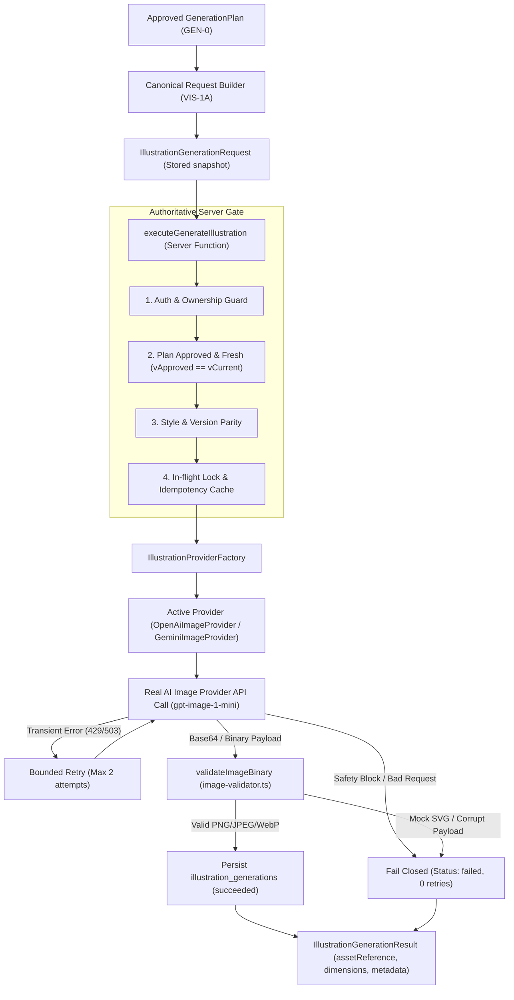

# VIS-1B — Real AI Illustration Generation Engine Documentation

## 1. Overview & Objective

Stage **VIS-1B** implements the server-side AI illustration generation engine for GuruPro. It connects the validated, canonical `IllustrationGenerationRequest` prepared by **VIS-1A** (from an approved `GenerationSpecification` in **GEN-0**) to a real AI image generation provider (`OpenAiImageProvider` with `gpt-image-1-mini` and `GeminiImageProvider`).

### Strict Invariants & Policies
1. **Strict Non-Fallback**: In case of provider error, quota limits, timeout, or safety rejections, the engine **strictly fails closed**. It **NEVER** substitutes a mock SVG (`buatIlustrasi`) or placeholder artwork as a successful generation.
2. **Authoritative Server-Side Gate**: Re-validates teacher identity, resource ownership, approved plan state, approval freshness (`approvedVersion === currentVersion`), and visual style parity prior to execution.
3. **Cost Control & Protection**:
   - In-flight execution locking prevents concurrent duplicate generation requests for the same request ID.
   - Idempotency caching serves previous successful artifacts for identical requests unless explicitly forced via `forceRetry: true`.
   - Bounded retries: At most 2 retries for transient HTTP errors (500, 502, 503, 504, 429) with exponential backoff (500ms, 1000ms).
   - Deterministic errors (400 Bad Request, prompt syntax) and AI Safety blocks (e.g. `finishReason === 'SAFETY'`) fail immediately with **0 retries**.
4. **Binary Validation**: Zero-dependency parser verifies image header magic bytes (PNG, JPEG, WebP), bounds dimensions (256px to 4096px), rejects mock SVG strings and XML text, and validates aspect ratio adherence within 12-15% tolerance.

---

## 2. Architecture & Pipeline



---

## 3. Database Schema

Migration file: `supabase/migrations/20260929130000_illustration_generations.sql`

```sql
CREATE TABLE IF NOT EXISTS public.illustration_generations (
    id UUID PRIMARY KEY DEFAULT gen_random_uuid(),
    request_id UUID NOT NULL REFERENCES public.illustration_generation_requests(id) ON DELETE CASCADE,
    generation_plan_id UUID NOT NULL REFERENCES public.generation_plans(id) ON DELETE CASCADE,
    module_id UUID NOT NULL REFERENCES public.modul_ajar(id) ON DELETE CASCADE,
    provider TEXT NOT NULL,
    model TEXT NOT NULL,
    status TEXT NOT NULL CHECK (status IN ('pending', 'processing', 'succeeded', 'failed')),
    asset_reference TEXT,
    mime_type TEXT,
    width INTEGER,
    height INTEGER,
    byte_size INTEGER,
    retry_count INTEGER DEFAULT 0,
    error_code TEXT,
    error_message TEXT,
    created_at TIMESTAMPTZ DEFAULT NOW(),
    updated_at TIMESTAMPTZ DEFAULT NOW()
);

-- RLS: Teachers can read and insert their own generations
ALTER TABLE public.illustration_generations ENABLE ROW LEVEL SECURITY;
```

---

## 4. Key Components

### 4.1 Image Binary Validator (`src/lib/ai/image-validator.ts`)
- `inspectImageBinary`: Reads binary headers to determine image format and exact pixel width/height (PNG IHDR, JPEG SOF markers, WebP VP8 chunks).
- `validateImageBinary`: Checks minimum payload size (512 bytes), rejects string or byte representations of `<svg`, `<?xml`, `<!DOCTYPE`, and verifies dimension bounds and aspect ratio conformance.
- `assertValidImageBinary`: Throws typed `AiServiceError` with code `AI_ERROR_CODES.GENERATION_FAILED` if invalid.

### 4.2 Provider Adapters (`src/lib/ai/providers/`)
- `openai-image-provider.ts`: Translates canonical request into OpenAI `/v1/images/generations` payload using model `gpt-image-1-mini` with `b64_json` response format. Implements bounded retry with exponential backoff and non-fallback closed failures.
- `gemini-image-provider.ts`: Implements Google Gemini multimodal generation with safety block normalization (`finishReason === 'SAFETY' -> AI_SAFETY_BLOCKED`).
- `illustration-provider-factory.ts`: Resolves active provider based on environment keys (`OPENAI_API_KEY`, `GEMINI_API_KEY`) and provides testing injection via `registerMockIllustrationProvider()`.

### 4.3 Server Functions (`src/lib/illustration-generation.functions.ts`)
- `executeGenerateIllustration` / `generateIllustrationServerFn`: Server-side executor that re-validates teacher ownership and approval freshness, locks in-flight execution, checks idempotency cache, delegates to active provider, verifies generated binary, and records audit trail in `illustration_generations`.
- `executeGetIllustrationGenerationResult` / `getIllustrationGenerationResultServerFn`: Fetches the latest generation result for a request.

### 4.4 UI Integration
- `src/lib/generation-planning-store.ts`: Tracks `generating`, `generationResult`, and provides `generateIllustration(requestId, forceRetry)` action.
- `src/components/generation-planning-panel.tsx`: Step 5 activates the generation button, renders loading spinner during generation, displays real generated image with provider/model/dimension badges on success, and renders error alert with "Coba Lagi" button on failure (strictly without mock SVG fallback).

---

## 5. Verification & Test Results

### 5.1 Automated Test Suite
- Command: `npm run test:vis1b` (runs `tests/ai/illustration-generation-engine.test.mjs`)
- Coverage: **33 test scenarios across 7 test groups**:
  1. Image Binary Validation (PNG, JPEG, WebP, empty payload, mock SVG rejection, corrupt bytes, sub-minimum dimensions, aspect ratio tolerance, base64 data URLs).
  2. Provider Adapters & Request Translation (OpenAI canonical prompt/text policy, 16:9 aspect ratio, Gemini multimodal contents, factory mock injection).
  3. Error Handling & Bounded Retries (transient 503 retry, transient 429 retry, deterministic 400 zero retry, safety policy zero retry, Gemini safety normalization).
  4. Server Functions & Authorization (teacher ownership, non-owner teacher 403, student 403, non-existent request 400).
  5. Approval Gate & Re-Validation (unapproved plan 400, stale approval 400, style mismatch 400, non-illustration targetType 400).
  6. Cost Control & Idempotency (in-flight lock 429, idempotent cache reuse, forceRetry bypass).
  7. Persistence, Audit & Strict Non-Fallback (successful generation row with metadata, failed provider row with failure status, strictly NO mock SVG substitution, corrupt binary closed failure).
- Status: **33 PASSED, 0 FAILED**.

### 5.2 Controlled Live Provider Verification
- Command: `npx tsx tests/ai/live-openai-test.mjs`
- Target Model: OpenAI `gpt-image-1-mini`
- Request: Water cycle pedagogical illustration (`style_ill_flat_edu`, 1:1 square, `allowTextInImage: false`).
- Result:
  - Status: `succeeded`
  - MIME type: `image/png`
  - Dimensions: `1024x1024`
  - Payload Size: `1,654,335 bytes` (~1.65 MB real binary PNG)
  - Duration: `31,668 ms`
  - Binary header validation: `Valid PNG, 1024x1024, 0 errors`.

### 5.3 Full Regression Test Suite
- Command: `npm test`
- Scope: All 39 test suites across security, auth, academic classes, grading, AI foundation, modul ajar, bank soal, GEN-0, VIS-1A, and VIS-1B.
- Status: **ALL 39 SUITES PASSED (0 FAILURES)**.

### 5.4 Production Build
- Command: `npx vite build`
- Result: Clean production build in 1.46s with 0 errors.
