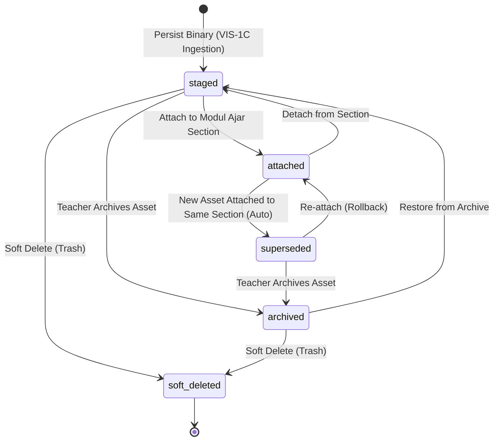

# VIS-1C — Asset Persistence, Provenance & Lifecycle Documentation

## 1. Overview & Objective

Stage **VIS-1C** establishes the asset persistence, cryptographic integrity, pedagogical provenance, and lifecycle management foundation for AI-generated illustrations in GuruPro. 

It takes the raw binary image output produced by **VIS-1B** and persists it into resilient object storage (Supabase Storage bucket `illustration-assets`), computes deterministic SHA-256 content hashes, creates canonical `IllustrationAsset` records in PostgreSQL, links them with full pedagogical provenance to their parent Modul Ajar, and manages their complete lifecycle transitions (`staged` → `attached` → `superseded` → `archived` → `soft_deleted`).

### Strict Invariants & Policies

1. **Cryptographic Content Integrity**:
   - Every stored asset calculates a deterministic SHA-256 hash over its raw binary payload.
   - Storage paths use content-addressable prefixes (`modules/{moduleId}/illustrations/{year}/{month}/{hash_prefix}-{uuid}.{ext}`).
2. **Pedagogical Provenance Preservation**:
   - The asset record stores an immutable snapshot of the generation parameters, prompt text, negative prompt, visual style, outline version, and curriculum grounding context.
   - It maintains referential integrity back to `generation_id`, `request_id`, `generation_plan_id`, and `module_id`.
3. **Non-Destructive Superseding Invariant**:
   - When a teacher attaches a new illustration asset to a Modul Ajar section that already has an active illustration, the prior asset is **automatically transitioned to `superseded`**.
   - It is **NEVER deleted or overwritten**. The historical asset row, its binary in storage, its SHA-256 hash, and its full provenance remain intact for auditability, rollback, and revision history.
4. **Modul Ajar Section Synchronization**:
   - Attaching an asset updates the section's illustration field (`ModulSection.ilustrasi = asset.publicUrl`) in `public.modul_ajar`, immediately reflecting in chapter views and PDF exports.
   - Detaching reverts the section illustration field and transitions the asset back to `staged`.
5. **Authoritative Server-Side Multi-Tenant RBAC**:
   - Only authenticated teachers who own the target Modul Ajar can persist, attach, detach, or transition assets.
   - Non-owners and students receive `ROLE_FORBIDDEN` (HTTP 403) with typed `AiServiceError`.

---

## 2. Architecture & Lifecycle State Machine



### Lifecycle States

| Status | Description | Modul Section Link |
| :--- | :--- | :--- |
| `staged` | Stored in bucket, ready to be reviewed or linked. | None |
| `attached` | Actively linked to a specific chapter/section in `modul_ajar`. | `sectionId` populated, `section.ilustrasi = publicUrl` |
| `superseded` | Replaced by a newer generation on the same section; preserved historically. | `sectionId` preserved, but section points to newer URL |
| `archived` | Explicitly marked inactive by teacher; hidden from active picker. | None |
| `soft_deleted` | Marked for cleanup; excluded from normal listings. | None |

---

## 3. Database Schema

Migration file: `supabase/migrations/20260930100000_illustration_assets.sql`

```sql
CREATE TABLE IF NOT EXISTS public.illustration_assets (
    id UUID PRIMARY KEY DEFAULT gen_random_uuid(),
    generation_id UUID NOT NULL REFERENCES public.illustration_generations(id) ON DELETE CASCADE,
    request_id UUID NOT NULL REFERENCES public.illustration_generation_requests(id) ON DELETE CASCADE,
    generation_plan_id UUID NOT NULL REFERENCES public.generation_plans(id) ON DELETE CASCADE,
    module_id UUID NOT NULL REFERENCES public.modul_ajar(id) ON DELETE CASCADE,
    section_id TEXT,
    teacher_id UUID NOT NULL REFERENCES auth.users(id) ON DELETE CASCADE,
    storage_path TEXT NOT NULL,
    public_url TEXT NOT NULL,
    storage_provider TEXT NOT NULL DEFAULT 'supabase_storage',
    mime_type TEXT NOT NULL,
    file_size_bytes INTEGER NOT NULL,
    sha256_hash TEXT NOT NULL,
    width INTEGER NOT NULL,
    height INTEGER NOT NULL,
    lifecycle_status TEXT NOT NULL DEFAULT 'staged' CHECK (
        lifecycle_status IN ('staged', 'attached', 'superseded', 'archived', 'soft_deleted')
    ),
    prompt_snapshot JSONB NOT NULL DEFAULT '{}'::jsonb,
    grounding_snapshot JSONB NOT NULL DEFAULT '{}'::jsonb,
    metadata JSONB NOT NULL DEFAULT '{}'::jsonb,
    created_at TIMESTAMPTZ DEFAULT NOW(),
    updated_at TIMESTAMPTZ DEFAULT NOW()
);

-- RLS: Teachers can read and manage their own illustration assets
ALTER TABLE public.illustration_assets ENABLE ROW LEVEL SECURITY;
```

---

## 4. Key Components

### 4.1 Canonical Contract (`src/lib/ai/illustration-asset-contract.ts`)
- `IllustrationAssetSchema`: Canonical Zod entity with full provenance attributes.
- `AssetLifecycleStatusSchema`: Type definition for `'staged' | 'attached' | 'superseded' | 'archived' | 'soft_deleted'`.
- `LIFECYCLE_TRANSITIONS`: Valid transition matrix preventing invalid jumps (e.g., cannot transition directly from `attached` to `soft_deleted` without unlinking).
- Server input schemas: `PersistIllustrationAssetInputSchema`, `AttachIllustrationAssetInputSchema`, `DetachIllustrationAssetInputSchema`, `TransitionAssetLifecycleInputSchema`, `ListModuleIllustrationAssetsInputSchema`.

### 4.2 Storage Service & Drivers (`src/lib/ai/illustration-storage-service.ts`)
- `computeSha256(buffer)`: Node.js `crypto` SHA-256 hash generator.
- `buildIllustrationStoragePath(moduleId, sha256, ext)`: Structured naming convention.
- `SupabaseStorageDriver`: Uploads binary buffers to Supabase Storage bucket `illustration-assets` with upsert support and gets permanent public URLs.
- `MemoryStorageDriver`: In-memory driver for deterministic, zero-network local testing and CI/CD pipelines.
- `resolveStorageDriver()` & `registerMockStorageDriver()`: Factory with dependency-injection support.

### 4.3 Server Functions (`src/lib/illustration-asset.functions.ts`)
- `executePersistIllustrationAsset`: Validates teacher ownership, computes SHA-256, uploads to storage, captures provenance snapshot from `illustration_generations` and `illustration_generation_requests`, and persists canonical row.
- `executeAttachIllustrationAsset`: Re-validates ownership, updates `modul_ajar.sections[i].ilustrasi = asset.publicUrl`, sets asset status to `attached`, and automatically transitions any prior active asset on that section to `superseded`.
- `executeDetachIllustrationAsset`: Clears `section.ilustrasi` and transitions asset status back to `staged`.
- `executeTransitionAssetLifecycle`: Validates state transition against `LIFECYCLE_TRANSITIONS` matrix and executes transition.
- `executeListModuleIllustrationAssets`: Returns non-deleted assets for a module sorted chronologically.

### 4.4 Reactive Client Hook (`src/lib/illustration-asset-store.ts`)
- `useIllustrationAssetStore`: Clean React hook built with native state and subscriber patterns (zero third-party state manager dependencies), offering:
  - `persistAsset(generationId, binaryDataUrl)`
  - `attachAsset(assetId, sectionId)`
  - `detachAsset(assetId)`
  - `transitionLifecycle(assetId, targetStatus)`
  - `fetchModuleAssets(moduleId)`
  - Active cache and loading states.

### 4.5 UI Integration (`src/components/generation-planning-panel.tsx` & `src/components/modul-editor.tsx`)
- In Step 5 of `IllustrationPlanningPanel`:
  - Visual asset preview with permanent URL.
  - Cryptographic badge displaying SHA-256 hash prefix with full-hash copy button.
  - Section attachment dropdown: Lists chapters/sections from `Modul Ajar`, allowing one-click attachment ("Tautkan ke Bab Modul Ajar") or detachment.
  - Collapsible module asset history displaying all generated variations, dates, and lifecycle badges (`attached`, `superseded`, `archived`).
  - `modul-editor.tsx`: Synchronizes section updates back to the parent editor so the Modul Ajar chapter views and export previews update reactively.

---

## 5. Verification & Test Suite

The dedicated test suite `tests/ai/illustration-asset-lifecycle.test.mjs` contains **29 automated tests across 7 functional groups**:

1. **Binary Ingestion, Storage Driver & SHA-256 Hashing**:
   - Deterministic SHA-256 hash calculations.
   - Distinct hashes for differing binary payloads.
   - Storage driver upload, canonical path generation, public URL derivation, and deletion.
   - Mock driver injection.
2. **Canonical Asset Contract & Provenance Preservation**:
   - Provenance links intact (`generation_id`, `request_id`, `generation_plan_id`, `module_id`).
   - Prompt and grounding snapshots preserved.
   - Idempotent repeated persistence.
   - Strict rejection on non-existent or failed generations.
3. **Modul Ajar Section Attachment & Automatic Superseding**:
   - Update of `section.ilustrasi` with public URL.
   - Automatic superseding of prior asset when attaching a new one to the same section.
   - Historical preservation of superseded assets (zero data loss).
   - Rejection on invalid section or wrong module ID.
4. **Detach & Lifecycle State Machine Transitions**:
   - Detach returns to `staged` and clears `section.ilustrasi`.
   - Transitioning between valid lifecycle states (`staged` → `archived`, `soft_deleted`).
   - Assertion of illegal state transitions (matrix rejection).
5. **Listing & Filter Integrity**:
   - Chronological sorting and exclusion of soft-deleted assets.
   - Multiple sections coexisting with active attached assets.
6. **Multi-Tenant RBAC & Ownership Security**:
   - Non-owner teachers receive `ROLE_FORBIDDEN` (403) on persist, attach, and transition.
   - Students receive `ROLE_FORBIDDEN` (403).
7. **Storage Failure & Error Resilience**:
   - Graceful error handling on storage driver failures.
   - Verification of non-destructive invariant across all rows.

All 29 tests pass with 100% success rate:
```bash
npm run test:vis1c
# Result: 29 passed, 0 failed
```
