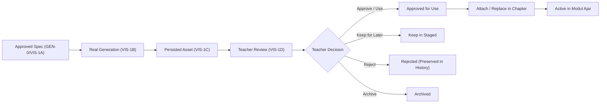
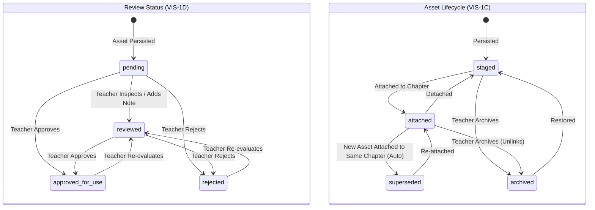

# VIS-1D — Teacher Review & Illustration Management Documentation

## 1. Overview & Objectives

Stage **VIS-1D** establishes the authoritative, teacher-controlled review and illustration asset management layer for GuruPro. 

It guarantees that the **teacher—not the AI—remains the sole and final decision-maker** regarding whether a generated pedagogical illustration is accepted, kept for later, rejected, archived, or attached to a Modul Ajar chapter.



### Strict Invariants & Policies

1. **Semantic Separation of Review Status vs. Asset Lifecycle**:
   - `reviewStatus` (`pending`, `reviewed`, `approved_for_use`, `rejected`) is **strictly decoupled** from asset `lifecycleStatus` (`staged`, `attached`, `superseded`, `archived`, `soft_deleted`).
   - Approving an image for use changes its review state, but does not attach it until the teacher explicitly selects a target chapter.
2. **Immutable Specification Comparison**:
   - The review interface displays the exact approved outline (subject, objective, composition, visual details, educational focus, text policy, things to avoid) and approved style version from the **immutable approved snapshot**, never from mutable live modul data.
3. **Multiple Generated Outputs Support**:
   - Supports multiple generated image variations for a plan/module.
   - Each asset maintains its own asset ID, hash, provenance, and independent review record.
   - Selecting one image never deletes or archives alternatives.
4. **Non-Destructive Invariant (Zero Data Loss)**:
   - Rejections and replacements NEVER delete data.
   - When a new illustration is attached to a chapter with an existing illustration, the prior asset automatically becomes `superseded` and remains intact in historical audits.
5. **Explicit Confirmation on Material Consequences**:
   - Replacing an active illustration requires confirmation dialog explaining that the prior image will be preserved as `superseded`.
   - Archiving an attached illustration requires confirmation dialog explaining that it will be unlinked from the chapter.
6. **Human-Only Review (No Auto-Regeneration)**:
   - Review notes are teacher-authored metadata stored for pedagogical reflection and audit.
   - Notes are **NEVER sent back to the AI model** and **NEVER trigger automatic regeneration**.
7. **Strict Non-Goals**:
   - **No AI quality scoring or LLM evaluator** (strictly reserved for VIS-1E).
   - **No Photoshop-like editor** (no cropping, brushes, filters).
   - **No automatic generation on rejection**.
   - **No PPT generation**.

---

## 2. Review Domain & Data Model

### Review Status vs. Asset Lifecycle State Machine



### Review Entity (`IllustrationReview`)

| Field | Type | Description |
| :--- | :--- | :--- |
| `id` | `TEXT (PK)` | Identifier (e.g. `rev_<assetId>`) |
| `asset_id` | `TEXT (FK)` | Canonical link to `illustration_assets(id)` (UNIQUE) |
| `generation_id` | `TEXT (FK)` | Link to `illustration_generations(id)` |
| `generation_plan_id` | `TEXT (FK)` | Link to `generation_plans(id)` |
| `module_id` | `TEXT` | Target Modul Ajar ID |
| `outline_version` | `INTEGER` | Approved outline version evaluated against |
| `style_id` | `TEXT` | Approved style ID |
| `style_version` | `INTEGER` | Approved style version |
| `review_status` | `TEXT` | `'pending' \| 'reviewed' \| 'approved_for_use' \| 'rejected'` |
| `teacher_decision` | `TEXT` | `'use' \| 'archive' \| 'regenerate' \| 'keep_for_later' \| null` |
| `teacher_notes` | `TEXT` | Optional teacher-authored evaluation notes |
| `reviewed_by` | `UUID (FK)` | Authenticated teacher user ID |
| `reviewed_at` | `TIMESTAMPTZ` | Timestamp when reviewed |
| `created_at` | `TIMESTAMPTZ` | Creation timestamp |
| `updated_at` | `TIMESTAMPTZ` | Modification timestamp (used for optimistic concurrency) |

---

## 3. Database Schema

Migration file: `supabase/migrations/20260930110000_illustration_reviews.sql`

```sql
CREATE TABLE IF NOT EXISTS public.illustration_reviews (
  id TEXT PRIMARY KEY,
  asset_id TEXT NOT NULL UNIQUE REFERENCES public.illustration_assets(id) ON DELETE CASCADE,
  generation_id TEXT NOT NULL REFERENCES public.illustration_generations(id) ON DELETE CASCADE,
  generation_plan_id TEXT NOT NULL REFERENCES public.generation_plans(id) ON DELETE CASCADE,
  module_id TEXT NOT NULL,
  outline_version INTEGER NOT NULL DEFAULT 1,
  style_id TEXT NOT NULL,
  style_version INTEGER NOT NULL DEFAULT 1,
  review_status TEXT NOT NULL DEFAULT 'pending' CHECK (review_status IN ('pending', 'reviewed', 'approved_for_use', 'rejected')),
  teacher_decision TEXT CHECK (teacher_decision IN ('use', 'archive', 'regenerate', 'keep_for_later')),
  teacher_notes TEXT,
  reviewed_by UUID NOT NULL REFERENCES auth.users(id) ON DELETE CASCADE,
  reviewed_at TIMESTAMPTZ,
  created_at TIMESTAMPTZ NOT NULL DEFAULT now(),
  updated_at TIMESTAMPTZ NOT NULL DEFAULT now()
);

-- RLS: Guru can select, insert, and update only their own reviews
ALTER TABLE public.illustration_reviews ENABLE ROW LEVEL SECURITY;
```

---

## 4. Key Components

### 4.1 Canonical Contract (`src/lib/ai/illustration-review-contract.ts`)
- `ReviewStatusSchema` & `TeacherDecisionSchema`.
- `IllustrationReviewSchema`: Complete Zod schema.
- `ApprovedOutlineSnapshot` & `ApprovedStyleSnapshot`: Immutable specification structures.
- `ReviewableIllustrationAsset`: Compound view joining `IllustrationAsset` + `IllustrationReview` + `ApprovedOutlineSnapshot` + `ApprovedStyleSnapshot`.
- `validateReviewTransition` & `assertValidReviewTransition`: Enforces allowed transition paths.

### 4.2 Server Functions (`src/lib/illustration-review.functions.ts`)
- `executeGetIllustrationReview`: Fetches existing review or initializes default `pending` review.
- `executeSaveIllustrationReview`: Server-authoritative role check (`guru`), owner check (`asset.owner_id === userId`), optimistic concurrency check (`expectedUpdatedAt`), valid state transition validation, and persistence.
- `executeApproveIllustrationForUse`: Convenience shortcut setting `reviewStatus: 'approved_for_use'`, `teacherDecision: 'use'`.
- `executeRejectIllustration`: Convenience shortcut setting `reviewStatus: 'rejected'`, recording optional notes (never deleting asset).
- `executeListReviewableIllustrations`: Returns all assets for a module/plan with review statuses, matching approved outline snapshot from `illustration_generation_requests`, and style snapshots.

### 4.3 Client Store (`src/lib/illustration-asset-store.ts`)
- Extended `useIllustrationAssetStore` hook with:
  - `reviewItems`: Array of `ReviewableIllustrationAsset`
  - `selectedAssetId` & `selectedReviewable`
  - `savingReview` & `reviewError`
  - Actions: `loadReviewableAssets`, `selectAssetForReview`, `saveReview`, `approveForUse`, `rejectAsset`, `keepForLater`.

### 4.4 UI Integration (`src/components/generation-planning-panel.tsx`)
- Step 5 Review Section features:
  - **Multi-Output / Asset Selector**: Thumbnail buttons allowing quick switching between generated alternatives.
  - **Semantic Separation Badges**: Displays both Review Status (`PENDING`, `DITINJAU`, `DISETUJUI`, `DITOLAK`) and Lifecycle Status (`STAGED`, `TERPAUT`, `SUPERSEDED`, `DIARSIPKAN`).
  - **Cryptographic SHA-256 Digest**: Badge with one-click copy button.
  - **Approved Outline Comparison Card**: Displays immutable approved objective, main subject, educational focus, composition, visual details, text policy, and style rules.
  - **Teacher Review Notes Box**: Textarea for teacher notes with disclaimer that notes do not invoke AI.
  - **Teacher Decisions**: "Setujui untuk Digunakan", "Simpan untuk Nanti", "Tolak / Jangan Gunakan".
  - **Chapter Attachment & Replacement**: Select chapter and attach, with confirmation modal if replacing an existing image.
  - **Confirmation Dialogs**: `AlertDialog` for replacing active illustration (explaining superseding) and archiving attached illustration (explaining unlinking).

---

## 5. Verification & Test Suite

The dedicated test suite `tests/ai/illustration-teacher-review.test.mjs` contains **44 automated tests across 8 functional groups**:

1. **Review Loading, Eligibility & Specification Comparison (7 tests)**:
   - Valid persisted asset creates default 'pending' review with clean state.
   - Non-existent asset ID throws `INVALID_REQUEST`.
   - Failed generation cannot be reviewed as a valid asset.
   - Soft-deleted asset throws `INVALID_REQUEST`.
   - Immutable approved outline is loaded and matches historical plan specification.
   - Immutable approved style and version are loaded accurately.
   - Pedagogical provenance (curriculum, subject, audience) is preserved intact.
2. **State Machine & Teacher Decisions (9 tests)**:
   - `pending` $\rightarrow$ `reviewed`.
   - `reviewed` $\rightarrow$ `approved_for_use` with decision `'use'`.
   - Direct approve via `executeApproveIllustrationForUse`.
   - `reviewed` $\rightarrow$ `rejected` with decision `'regenerate'` (non-destructive).
   - Direct reject via `executeRejectIllustration` (non-destructive).
   - Keep for later with decision `'keep_for_later'`.
   - Illegal transitions (`approved_for_use` $\rightarrow$ `pending`, `rejected` $\rightarrow$ `pending`) rejected with `INVALID_REQUEST`.
   - Review approval does NOT automatically attach asset (stays `staged`).
3. **Multi-Output Generation & Asset Selection (5 tests)**:
   - Multiple outputs coexist with independent review records.
   - Reviewing Asset A does not mutate Asset B's review status.
   - Approving Asset A does not delete or reject Asset B.
   - Rejecting Asset B preserves Asset A and Asset B in database.
   - `listReviewableIllustrations` returns all non-deleted outputs sorted by date.
4. **Section Attachment, Replacement & Confirmation Invariant (6 tests)**:
   - Attaching approved asset updates `ModulSection.ilustrasi` with `publicUrl`.
   - Attaching asset to section that already has an active illustration triggers superseding.
   - Previous active illustration transitions to `superseded` with historical data intact.
   - Superseded asset retains its SHA-256 hash, URL, and approved outline comparison.
   - Detaching reverts status to `staged` and clears `ModulSection.ilustrasi`.
   - Attempting to attach `soft_deleted` asset is rejected.
5. **Archive & Lifecycle Invariants (4 tests)**:
   - Staged asset can be transitioned to `archived`.
   - Attached asset transitioned to `archived` safely unlinks from `ModulSection`.
   - Archived assets remain in historical reviews but are excluded from active section picker.
   - Archived asset retains full provenance and review history.
6. **Teacher Notes & Concurrency Protection (4 tests)**:
   - Teacher note is persisted and survives repeated reload.
   - Updating note with matching `expectedUpdatedAt` succeeds.
   - Stale update with mismatched `expectedUpdatedAt` throws `INVALID_REQUEST` (concurrency conflict).
   - Teacher note is strictly teacher-authored metadata and is NOT sent to any AI provider.
7. **Multi-Tenant RBAC & Ownership Security (6 tests)**:
   - Owner teacher can review, approve, reject, and attach asset.
   - Non-owner teacher attempting to get review receives `ROLE_FORBIDDEN`.
   - Non-owner teacher attempting to save review receives `ROLE_FORBIDDEN`.
   - Student role attempting review receives `ROLE_FORBIDDEN`.
   - Unauthenticated request receives `ROLE_FORBIDDEN` / `AUTH_ERROR`.
   - Cross-module attachment is rejected with `INVALID_REQUEST`.
8. **Strict Non-Goals & Invariant Enforcement (3 tests)**:
   - Review operations NEVER invoke AI image generation API.
   - Rejection does NOT automatically trigger re-generation.
   - No AI quality score or automated vision judge is executed in VIS-1D.

All 44 tests pass with 100% success rate:
```bash
npm run test:vis1d
# Result: 44 passed, 0 failed
```
