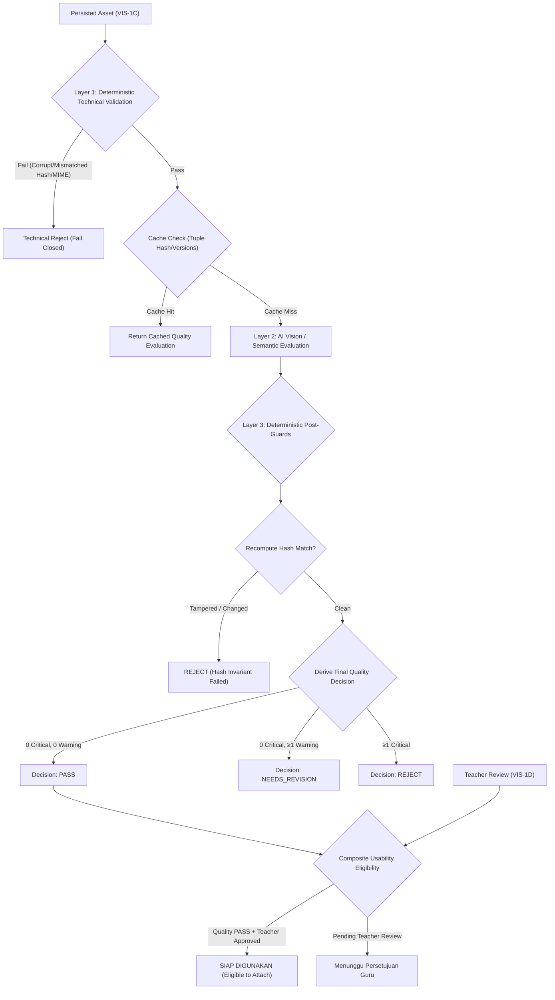

# VIS-1E — Illustration Quality Gate & End-to-End Verification Documentation

## 1. Overview & Objectives

Stage **VIS-1E** is the final quality-control and validation stage of the GuruPro AI Illustration Pipeline:

$$\text{GEN-0 (Planning)} \longrightarrow \text{VIS-1A (Contract)} \longrightarrow \text{VIS-1B (Real Generation)} \longrightarrow \text{VIS-1C (Persistence)} \longrightarrow \text{VIS-1D (Teacher Review)} \longrightarrow \mathbf{\text{VIS-1E [FINAL GATE]}}$$

The goal of VIS-1E is to validate deterministically and semantically whether a real generated illustration:
1. **Matches the Teacher-Approved Outline** (main subject, supporting elements, environment, perspective).
2. **Follows the Approved Visual Style Rules** (style preset, version, visual constraints).
3. **Preserves Educational Concepts & Grounding** without introducing contradictions or unsupported claims.
4. **Adheres to the Text-in-Image Policy** (required labels present, no model-invented text hallucinations, no forbidden terms).
5. **Satisfies Deterministic Technical Constraints** (valid MIME, dimensions 256–4096px, aspect ratio within tolerance, SHA-256 cryptographic hash match, complete provenance metadata, storage accessibility).
6. **Remains an Advisory Quality Gate** that respects Teacher Review Sovereignty (AI `PASS` does **not** automatically approve or attach the image).



---

## 2. 3-Layer Quality Gate Architecture

### Layer 1: Deterministic Technical Validation (Fail-Closed)
Layer 1 inspects the physical binary payload **before any paid AI Vision call is made**:
* **Binary Existence & Storage Accessibility**: Retrieves binary via `mockAssetBinaries`, `StorageDriver`, data URL, or Supabase Storage.
* **MIME & Format Inspection**: Inspects binary magic bytes (`image/png`, `image/jpeg`, `image/webp`).
* **Dimensions Check**: Width and height must be between 256px and 4096px.
* **Aspect Ratio Verification**: Tolerates $\pm 10\%$ deviation from the requested aspect ratio (`1:1`, `16:9`, `4:3`).
* **Minimum Size & Non-Mock Check**: Byte size must be $\ge 512$ bytes; rejected if format is unknown or stub.
* **Cryptographic SHA-256 Integrity**: Recomputed hash of bytes must match the immutable `asset.sha256_hash`.
* **Provenance Completeness**: Asserts that `generation_id`, `request_id`, `generation_plan_id`, `module_id`, and `owner_id` are all populated.

> [!IMPORTANT]
> If any Layer 1 check fails, the evaluation **fails closed immediately** with a critical technical finding. No expensive external AI vision API is ever invoked on corrupt or non-compliant assets.

### Layer 2: AI Vision / Semantic Evaluation
Layer 2 executes structured vision inspection using `illustration_quality_v1` prompt:
* **Outline Alignment**: Evaluates whether `mainSubject`, `supportingElements`, `environmentBackground`, and `composition` match the immutable approved outline snapshot.
* **Style Alignment**: Evaluates adherence to the approved style preset rules (e.g., flat vector rules vs. photorealistic textures).
* **Educational Consistency**: Verifies whether the educational concept is accurate, free from major curriculum contradictions, and grounded in the source references.
* **Tolerant of Artistic Nuance**: Ambient natural details (e.g. lighting, subtle shading, background foliage) that do not contradict educational facts are permitted and do not cause false rejections.
* **Text Policy Compliance**: Checks for presence of mandatory labels, absence of forbidden terms (`thingsToAvoid`), and flags model-invented text hallucinations when `allowModelInventedText: false`.

### Layer 3: Deterministic Post-Evaluation Guards & Decision Engine
Layer 3 enforces the final authoritative verdict using pure rule logic (`deriveQualityDecision`):
* **Recomputed Hash Guard**: Re-verifies that binary bytes were not mutated during the evaluation lifecycle.
* **Decision Rules**:
  * Any Layer 1 failure $\longrightarrow$ `REJECT` or `ERROR`.
  * Storage inaccessibility $\longrightarrow$ `ERROR`.
  * Any `critical` finding $\longrightarrow$ `REJECT`.
  * Any `warning` finding without critical findings $\longrightarrow$ `NEEDS_REVISION`.
  * All deterministic checks passed, zero critical findings, zero warnings $\longrightarrow$ `PASS`.

---

## 3. Strict Invariants & Policies

1. **Teacher Sovereignty (AI Quality $\neq$ Teacher Decision)**:
   * AI evaluation provides structured advisory evidence (`PASS`, `NEEDS_REVISION`, `REJECT`).
   * An AI `PASS` does **not** automatically mark an asset as `approved_for_use`.
   * Only the teacher can approve an asset for use.
2. **Non-Destructive Invariant**:
   * A quality status of `NEEDS_REVISION` or `REJECT` **never** automatically triggers image regeneration.
   * Rejected assets are preserved in the database for auditability and history; they are never deleted automatically.
3. **Composite Usability Eligibility**:
   $$\text{eligibleForUse} = \text{validAsset} \wedge (\text{qualityStatus} = \text{'PASS'}) \wedge (\text{reviewStatus} = \text{'approved\_for_use'})$$
4. **Cost Control & In-Flight Locking**:
   * Quality evaluation is an explicit teacher action (no automatic execution on page load).
   * In-memory/database caching by `(asset_id, asset_hash, outline_version, style_version, evaluator_version)` prevents duplicate API fees.
   * `inFlightEvaluationLocks` blocks concurrent requests on the same asset.
5. **Strict Non-Goals**:
   * **NO automatic regeneration**.
   * **NO Photoshop-style image editor or cropping**.
   * **NO presentation (PPT) generation**.

---

## 4. Quality Evaluation Contracts & Schemas

### Decision & Severity Schemas
```typescript
export const QualityDecisionSchema = z.enum(["PASS", "NEEDS_REVISION", "REJECT", "ERROR"]);
export const FindingSeveritySchema = z.enum(["critical", "warning", "info"]);
export const FindingCategorySchema = z.enum([
  "outline",
  "style",
  "educational",
  "composition",
  "text",
  "grounding",
  "technical",
]);
```

### Finding Contract
```typescript
export const IllustrationQualityFindingSchema = z.object({
  code: z.string().min(1),
  severity: FindingSeveritySchema,
  category: FindingCategorySchema,
  description: z.string().min(1),
  relatedOutlineField: z.string().optional(),
  evidenceReference: z.string().optional(),
  recommendation: z.string().optional(),
});
```

---

## 5. UI Integration in Generation Planning Panel

In Step 5 ("Pratinjau & Integrasi Modul Ajar"), the UI includes:
* **Layer 1 Technical Summary Checklist**: Shows MIME type, dimensions, aspect ratio, and cryptographic hash integrity status.
* **AI Quality Gate Decision Card**:
  * Visual decision badge (`PASS` in green, `NEEDS_REVISION` in amber, `REJECT` in red, `ERROR` in zinc).
  * Action button: `Evaluasi Kualitas AI` (with spinner when evaluation is in progress).
* **Usability Eligibility Indicator**:
  * Badges the asset as `SIAP DIGUNAKAN` when both AI quality is `PASS` and teacher review is `approved_for_use`.
  * Explains clearly if teacher review is still pending.
* **Detailed Findings List**: Categorized with severity tags, specific outline references, and pedagogical recommendations.

---

## 6. Verification & Test Suite Summary

The VIS-1E test suite (`tests/ai/illustration-quality-gate.test.mjs`) contains **51 tests** covering 10 groups:

| Group | Scope | Test Count | Result |
|---|---|---|---|
| Group 1 | Layer 1 Deterministic Technical Validation | 9 tests | 9/9 PASS |
| Group 2 | Evaluator Contract & Schema Validation | 5 tests | 5/5 PASS |
| Group 3 | Outline Alignment Evaluation | 5 tests | 5/5 PASS |
| Group 4 | Style Alignment Evaluation | 4 tests | 4/4 PASS |
| Group 5 | Educational Consistency & Grounding | 4 tests | 4/4 PASS |
| Group 6 | Text Policy Compliance | 4 tests | 4/4 PASS |
| Group 7 | Decision Engine & Layer 3 Post-Guards | 5 tests | 5/5 PASS |
| Group 8 | Cost Control, Caching & In-flight Locking | 5 tests | 5/5 PASS |
| Group 9 | Multi-Tenant RBAC & Security | 5 tests | 5/5 PASS |
| Group 10 | Non-Destructive Invariant, Decoupling & Full Illustration E2E Test | 5 tests | 5/5 PASS |
| **Total** | **All Groups Combined** | **51 tests** | **51/51 PASS (100%)** |

### Complete E2E Pipeline Verification
Test `10.5` verifies the complete pipeline flow:
$$\text{GEN-0 Outline} \rightarrow \text{Edits} \rightarrow \text{Style} \rightarrow \text{Approval} \rightarrow \text{VIS-1A Spec} \rightarrow \text{VIS-1B Gen} \rightarrow \text{VIS-1C Persist} \rightarrow \text{VIS-1D Review} \rightarrow \text{VIS-1E Quality Gate} \rightarrow \text{Modul Attachment}$$
Every step transitions cleanly with zero regressions across the codebase.
