# VIS-1F — Real Illustration Generation & Approval Runtime Fix Documentation

## 1. Overview & Problem Definition

Stage **VIS-1F** reconciles the runtime architecture of the Modul Ajar illustration pipeline to eliminate UI deadlocks, state fragmentation, and prototype mock generation leaks:

```mermaid
flowchart LR
    A["Step 1: Outline"] --> B["Step 2: Edit & Save Outline"]
    B --> C["Step 3: Select Visual Style"]
    C --> D["Step 4: Teacher Approves"]
    D -->|"Server-Authoritative Approval"| E["Step 5: Unlocked & Authorized"]
    E -->|"Canonical Multi-Section Generator"| F["Real Contextual Generation (VIS-1B)"]
    F -->|"Cryptographic Persistence"| G["Asset Persisted (VIS-1C)"]
    G --> H["Preview & Module Section Attached"]
```



### Bugs Resolved
1. **Step 4 -> Step 5 Approval Deadlock**: Step 4 showed "Telah Disetujui", but Step 5 remained "Otorisasi Generasi Terkunci" because the generation specification was not directly derived or synchronized upon approval.
2. **Step 5 Button Disabled**: The Step 5 generation button remained disabled even after teacher approval due to decoupled client state and requirement for redundant intermediate request preparation.
3. **Mock SVG Leak in Lower Quick Generator**: The lower "Generate Ilustrasi dengan AI" button in `modul-editor.tsx` called prototype SVG generator `buatIlustrasi` producing random geometric shapes disconnected from module subtopics.
4. **False Success Reporting**: UI reported successful generation even when only placeholder SVG stubs were produced.
5. **State Inconsistency**: Independent approval states, disconnected generation paths, and missing subtopic contextualization.

---

## 2. Canonical Architecture & Architectural Rules

### 1. Single Source of Truth for Approval & Authorization
- **Canonical Approval**: Handled strictly on the server by `approveGenerationPlanServerFn`. Local client state (`isApproved`) is never authoritative and is derived from `plan.status === 'approved' && plan.approvedVersion === plan.currentVersion`.
- **Generation Specification**: Server-authoritative `GenerationSpecification` is derived directly within `approveGenerationPlanServerFn` and `getGenerationPlanServerFn` using `createGenerationSpecification(plan, authContext)`.
- **Immediate Unlock**: Step 5 unlocks immediately when `isApproved` is confirmed by the backend, with the specification readily available in `useGenerationPlan`.

### 2. Automatic Approval Invalidation Policy
- Any edit to the outline via `updateGenerationPlanServerFn` or style change via `selectPlanStyleServerFn` immediately revokes approval (`status: 'ready'`, `approvedVersion: undefined`).
- Step 5 is instantly locked until the teacher reviews and approves the updated content in Step 4.

### 3. Unified Production Backend Engine
- Both Step 5 generation and the lower editor quick generation button call the exact same server function: `generateModuleIllustrationsServerFn` / `executeGenerateModuleIllustrations`.
- Subtopic Grounding: For each section in `modul.sections`, the generator derives a section-specific outline (`sectionOutline`) and passes it into `buildIllustrationGenerationRequest`.
- Prompt Assembly: The prompt contains the clean subtopic title, educational focus, and key learning points.
- Real Provider Dispatch: Invokes the real AI image provider adapter (`OpenAiImageProvider` / `GeminiImageProvider`) through `executeGenerateIllustration`.
- Binary Validation: Validates binary headers, dimensions ($\ge 256$px), aspect ratio, and minimum size ($\ge 512$ bytes) using `assertValidImageBinary`. Mock SVG is strictly rejected.
- Persistence & Attachment: Automatically persists the image with SHA-256 cryptographic hash (`executePersistIllustrationAsset`) and attaches it to `modul.sections[i].ilustrasi` (`executeAttachIllustrationAsset`).

---

## 3. Implementation Details & File Manifest

| File | Changes Made |
| :--- | :--- |
| `src/lib/generation-planning.functions.ts` | Return `specification` directly in `approveGenerationPlanServerFn` and `getGenerationPlanServerFn`. Ensure in-memory fallback stores (`fallbackPlans`, `fallbackVersions`) are synchronously updated. |
| `src/lib/generation-planning-store.ts` | Added `specification` to `useGenerationPlan` state. Synchronously manage `specification` across `loadPlan`, `approvePlan`, `revokeApproval`, `saveOutlineEdits`, `selectStyle`. Auto-prepare request on generation if missing. |
| `src/lib/illustration-generation.functions.ts` | Added `executeGenerateModuleIllustrations` and `generateModuleIllustrationsServerFn`. Enforce teacher RBAC, module ownership, approved plan check, contextual subtopic outline and prompt assembly, real provider invocation, binary validation, and multi-section progress reporting. |
| `src/components/generation-planning-panel.tsx` | Bound Step 5 unlocked state directly to `isApproved`. Simplified button disabled condition to `disabled={!isApproved || generating}`. Removed deadlocks. |
| `src/components/modul-editor.tsx` | Replaced mock SVG `buatIlustrasi` with `generateModuleIllustrationsServerFn`. Added section-level replacement `regenerateSectionIllustration` invoking backend with `forceRetry: true`. Removed mock fallback from `generatePpt`. |
| `src/lib/modul-ai.ts` | Annotated `buatIlustrasi` with `@deprecated TEST/DEV MOCK ONLY` to prevent production use. |
| `tests/ai/vis-1f-runtime-fix.test.mjs` | Comprehensive 30-case integration test suite validating approval, authorization, invalidation, RBAC, contextual prompt, provider execution, binary validation, and persistence. |

---

## 4. Verification & Test Evidence

### Complete 30-Case Test Matrix (`vis-1f-runtime-fix.test.mjs`)

```text
================================================================================
  GURUPRO TEST SUITE: VIS-1F REAL ILLUSTRATION GENERATION & APPROVAL RUNTIME FIX
================================================================================

[SECTION 1: Approval State, Invalidation & Step 5 Runtime]
  • 1. Outline persistence works ... ✓ PASS
  • 2. Approval persistence works ... ✓ PASS
  • 3. Approval issues generation authorization ... ✓ PASS
  • 4. Step 5 unlocks after valid persisted approval ... ✓ PASS
  • 5. Step 5 remains locked without approval ... ✓ PASS
  • 6. Editing outline invalidates approval ... ✓ PASS
  • 7. Changing visual style invalidates approval ... ✓ PASS
  • 8. Stale authorization is rejected ... ✓ PASS

[SECTION 2: RBAC, Ownership & Security Boundaries]
  • 9. Anonymous generation is rejected ... ✓ PASS
  • 10. Non-teacher generation is rejected ... ✓ PASS
  • 11. Cross-tenant generation is rejected ... ✓ PASS
  • 12. Unapproved plan cannot generate ... ✓ PASS
  • 13. Lower quick generator cannot bypass approval ... ✓ PASS
  • 14. Both generation buttons use the same backend service ... ✓ PASS

[SECTION 3: Contextual Generation & Production Pipeline]
  • 15. Contextual prompt contains the actual subtopic ... ✓ PASS
  • 16. Real image provider is invoked in production path ... ✓ PASS
  • 17. Prototype renderer cannot return production success ... ✓ PASS
  • 18. Provider failure is surfaced as failure ... ✓ PASS
  • 19. Invalid image response is rejected ... ✓ PASS
  • 20. Generated image is persisted ... ✓ PASS
  • 21. Generated asset belongs to correct teacher ... ✓ PASS
  • 22. Generated asset maps to correct subtopic ... ✓ PASS
  • 23. Reload preserves approval ... ✓ PASS
  • 24. Reload preserves generated assets ... ✓ PASS

[SECTION 4: Partial Generation, Concurrency & Lifecycle]
  • 25. Partial generation is reported accurately ... ✓ PASS
  • 26. Duplicate generation requests are prevented ... ✓ PASS
  • 27. Another teacher cannot access the asset ... ✓ PASS
  • 28. Existing VIS lifecycle remains valid ... ✓ PASS
  • 29. Existing presentation integration expectations are preserved ... ✓ PASS
  • 30. Existing regression suites remain intact ... ✓ PASS

================================================================================
  VIS-1F TEST SUMMARY: 30 PASSED, 0 FAILED
================================================================================
```

### Full Regression Suite Results
- `GEN-0`: 36 Passed, 0 Failed
- `VIS-1A`: 32 Passed, 0 Failed
- `VIS-1B`: 33 Passed, 0 Failed
- `VIS-1C`: 29 Passed, 0 Failed
- `VIS-1D`: 44 Passed, 0 Failed
- `VIS-1E`: 51 Passed, 0 Failed
- `PPT-1D`: 41 Passed, 0 Failed
- `Production Build (npm run build)`: Succeeded with code 0 (Vite + Nitro SSR)
