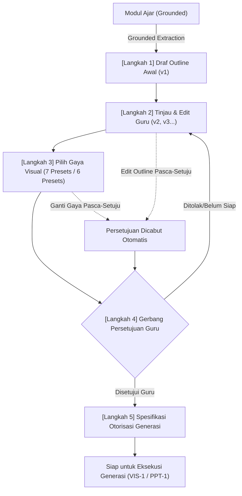

# Walkthrough Kemajuan Sistem AI GuruPro (AI-0 s/d GEN-0)

Dokumen ini menyajikan rincian lengkap mengenai seluruh arsitektur, kontrak kanonikal, keamanan kunci jawaban, pipeline pembuatan konteks grounding, mesin generasi butir soal, gerbang kendali mutu semantik berbasis AI, alur tinjauan/penyuntingan guru, fondasi publikasi bank soal, stabilisasi integritas skema (AI-4F-A.1), dan **fondasi perencanaan generasi (GEN-0 — Generation Planning Foundation)** pada sistem AI GuruPro.

---

## 1. Ringkasan Status & Evaluasi Kesiapan

| Tahapan AI | Deskripsi & Cakupan | Status | Kesiapan ke Tahap Berikutnya |
| :--- | :--- | :---: | :---: |
| **AI-0** | Fondasi Keamanan Server-Side, Otorisasi Guru Terverifikasi, Isolasi Multi-Tenant, Ingestion Dokumen, Hash SHA-256, Chunking Deterministik, dan Taksonomi Galat Terpadu | **SELESAI** | Lulus Verifikasi (42/42 Tests) |
| **AI-1** | Ekstraksi Sumber Nyata (PDF, DOCX, TXT, HTML), Normalisasi Deterministik, Golden Retrieval Dataset, Penguatan Grounding Anti-Halusinasi, dan Deteksi Kueri Negatif | **SELESAI** | Lulus Verifikasi (35/35 & 14/14 Tests) |
| **AI-2A** | Kontrak Kanonikal Modul Ajar, Skema Keluaran Zod (Kurikulum Merdeka Fase A–F), Invarian Anti-Promosi NOT_FOUND, Skema Database `ai_metadata JSONB`, dan Kompatibilitas PDF Exporter | **SELESAI** | Lulus Verifikasi (16/16 Tests) |
| **AI-2B** | *Grounded Context Builder Pipeline*, Resolusi Multi-Sumber, Deduplikasi Chunks, Peringkat Deterministik, Anggaran Konteks (Max 10 Chunks/3000 Kata), Evaluasi Ketercakupan 4 Bagian, Deteksi Konflik Sumber, dan Sanitasi Prompt Anti-Injection | **SELESAI** | Lulus Verifikasi (25/25 Tests) |
| **AI-2C** | *Real AI Modul Ajar Generation Engine*, Gateway/Model AI Eksternal (Lovable / Gemini / OpenAI), Hierarki Instruksi Ketat, Retry Terbatas, Validasi Bukti Pasca-Generasi, dan Draf Modul Aman | **SELESAI** | Lulus Verifikasi (31/31 Tests) |
| **AI-2D** | *AI Output Grounding & Quality Validation* (Evaluasi Mutu Semantik Deterministik, Deteksi Klaim/Angka Palsu, Rasio Cakupan Bukti, Koherensi Pedagogis, Bounded Semantic Correction Retry) | **SELESAI** | Lulus Verifikasi (28/28 Tests) |
| **AI-3A** | *Real Modul Ajar UI Integration & Generation Flow* (Integrasi UI Modul Ajar dengan Server Generation Pipeline, Mesin Status 6-Tahap, 5 Opsi Sumber Materi, Kontrak Persistensi DB, Penanda Mutu Visual & Provenance) | **SELESAI** | Lulus Verifikasi (14/14 Tests) |
| **AI-3B** | *Modul Ajar Draft Refinement & Teacher Review Flow* (Penyuntingan Terstruktur Multi-Tab, Kardinalitas Minimal, Preservasi Provenance AI, Anti-Fake-Validation, Concurrency & Ownership Guards, Strict Draft Invariant, Dirty State UX) | **SELESAI** | Lulus Verifikasi (14/14 Tests) |
| **AI-3C** | *Modul Ajar Publish Workflow* (Alur Publikasi Eksplisit Guru, Evaluasi Kelayakan Publikasi, Integrasi Bukti, Transisi Tunggal Draft ke Terbit, Penguncian Read-Only Pasca-Terbit, Dialog Konfirmasi, RLS Read-Access Siswa) | **SELESAI** | Lulus Verifikasi (20/20 Tests) |
| **AI-3D** | *Modul Ajar End-to-End Quality Gate* (Verifikasi Deterministik Seluruh Siklus Hidup Modul Ajar: 4 Alur Ingesti, Context, Generation, Quality Gate, Persistensi Draf, Review/Edit Guru, Publikasi, Akses Siswa Read-Only, Matriks Otorisasi 6 Peran, Anti-Halusinasi & Zero Fake Fallback) | **SELESAI** | Lulus Verifikasi (31/31 Tests) |
| **AI-4A** | *Canonical Question Contract & Grounding Foundation* (Audit Model Soal/Paket Nyata, Kontrak Kanonikal Zod Pilihan Ganda & Esai, Invarian Kerahasiaan Kunci Jawaban, Proyeksi Student-Safe, Evidence Binding & Anti-Promosi, Taksonomi Galat, Migrasi Database Paket Soal `ai_metadata JSONB`) | **SELESAI** | Lulus Verifikasi (24/24 Tests) |
| **AI-4B** | *Question Grounded Context Builder* (Jembatan Konteks Soal Deterministik, Aliran Query Faktual/Distractor/Prosedural, Preservasi Nilai Eksak, Deduplikasi & Ranking Stabil, Deteksi Konflik Lintas Sumber, Evaluasi Ketercakupan Bukti, Serialisasi XML Aman Injeksi, Server Function TanStack Start) | **SELESAI** | Lulus Verifikasi (28/28 Tests) |
| **AI-4C** | *Real AI Question Generation Engine* (Mesin Generasi Soal Sisi Server, Integrasi Gemini 2.5 Flash / Lovable AI Gateway, Central Prompt Registry `question_generator_grounded_v1`, Fail-Closed Anti-Hallucination Gate, Penegakan Jumlah Butir & Bounded Retry, Preservasi Nilai Eksak, Pemisahan Kunci Jawaban, Draf Persistensi `paket_soal`) | **SELESAI** | Lulus Verifikasi (28/28 Tests) |
| **AI-4D** | *Question Quality Validation* (Gerbang Kendali Mutu Semantik 3-Lapis: Hard Rules Deterministik, Evaluator Semantik LLM, Decision Engine Non-Numerik PASS/REVISE/REJECT, Bounded 1-Shot Correction Retry, Preservasi Nilai Eksak, Deteksi Duplikasi Jaccard, Invarian Persistensi Draf, Pemisahan Kunci Jawaban Siswa) | **SELESAI** | Lulus Verifikasi (30/30 Tests) |
| **AI-4E** | *Teacher Question Review / Edit / Save* (Antarmuka Peninjauan Draf Guru Terverifikasi, Penyuntingan Pilihan Ganda 4 Opsi Distinct & Kunci A-D, Penyuntingan Esai Rubrik >= 10 Chars, Preservasi Provenance AI & Temuan AI-4D, Pelacakan `teacherEdited` Tingkat Soal & Paket, Strict Draft Invariant, Concurrency Protection `expectedUpdatedAt`, Mesin Status Dirty/Saving/Saved/Error, Isolasi Keamanan Siswa `toStudentSafeQuestion`) | **SELESAI** | Lulus Verifikasi (26/26 Tests) |
| **AI-4F-A** | *Question Bank Publish Foundation* (Kontrak Kanonikal Kelayakan Publikasi Server-Side, Transisi Atomik Status Draft ke Terbit, Penegakan Otorisasi Guru Terverifikasi & Kepemilikan Tenant, Invarian Anti-Reject AI-4D, Integritas Grounding & Anti-Dangling, Proteksi Double-Publish & Arsip, Preservasi Provenance Audit `publishedAt` & `publishedBy`, Segregasi Kunci Jawaban `StudentSafeQuestion`) | **SELESAI** | Lulus Verifikasi (23/23 Tests) |
| **AI-4F-A.1** | *Environment, Schema & Publish Integrity Stabilization* (Rekonsiliasi Drift Skema Supabase, Perbaikan Tipe ID Snapshot TEXT PK, Two-Tier Snapshot Storage L1+L2, Eliminasi Silent Delete Metadata, Penutupan Bypass Klien Publikasi, Trigger Database Guard Transisi Terbit, Perbaikan TS Store & Route, 10 Cek Dedicated) | **SELESAI** | Lulus Verifikasi (10/10 Tests) |
| **GEN-0** | *Generation Planning Foundation* (Fondasi Perencanaan Bersama Ilustrasi & PPT AI, Kontrak Kanonikal Outline, 5-Langkah Siklus Hidup, 7 Preset Gaya Ilustrasi, 6 Preset Gaya PPT, Gerbang Persetujuan Guru, Kebijakan Pembatalan Otomatis, Spesifikasi Otorisasi, UI Panel Modul Editor Tab 4 & 5, Invarian Non-Generasi & Nol Biaya) | **SELESAI** | Lulus Verifikasi (36/36 Tests) |
| **VIS-1A** | *Illustration Generation Contract & Request Builder* (Kontrak Kanonikal Provider-Independent, Parameter Generasi, Text-in-Image Policy Tanpa Invented Text, Prompt Assembler Deterministik & Sanitasi Injeksi, Gerbang Validasi Ulang Persetujuan Server-Side, Migrasi DB `illustration_generation_requests`, Server Function TanStack Start, UI Inspeksi Pre-Generation, Invarian Non-Generasi) | **SELESAI** | **LULUS VERIFIKASI (32/32 TESTS, 37/37 SUITES 100% PASS)** |
| **Tahap Berikutnya** | VIS-1B: Real AI Image Generation Execution / PPT-1: AI PPT Generation | **MENUNGGU** | Berhenti Sesuai Perintah Khusus (Strict Stop — Non-Generation Invariant) |

> [!IMPORTANT]
> **Status Kelulusan Tahap VIS-1A**:
> **`VIS-1A ILLUSTRATION GENERATION CONTRACT & REQUEST BUILDER COMPLETE — ALL 37 TEST SUITES PASSING (0 REGRESSIONS)`**
> 
> Tahap persiapan permintaan generasi ilustrasi AI telah diselesaikan dan terverifikasi secara penuh:
> 1. Kontrak kanonikal independen-penyedia (`IllustrationGenerationParameters`, `IllustrationTextPolicy`, `AssembledIllustrationPrompt`, `IllustrationGenerationRequest`, `IllustrationGenerationResult`).
> 2. Penegakan ketat kebijakan teks gambar: model dilarang membuat teks karangan sendiri (`allowModelInventedText: false`) dan hanya merender label teks wajib dari outline.
> 3. Perakit prompt deterministik dan pertahanan anti-injeksi: sanitasi kata kunci pembelokan instruksi (`ignore previous instructions`, `SYSTEM:`) dan tag skrip.
> 4. Validasi ulang persetujuan sisi server: menolak rencana tidak disetujui, rencana berstatus kedaluwarsa (`approvedVersion !== currentVersion`), outline/gaya yang diubah pasca-persetujuan, rencana presentasi, atau guru non-pemilik.
> 5. Tabel database `public.illustration_generation_requests` lengkap dengan kebijakan keamanan tingkat baris (RLS).
> 6. Server functions TanStack Start (`prepareIllustrationGenerationRequestServerFn`, `getIllustrationGenerationRequestServerFn`) terintegrasi pada store klien dan UI panel Langkah 5.
> 7. Seluruh 37 test suites sistem (termasuk 32 skenario baru pada `illustration-generation-contract.test.mjs`) lulus 100%, kompilasi build produksi bersih tanpa galat, dan **tidak ada pemanggilan API generator gambar eksternal**.

---

## 2. Rincian Implementasi GEN-0 (Generation Planning Foundation)



### 2.1 Berkas Baru & Modifikasi
1. **`src/lib/ai/generation-planning-contract.ts`**: Kontrak kanonikal Zod (`IllustrationOutline`, `PresentationOutline`, `GenerationStyle`, `GenerationPlan`, `GenerationPlanVersion`, `GenerationSpecification`), 7 preset gaya ilustrasi, 6 preset gaya presentasi, validasi kontinuitas urutan slide 1..N.
2. **`src/lib/ai/generation-planning-service.ts`**: Ekstraksi outline ter-grounding dari Modul Ajar tanpa API berbiaya, manipulasi slide (add, remove, reorder, update), siklus hidup versi (v1 -> v2), gerbang persetujuan dan pencabutan otomatis.
3. **`supabase/migrations/20260929110000_generation_planning_foundation.sql`**: Tabel `generation_styles`, `generation_plans`, `generation_plan_versions` lengkap dengan RLS isolasi guru dan indeks unik.
4. **`src/lib/generation-planning.functions.ts`**: TanStack Start server functions aman (`createGenerationPlanServerFn`, `getGenerationPlanServerFn`, `updateGenerationPlanServerFn`, `selectPlanStyleServerFn`, `approveGenerationPlanServerFn`, `revokeApprovalServerFn`, `listAvailableStylesServerFn`, `getGenerationSpecificationServerFn`).
5. **`src/lib/generation-planning-store.ts`**: Client React hook `useGenerationPlan` reaktif.
6. **`src/components/generation-planning-panel.tsx`**: Komponen UI interaktif `IllustrationPlanningPanel` dan `PresentationPlanningPanel`.
7. **`src/components/modul-editor.tsx`**: Pemasangan panel perencanaan di Tab 4 (Ilustrasi) dan Tab 5 (PPT) dengan fitur lama tetap berfungsi.
8. **`tests/ai/generation-planning-foundation.test.mjs`**: 36 skenario pengujian komprehensif.
9. **`docs/GEN-0-GENERATION-PLANNING-FOUNDATION.md`**: Dokumentasi teknis & arsitektur lengkap.

---

## 3. Hasil Pengujian & Verifikasi

### 3.1 Suite Pengujian Khusus GEN-0 (`generation-planning-foundation.test.mjs`)
Dijalankan melalui `npx tsx tests/ai/generation-planning-foundation.test.mjs`:

```text
================================================================================
  GURUPRO TEST SUITE: GEN-0 GENERATION PLANNING FOUNDATION                      
================================================================================

--- Section 1: Illustration Outline Contract Validation ---
  • Valid illustration outline passes validation ... ✓ PASS
  • Rejects illustration outline with empty or short title ... ✓ PASS
  • Rejects illustration outline with missing mainSubject ... ✓ PASS
  • Rejects illustration outline with short objective (< 5 chars) ... ✓ PASS

--- Section 2: Presentation Outline & Slide Contract Validation ---
  • Valid presentation outline passes validation ... ✓ PASS
  • Rejects presentation outline with 0 slides ... ✓ PASS
  • Rejects presentation outline with non-continuous slide numbers ... ✓ PASS
  • Rejects slide with empty key points ... ✓ PASS

--- Section 3: Slide Manipulation Operations ---
  • addSlideToPresentationOutline appends slide with sequential order ... ✓ PASS
  • removeSlideFromPresentationOutline removes slide and reindexes remaining slides ... ✓ PASS
  • removeSlideFromPresentationOutline fails when trying to remove the only slide ... ✓ PASS
  • reorderSlidesInPresentationOutline reorders slides and enforces continuous 1..N order ... ✓ PASS
  • reorderSlidesInPresentationOutline rejects mismatched slide IDs ... ✓ PASS
  • updateSlideInPresentationOutline updates properties of target slide ... ✓ PASS

--- Section 4: Style System & Presets Invariants ---
  • Illustration style catalog contains exactly 7 predefined presets ... ✓ PASS
  • Presentation style catalog contains exactly 6 predefined presets ... ✓ PASS
  • getStyleById retrieves style or returns undefined for unknown ID ... ✓ PASS

--- Section 5: Grounded Initial Plan Generation ---
  • generateInitialIllustrationOutline grounds on specific section and modul metadata ... ✓ PASS
  • generateInitialPresentationOutline generates grounded slide sequence for whole modul ... ✓ PASS
  • createInitialPlan initializes valid plan with initial version 1 and ready status ... ✓ PASS
  • createInitialPlan rejects invalid outline ... ✓ PASS

--- Section 6: Version Lifecycle & Immutable Snapshots ---
  • applyOutlineEdits increments version from v1 to v2 with immutable snapshot ... ✓ PASS
  • applyOutlineEdits rejects non-owner teacher ... ✓ PASS

--- Section 7: Approval Gate & State Machine ---
  • applyPlanApproval transitions plan to approved and locks approvedVersion ... ✓ PASS
  • applyPlanApproval fails if style is not selected or invalid ... ✓ PASS
  • applyPlanApproval fails if caller is not the owner teacher ... ✓ PASS
  • applyPlanApproval fails if caller is student ... ✓ PASS
  • applyPlanApprovalRevocation unlocks approved plan back to ready ... ✓ PASS

--- Section 8: Automatic Approval Invalidation Policy ---
  • Editing outline on approved plan automatically revokes approval (status -> ready) ... ✓ PASS
  • Changing visual style on approved plan automatically revokes approval ... ✓ PASS
  • Selecting invalid style ID or mismatched target type is rejected ... ✓ PASS

--- Section 9: Generation Authorization & Consumable Specification ---
  • createGenerationSpecification succeeds for fully approved current plan ... ✓ PASS
  • createGenerationSpecification creates valid 16:9 presentation spec ... ✓ PASS
  • createGenerationSpecification fails if plan is not in approved status ... ✓ PASS
  • createGenerationSpecification fails if approvedVersion is stale (stale approval invariant) ... ✓ PASS

--- Section 10: Non-Generation & Cost-Control Invariant ---
  • Planning, editing, and authorization execute strictly without external image/PPT APIs ... ✓ PASS

================================================================================
  GEN-0 TEST SUMMARY: 36 PASSED, 0 FAILED
================================================================================
```

### 3.2 Eksekusi Penuh Seluruh Suite Pengujian Sistem (`npm test`)
Seluruh 36 test suites sistem dieksekusi secara otomatis dan lulus 100%:
- Keamanan & Remediasi: `security.test.mjs`, `remediation.test.mjs` (LULUS)
- Peran & Otorisasi: `auth-role.test.mjs`, `dashboard-roles.test.mjs`, `admin-operations.test.mjs` (LULUS)
- Domain Inti: `kelas-membership.test.mjs`, `mapel-kelas-sync.test.mjs`, `tahun-ajaran-context.test.mjs`, `penugasan.test.mjs`, `kkm-remedial.test.mjs`, `submission.test.mjs`, `penilaian.test.mjs`, `rekap-nilai.test.mjs`, `persistence-integrity.test.mjs`, `export-archive.test.mjs`, `core-system-gate.test.mjs` (LULUS)
- AI Grounding & Fondasi: `ai-foundation.test.mjs`, `ai-retrieval-validation.test.mjs`, `ai-final-gate.test.mjs` (LULUS)
- Pipeline Modul Ajar AI: `modul-generation-contract.test.mjs`, `modul-grounding-context.test.mjs`, `modul-ai-generation.test.mjs`, `modul-quality-validation.test.mjs`, `modul-ui-flow.test.mjs`, `modul-teacher-review.test.mjs`, `modul-publish-workflow.test.mjs`, `modul-e2e-quality-gate.test.mjs` (LULUS)
- Pipeline Paket Soal AI: `question-contract.test.mjs`, `question-grounding-context.test.mjs`, `question-generation.test.mjs`, `question-quality-validation.test.mjs`, `question-teacher-review.test.mjs`, `question-bank-publishing.test.mjs`, `publish-integrity-stabilization.test.mjs` (LULUS)
- **Fondasi Perencanaan Generasi GEN-0: `generation-planning-foundation.test.mjs` (36/36 LULUS)**

### 3.3 Kompilasi Build Produksi (`npx vite build`)
- Berhasil mengompilasi bundel klien dan SSR TanStack Start/Nitro tanpa galat dalam durasi 729ms.

---

## 4. Batasan & Kepatuhan Prosedural

Sesuai instruksi khusus:
- Pekerjaan dibatasi secara ketat hanya pada **GEN-0 — Generation Planning Foundation**.
- **Generasi gambar AI nyata (VIS-1) dan generasi berkas PPTX nyata (PPT-1) TIDAK DIIMPLEMENTASIKAN** pada tahap ini.
- Sistem berhenti di sini untuk peninjauan dan persetujuan pengguna sebelum melangkah ke tahap selanjutnya.
