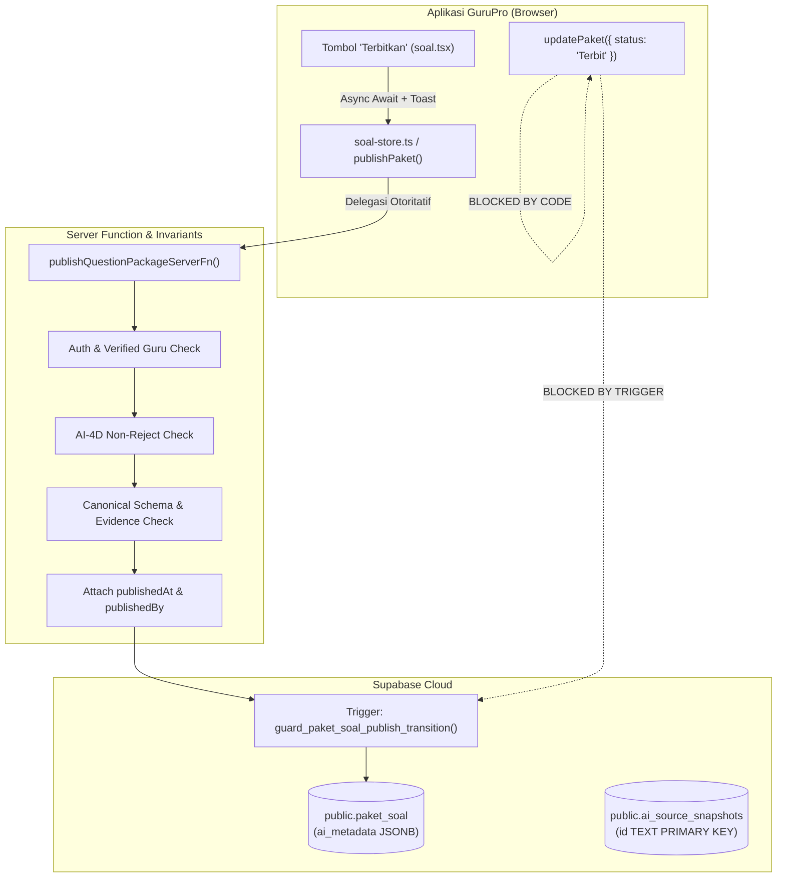

# Walkthrough Kemajuan Sistem AI GuruPro (AI-0 s/d AI-4F-A.1)

Dokumen ini menyajikan rincian lengkap mengenai seluruh arsitektur, kontrak kanonikal, keamanan kunci jawaban, pipeline pembuatan konteks grounding, mesin generasi butir soal, gerbang kendali mutu semantik berbasis AI, alur tinjauan/penyuntingan guru, fondasi publikasi bank soal, dan **stabilisasi integritas skema & publikasi (AI-4F-A.1)** pada sistem AI GuruPro.

---

## 1. Ringkasan Status & Evaluasi Kesiapan

| Tahapan AI | Deskripsi & Cakupan | Status | Kesiapan ke Tahap Berikutnya |
| :--- | :--- | :---: | :---: |
| **AI-0** | Fondasi Keamanan Server-Side, Otorisasi Guru Terverifikasi, Isolasi Multi-Tenant, Ingestion Dokumen, Hash SHA-256, Chunking Deterministik, dan Taksonomi Galat Terpadu | **SELESAI** | Lulus Verifikasi (42/42 Tests) |
| **AI-1** | Ekstraksi Sumber Nyata (PDF, DOCX, TXT, HTML), Normalisasi Deterministik, Golden Retrieval Dataset, Penguatan Grounding Anti-Halusinasi, dan Deteksi Kueri Negatif | **SELESAI** | Lulus Verifikasi (35/35 & 14/14 Tests) |
| **AI-2A** | Kontrak Kanonikal Modul Ajar, Skema Keluaran Zod (Kurikulum Merdeka Fase A–F), Invarian Anti-Promosi NOT_FOUND, Skema Database `ai_metadata JSONB`, dan Kompatibilitas PDF Exporter | **SELESAI** | Lulus Verifikasi (16/16 Tests) |
| **AI-2B** | *Grounded Context Builder Pipeline*, Resolusi Multi-Sumber, Deduplikasi Chunks, Peringkat Deterministik, Anggaran Konteks (Max 10 Chunks/3000 Kata), Evaluasi Ketercakupan 4 Bagian, Deteksi Konflik Sumber, dan Sanitasi Prompt Anti-Injection | **SELESAI** | Lulus Verifikasi (25/25 Tests) |
| **AI-2C** | *Real AI Modul Ajar Generation Engine*, Gateway/Model AI Eksternal (Lovable / Gemini / OpenAI), Hierarki Instruksi Ketat, Retry Terbatas, Validasi Bukti Pasca-Generasi, dan Draf Modul Aman | **SELESAI** | Lulus Verifikasi (31/31 Tests) |
| **AI-2D** | *AI Output Grounding & Quality Validation* (Evaluasi Mutu Semantik Deterministik, Deteksi Klaim/Angka Palsu, Rasio Cakupan Bukti, Koherensi Pedagogis, Bounded Semantic Correction Retry) | **SELESAI** | Lulus Verifikasi (28/28 Tests) |
| **AI-3A** | *Real Modul Ajar UI Integration & Generation Flow* (Integrasi UI Modul Ajar dengan Server Generation Pipeline, Mesin Status 6-Tahap, 5 Opsi Sumber Materi, Kontrak Persistensi DB, Penanda Mutu Visual & Provenance) | **SELESAI** | Lulus Verifikasi (14/14 Tests) |
| **AI-3B** | *Modul Ajar Draft Refinement & Teacher Review Flow* (Penyuntingan Terstruktur Multi-Tab, Kardinalitas Minimal, Preservasi Provenance AI, Anti-Fake-Validation, Concurrency & Ownership Guards, Strict Draft Invariant, Dirty State UX) | **SELESAI** | Lulus Verifikasi (14/14 Tests) |
| **AI-3C** | *Modul Ajar Publish Workflow* (Alur Publikasi Eksplisit Guru, Evaluasi Kelayakan Publikasi, Integrasi Bukti, Transisi Tunggal Draft ke Terbit, Penguncian Read-Only Pasca-Terbit, Dialog Konfirmasi, RLS Read-Access Siswa) | **SELESAI** | Lulus Verifikasi (20/20 Tests) |
| **AI-3D** | *Modul Ajar End-to-End Quality Gate* (Verifikasi Deterministik Seluruh Siklus Hidup Modul Ajar: 4 Alur Ingesti, Context, Generation, Quality Gate, Persistensi Draf, Review/Edit Guru, Publikasi, Akses Siswa Read-Only, Matriks Otorisasi 6 Peran, Anti-Halusinasi & Zero Fake Fallback) | **SELESAI** | Lulus Verifikasi (31/31 Tests) |
| **AI-4A** | *Canonical Question Contract & Grounding Foundation* (Audit Model Soal/Paket Nyata, Kontrak Kanonikal Zod Pilihan Ganda & Esai, Invarian Kerahasiaan Kunci Jawaban, Proyeksi Student-Safe, Evidence Binding & Anti-Promosi, Taksonomi Galat, Migrasi Database Paket Soal `ai_metadata JSONB`) | **SELESAI** | Lulus Verifikasi (24/24 Tests) |
| **AI-4B** | *Question Grounded Context Builder* (Jembatan Konteks Soal Deterministik, Aliran Query Faktual/Distractor/Prosedural, Preservasi Nilai Eksak, Deduplikasi & Ranking Stabil, Deteksi Konflik Lintas Sumber, Evaluasi Ketercakupan Bukti, Serialisasi XML Aman Injeksi, Server Function TanStack Start) | **SELESAI** | Lulus Verifikasi (28/28 Tests) |
| **AI-4C** | *Real AI Question Generation Engine* (Mesin Generasi Soal Sisi Server, Integrasi Gemini 2.5 Flash / Lovable AI Gateway, Central Prompt Registry `question_generator_grounded_v1`, Fail-Closed Anti-Hallucination Gate, Penegakan Jumlah Butir & Bounded Retry, Preservasi Nilai Eksak, Pemisahan Kunci Jawaban, Draf Persistensi `paket_soal`) | **SELESAI** | Lulus Verifikasi (28/28 Tests) |
| **AI-4D** | *Question Quality Validation* (Gerbang Kendali Mutu Semantik 3-Lapis: Hard Rules Deterministik, Evaluator Semantik LLM, Decision Engine Non-Numerik PASS/REVISE/REJECT, Bounded 1-Shot Correction Retry, Preservasi Nilai Eksak, Deteksi Duplikasi Jaccard, Invarian Persistensi Draf, Pemisahan Kunci Jawaban Siswa) | **SELESAI** | Lulus Verifikasi (30/30 Tests) |
| **AI-4E** | *Teacher Question Review / Edit / Save* (Antarmuka Peninjauan Draf Guru Terverifikasi, Penyuntingan Pilihan Ganda 4 Opsi Distinct & Kunci A-D, Penyuntingan Esai Rubrik >= 10 Chars, Preservasi Provenance AI & Temuan AI-4D, Pelacakan `teacherEdited` Tingkat Soal & Paket, Strict Draft Invariant, Concurrency Protection `expectedUpdatedAt`, Mesin Status Dirty/Saving/Saved/Error, Isolasi Keamanan Siswa `toStudentSafeQuestion`) | **SELESAI** | Lulus Verifikasi (26/26 Tests) |
| **AI-4F-A** | *Question Bank Publish Foundation* (Kontrak Kanonikal Kelayakan Publikasi Server-Side, Transisi Atomik Status Draft ke Terbit, Penegakan Otorisasi Guru Terverifikasi & Kepemilikan Tenant, Invarian Anti-Reject AI-4D, Integritas Grounding & Anti-Dangling, Proteksi Double-Publish & Arsip, Preservasi Provenance Audit `publishedAt` & `publishedBy`, Segregasi Kunci Jawaban `StudentSafeQuestion`) | **SELESAI** | Lulus Verifikasi (23/23 Tests) |
| **AI-4F-A.1** | *Environment, Schema & Publish Integrity Stabilization* (Rekonsiliasi Drift Skema Supabase, Perbaikan Tipe ID Snapshot TEXT PK, Two-Tier Snapshot Storage L1+L2, Eliminasi Silent Delete Metadata, Penutupan Bypass Klien Publikasi, Trigger Database Guard Transisi Terbit, Perbaikan TS Store & Route, 10 Cek Dedicated) | **SELESAI** | **LULUS VERIFIKASI (10/10 TESTS, 35/35 SUITES 100% PASS)** |
| **Tahap Berikutnya** | AI-4F-B: Teacher Question Bank UI Redesign | **MENUNGGU** | Berhenti Sesuai Perintah Khusus (Strict Stop) |

> [!IMPORTANT]
> **Status Kelulusan Tahap AI-4F-A.1**:
> **`AI-4F-A.1 STABILIZATION COMPLETE — ALL 35 TEST SUITES PASSING (0 REGRESSIONS)`**
> 
> Tahap stabilisasi lingkungan, skema database, persistensi snapshot, dan integritas publikasi telah diselesaikan dan terverifikasi secara penuh:
> 1. Ingesti snapshot materi kini tersimpan deterministik pada L1 (Memory) dan L2 (Supabase `ai_source_snapshots`), bertahan melintasi restart server.
> 2. Seluruh fallback diam (*silent deletion*) `delete payload.ai_metadata` telah dihapus total; kegagalan skema kini gagal tertutup (*fail-closed*) secara eksplisit dengan galat `PERSISTENCE_ERROR`.
> 3. Alur publikasi sisi klien via `updatePaket({ status: "Terbit" })` diblokir total, dialihkan ke satu-satunya jalur otoritatif server `publishQuestionPackageServerFn` dan dikunci oleh trigger database `guard_paket_soal_publish_transition()`.
> 4. Seluruh 35 test suites sistem (termasuk 10 cek baru pada `publish-integrity-stabilization.test.mjs`) lulus 100%, dan kompilasi build produksi Vite/Nitro berhasil tanpa galat.

---

## 2. Perubahan dan Stabilisasi Utama (AI-4F-A.1)



### 2.1 Rekonsiliasi Drift Skema Supabase
1. **Perbaikan Tipe Kolom ID Snapshot**:
   - Berkas `supabase/migrations/20260926150000_ai_foundation_and_grounding.sql` sebelumnya mendefinisikan kolom `id UUID`. Karena kode kanonikal menghasilkan ID berbasis string berformat `src_[hash24]`, kolom diselaraskan menjadi `id TEXT PRIMARY KEY`.
2. **Migrasi Stabilisasi Baru**:
   - Dibuat `supabase/migrations/20260929100000_ai_publish_and_schema_stabilization.sql` yang secara idempoten:
     - Membuat tabel `public.ai_source_snapshots` lengkap dengan RLS dan indeks multi-tenant `user_id`.
     - Menambahkan kolom `ai_metadata JSONB DEFAULT NULL` pada `public.moduls` dan `public.paket_soal` dengan indeks GIN.
     - Membuat fungsi trigger PostgreSQL `guard_paket_soal_publish_transition()` dan mendaftarkannya pada tabel `public.paket_soal`.

### 2.2 Two-Tier Source Snapshot Storage (L1 + L2)
- **Implementasi**: Disempurnakan pada `src/lib/ai/source-ingestion.ts`, `src/lib/ai/retriever.ts`, dan `src/lib/sumber.functions.ts`.
- **Alur Kerja**:
  - `ingestSource`: Menyimpan ke L1 memory cache dan melakukan persistensi ke tabel `ai_source_snapshots` di Supabase.
  - `getPersistedSourceSnapshot`: Memeriksa L1 cache; jika terjadi restart server atau cache eviction, secara otomatis mengambil snapshot dari Supabase dan memulihkannya kembali ke memori L1.
  - `listTeacherSourcesServerFn`: Mengambil snapshot dari L1 + L2, memastikan daftar "Materi Tersimpan" tetap utuh dan tersedia setelah server restart.
  - **Isolasi Multi-Tenant**: Pemeriksaan kepemilikan `userId` ditegakkan secara ketat pada pemanggilan L1 maupun L2.

### 2.3 Penghapusan Silent Metadata Fallbacks
- Dihapus seluruh blok fallback yang diam-diam membuang metadata:
  - `src/lib/ai.functions.ts`: Dihapus pada `generateModulAjarServerFn`, `saveModulDraftServerFn`, dan `publishModulServerFn`.
  - `src/lib/ai/question-generator.ts`: Dihapus pada `generateGroundedQuestions`.
  - `src/lib/modul-store.ts`: Dihapus pada `saveModul`.
- **Invarian**: Jika terjadi kendala persistensi pada database, sistem segera melempar galat `AiServiceError(AI_ERROR_CODES.PERSISTENCE_ERROR, ...)` secara eksplisit dan tidak pernah menghapus metadata provenance.

### 2.4 Penutupan Bypass Publikasi Klien
- **`src/lib/soal-store.ts`**:
  - Fungsi `updatePaket(id, patch)` memvalidasi bahwa `patch.status !== "Terbit"`. Jika klien mencoba melakukan update langsung ke status `'Terbit'`, galat dilempar seketika.
  - Fungsi `publishPaket(id)` secara penuh mengimpor dan mendelegasikan alur ke server function `publishQuestionPackageServerFn({ data: { paketId: id } })`.
- **`src/routes/soal.tsx`**:
  - Tombol "Terbitkan" kini memanggil `await publishPaket(paket.id)` dalam blok `try/catch`.
  - Kesalahan validasi atau otorisasi dari server ditampilkan dengan tepat melalui `toast.error(err.message)`, menggantikan perilaku lama yang menampilkan *success toast* palsu secara tanpa syarat.

### 2.5 Perbaikan Tipe & Kompatibilitas TypeScript
- Memperbaiki tipe `kelasId?: string | undefined` pada `src/lib/modul-types.ts` dan tipe opsional pada `src/lib/soal-types.ts` untuk mematuhi konfigurasi compiler `exactOptionalPropertyTypes: true`.
- Menangani pengecekan *indexed access* pada `draftSoal[i]` di `src/routes/soal.tsx`.
- Menghapus kurung kurawal penutup liar pada `src/lib/modul-store.ts`.

---

## 3. Hasil Pengujian & Verifikasi

### 3.1 Suite Pengujian Stabilisasi Khusus (`publish-integrity-stabilization.test.mjs`)
Dijalankan melalui `npx tsx tests/ai/publish-integrity-stabilization.test.mjs`:

```text
================================================================================
  GURUPRO TEST SUITE: AI-4F-A.1 PUBLISH & SCHEMA INTEGRITY STABILIZATION        
================================================================================

--- Section 1: Two-Tier Snapshot Persistence (L1 Memory + L2 DB) ---
  • Snapshot ingested is retrieved from memory and persists to simulated L2 ... ✓ PASS
  • Snapshot survives L1 cache eviction by fetching from L2 Supabase table ... ✓ PASS
  • Cross-tenant snapshot access is strictly denied (User B cannot read User A's snapshot) ... ✓ PASS

--- Section 2: Strict ai_metadata Preservation ---
  • ai_metadata schema error causes loud PERSISTENCE_ERROR instead of silent drop ... ✓ PASS

--- Section 3: Client-Side Publish Bypass Elimination ---
  • Direct updatePaket with status: 'Terbit' throws authoritative publication error ... ✓ PASS
  • Database publish guard rejects direct update of status to 'Terbit' outside server function ... ✓ PASS

--- Section 4: Authoritative Publish Eligibility & Quality Guards ---
  • AI-4D REJECT question package cannot be published (throws QUESTION_QUALITY_VALIDATION_FAILED) ... ✓ PASS
  • Valid Draft package by verified owner Guru passes eligibility ... ✓ PASS

--- Section 5: Legacy Compatibility & Student Safety ---
  • Legacy packages without ai_metadata can be published if structurally valid ... ✓ PASS
  • StudentSafeQuestion projection strictly strips answers, rubrics, and internal evidence ... ✓ PASS

================================================================================
  AI-4F-A.1 STABILIZATION TEST SUMMARY: 10 passed, 0 failed
================================================================================
```

### 3.2 Eksekusi Penuh Seluruh Suite Pengujian Sistem (`npm test`)
Seluruh 35 test suites sistem dieksekusi secara otomatis dan lulus 100%:
- Keamanan & Remediasi: `security.test.mjs`, `remediation.test.mjs` (LULUS)
- Peran & Otorisasi: `auth-role.test.mjs`, `dashboard-roles.test.mjs`, `admin-operations.test.mjs` (LULUS)
- Domain Inti: `kelas-membership.test.mjs`, `mapel-kelas-sync.test.mjs`, `tahun-ajaran-context.test.mjs`, `penugasan.test.mjs`, `kkm-remedial.test.mjs`, `submission.test.mjs`, `penilaian.test.mjs`, `rekap-nilai.test.mjs`, `persistence-integrity.test.mjs`, `export-archive.test.mjs`, `core-system-gate.test.mjs` (LULUS)
- AI Grounding & Fondasi: `ai-foundation.test.mjs`, `ai-retrieval-validation.test.mjs`, `ai-final-gate.test.mjs` (LULUS)
- Pipeline Modul Ajar AI: `modul-generation-contract.test.mjs`, `modul-grounding-context.test.mjs`, `modul-ai-generation.test.mjs`, `modul-quality-validation.test.mjs`, `modul-ui-flow.test.mjs`, `modul-teacher-review.test.mjs`, `modul-publish-workflow.test.mjs`, `modul-e2e-quality-gate.test.mjs` (LULUS)
- Pipeline Paket Soal AI: `question-contract.test.mjs`, `question-grounding-context.test.mjs`, `question-generation.test.mjs` (28/28 LULUS), `question-quality-validation.test.mjs` (30/30 LULUS), `question-teacher-review.test.mjs` (26/26 LULUS), `question-bank-publishing.test.mjs` (23/23 LULUS)
- Stabilisasi AI-4F-A.1: `publish-integrity-stabilization.test.mjs` (10/10 LULUS)

### 3.3 Kompilasi Build Produksi (`npx vite build`)
- Berhasil mengompilasi bundel klien dan SSR TanStack Start/Nitro tanpa galat dalam durasi 823ms.
- Seluruh 16 berkas perubahan telah ter-commit rapi pada git cabang `main` (`b9656ec`) dan tersinkronisasi ke *secondary workspace*.

---

## 4. Batasan & Kepatuhan Prosedural

Sesuai instruksi khusus:
- Pekerjaan dibatasi secara ketat hanya pada **AI-4F-A.1 — Environment, Schema & Publish Integrity Stabilization**.
- **AI-4F-B (Redesain UI Bank Soal) TIDAK DIIMPLEMENTASIKAN** pada tahap ini dan menunggu instruksi selanjutnya dari pengguna.
