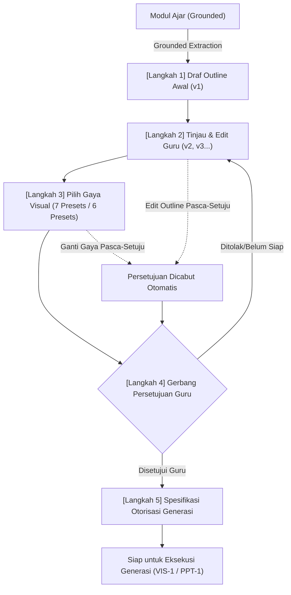
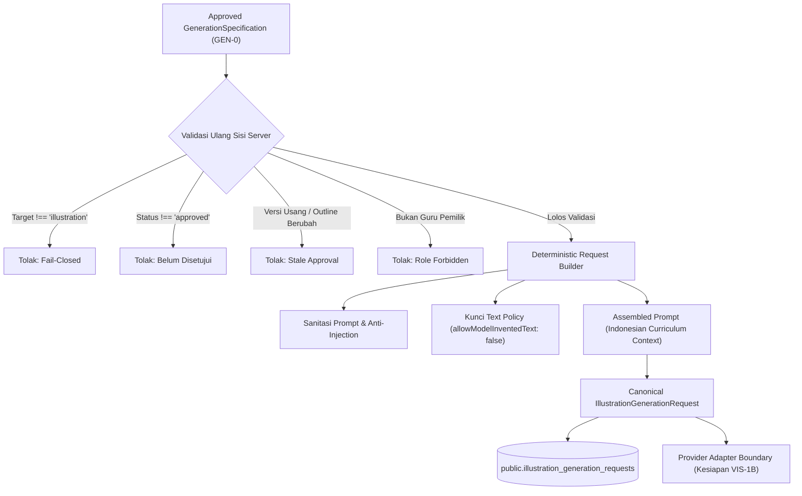
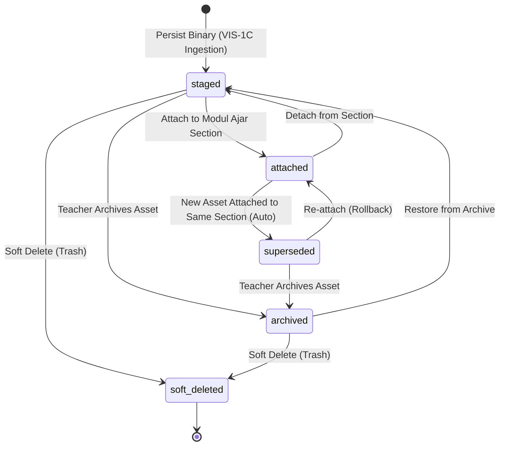
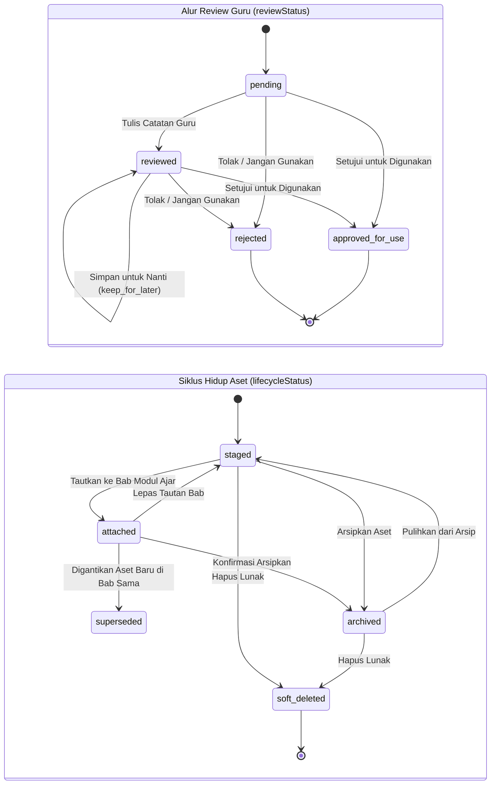
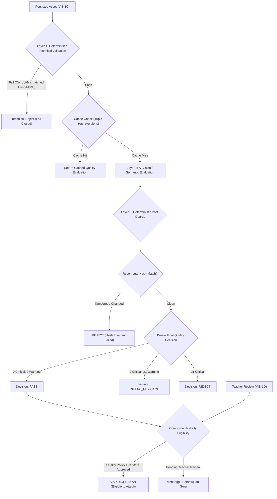

# Walkthrough Kemajuan Sistem AI GuruPro (AI-0 s/d GEN-0)

Dokumen ini menyajikan rincian lengkap mengenai seluruh arsitektur, kontrak kanonikal, keamanan kunci jawaban, pipeline pembuatan konteks grounding, mesin generasi butir soal, gerbang kendali mutu semantik berbasis AI, alur tinjauan/penyuntingan guru, fondasi publikasi bank soal, stabilisasi integritas skema (AI-4F-A.1), dan **fondasi perencanaan generasi (GEN-0 — Generation Planning Foundation)** pada sistem AI GuruPro.

---

## 1. Ringkasan Status & Evaluasi Kesiapan

| Tahapan AI | Deskripsi & Cakupan | Status | Kesiapan ke Tahap Berikutnya |
| :--- | :--- | :---: | :---: |
| **AI-0** | Fondasi Keamanan Server-Side, Otorisasi Guru Terverifikasi, Isolasi Multi-Tenant, Ingestion Dokumen, Hash SHA-256, Chunking Deterministik, dan Taksonomi Galat Terpadu | **SELESAI** | Lulus Verifikasi (42/42 Tests) |
| **AI-1** | Ekstraksi Sumber Nyata (PDF, DOCX, TXT, HTML), Normalisasi Deterministik, Golden Retrieval Dataset, Penguatan Grounding Anti-Halusinasi, dan Deteksi Kueri Negatif | **SELESAI** | Lulus Verifikasi (35/35 & 14/14 Tests) |
| **AI-2A** | Kontrak Kanonikal Modul Ajar, Skema Keluaran Zod (Kurikulum Merdeka Fase A–F), Invarian Anti-Promosi NOT_FOUND, Skema Database `ai_metadata JSONB`, dan Kompatibilitas PDF Exporter | **SELESAI** | Lulus Verifikasi (16/16 Tests) |
| **AI-2B** | *Grounded Context Builder Pipeline*, Resolusi Multi-Sumber, Deduplikasi Chunks, Peringkat Deterministik, Anggaran Konteks (Max 10 Chunks/3000 Kata), Evaluasi Ketercakupan 4 Bagian, Deteksi Konflik Sumber, dan Sanitasi Prompt Anti-Injection | **SELESAI** | Lulus Verifikasi (25/25 Tests) |
| **AI-2C** | *Real AI Modul Ajar Generation Engine*, Gateway/Model AI Eksternal (Lovable / Gemini / OpenAI), Hierarki Instruksi Ketat, Retry Terbatas, Validasi Bukti Pasca-Generasi, dan Draf Modul Aman | **SELESAI** | Lulus Verifikasi (31/31 Tests) |
| **AI-2D** | *AI Output Grounding & Quality Validation* (Evaluasi Mutu Semantik Deterministik, Deteksi Klaim/Angka Palsu, Rasio Cakupan Bukti, Koherensi Pedagogis, Bounded Semantic Correction Retry) | **SELESAI** | Lulus Verifikasi (28/28 Tests) |
| **AI-3A** | *Real Modul Ajar UI Integration & Generation Flow* (Integrasi UI Modul Ajar dengan Server Generation Pipeline, Mesin Status 6-Tahap, 5 Opsi Sumber Materi, Kontrak Persistensi DB, Penanda Mutu Visual & Provenance) | **SELESAI** | Lulus Verifikasi (14/14 Tests) |
| **AI-3B** | *Modul Ajar Draft Refinement & Teacher Review Flow* (Penyuntingan Terstruktur Multi-Tab, Kardinalitas Minimal, Preservasi Provenance AI, Anti-Fake-Validation, Concurrency & Ownership Guards, Strict Draft Invariant, Dirty State UX) | **SELESAI** | Lulus Verifikasi (14/14 Tests) |
| **AI-3C** | *Modul Ajar Publish Workflow* (Alur Publikasi Eksplisit Guru, Evaluasi Kelayakan Publikasi, Integrasi Bukti, Transisi Tunggal Draft ke Terbit, Penguncian Read-Only Pasca-Terbit, Dialog Konfirmasi, RLS Read-Access Siswa) | **SELESAI** | Lulus Verifikasi (20/20 Tests) |
| **AI-3D** | *Modul Ajar End-to-End Quality Gate* (Verifikasi Deterministik Seluruh Siklus Hidup Modul Ajar: 4 Alur Ingesti, Context, Generation, Quality Gate, Persistensi Draf, Review/Edit Guru, Publikasi, Akses Siswa Read-Only, Matriks Otorisasi 6 Peran, Anti-Halusinasi & Zero Fake Fallback) | **SELESAI** | Lulus Verifikasi (31/31 Tests) |
| **AI-4A** | *Canonical Question Contract & Grounding Foundation* (Audit Model Soal/Paket Nyata, Kontrak Kanonikal Zod Pilihan Ganda & Esai, Invarian Kerahasiaan Kunci Jawaban, Proyeksi Student-Safe, Evidence Binding & Anti-Promosi, Taksonomi Galat, Migrasi Database Paket Soal `ai_metadata JSONB`) | **SELESAI** | Lulus Verifikasi (24/24 Tests) |
| **AI-4B** | *Question Grounded Context Builder* (Jembatan Konteks Soal Deterministik, Aliran Query Faktual/Distractor/Prosedural, Preservasi Nilai Eksak, Deduplikasi & Ranking Stabil, Deteksi Konflik Lintas Sumber, Evaluasi Ketercakupan Bukti, Serialisasi XML Aman Injeksi, Server Function TanStack Start) | **SELESAI** | Lulus Verifikasi (28/28 Tests) |
| **AI-4C** | *Real AI Question Generation Engine* (Mesin Generasi Soal Sisi Server, Integrasi Gemini 2.5 Flash / Lovable AI Gateway, Central Prompt Registry `question_generator_grounded_v1`, Fail-Closed Anti-Hallucination Gate, Penegakan Jumlah Butir & Bounded Retry, Preservasi Nilai Eksak, Pemisahan Kunci Jawaban, Draf Persistensi `paket_soal`) | **SELESAI** | Lulus Verifikasi (28/28 Tests) |
| **AI-4D** | *Question Quality Validation* (Gerbang Kendali Mutu Semantik 3-Lapis: Hard Rules Deterministik, Evaluator Semantik LLM, Decision Engine Non-Numerik PASS/REVISE/REJECT, Bounded 1-Shot Correction Retry, Preservasi Nilai Eksak, Deteksi Duplikasi Jaccard, Invarian Persistensi Draf, Pemisahan Kunci Jawaban Siswa) | **SELESAI** | Lulus Verifikasi (30/30 Tests) |
| **AI-4E** | *Teacher Question Review / Edit / Save* (Antarmuka Peninjauan Draf Guru Terverifikasi, Penyuntingan Pilihan Ganda 4 Opsi Distinct & Kunci A-D, Penyuntingan Esai Rubrik >= 10 Chars, Preservasi Provenance AI & Temuan AI-4D, Pelacakan `teacherEdited` Tingkat Soal & Paket, Strict Draft Invariant, Concurrency Protection `expectedUpdatedAt`, Mesin Status Dirty/Saving/Saved/Error, Isolasi Keamanan Siswa `toStudentSafeQuestion`) | **SELESAI** | Lulus Verifikasi (26/26 Tests) |
| **AI-4F-A** | *Question Bank Publish Foundation* (Kontrak Kanonikal Kelayakan Publikasi Server-Side, Transisi Atomik Status Draft ke Terbit, Penegakan Otorisasi Guru Terverifikasi & Kepemilikan Tenant, Invarian Anti-Reject AI-4D, Integritas Grounding & Anti-Dangling, Proteksi Double-Publish & Arsip, Preservasi Provenance Audit `publishedAt` & `publishedBy`, Segregasi Kunci Jawaban `StudentSafeQuestion`) | **SELESAI** | Lulus Verifikasi (23/23 Tests) |
| **AI-4F-A.1** | *Environment, Schema & Publish Integrity Stabilization* (Rekonsiliasi Drift Skema Supabase, Perbaikan Tipe ID Snapshot TEXT PK, Two-Tier Snapshot Storage L1+L2, Eliminasi Silent Delete Metadata, Penutupan Bypass Klien Publikasi, Trigger Database Guard Transisi Terbit, Perbaikan TS Store & Route, 10 Cek Dedicated) | **SELESAI** | Lulus Verifikasi (10/10 Tests) |
| **GEN-0** | *Generation Planning Foundation* (Fondasi Perencanaan Bersama Ilustrasi & PPT AI, Kontrak Kanonikal Outline, 5-Langkah Siklus Hidup, 7 Preset Gaya Ilustrasi, 6 Preset Gaya PPT, Gerbang Persetujuan Guru, Kebijakan Pembatalan Otomatis, Spesifikasi Otorisasi, UI Panel Modul Editor Tab 4 & 5, Invarian Non-Generasi & Nol Biaya) | **SELESAI** | Lulus Verifikasi (36/36 Tests) |
| **VIS-1A** | *Illustration Generation Contract & Request Builder* (Kontrak Kanonikal Provider-Independent, Parameter Generasi, Text-in-Image Policy Tanpa Invented Text, Prompt Assembler Deterministik & Sanitasi Injeksi, Gerbang Validasi Ulang Persetujuan Server-Side, Migrasi DB `illustration_generation_requests`, Server Function TanStack Start, UI Inspeksi Pre-Generation, Invarian Non-Generasi) | **SELESAI** | Lulus Verifikasi (32/32 Tests) |
| **VIS-1B** | *Real AI Illustration Generation Engine* (Mesin Generasi Gambar AI Nyata, Provider Adapter OpenAI gpt-image-1-mini & Gemini, Invarian Strict Non-Fallback Tanpa Mock SVG, Validasi Header Binary PNG/JPEG/WebP & Aspek Rasio, Gerbang Validasi Ulang Persetujuan Server-Side, Cost Control & In-flight Locking, Idempotency Cache, Migrasi DB `illustration_generations`, UI Generasi Nyata) | **SELESAI** | Lulus Verifikasi (33/33 Tests, Live Test Verified) |
| **VIS-1C** | *Asset Persistence, Provenance & Lifecycle* (Ingesti Binary & Storage Supabase, Hash SHA-256 Deterministik, Kontrak Kanonikal `IllustrationAsset`, Preservasi Provenance Lengkap, Mesin Status Siklus Hidup `staged`→`attached`→`superseded`→`archived`→`soft_deleted`, Invarian Non-Destruktif Tanpa Hapus Data, Sinkronisasi Bab Modul Ajar `section.ilustrasi`, RBAC Multi-Tenant Guru, UI Asset Manager & History) | **SELESAI** | Lulus Verifikasi (29/29 Tests) |
| **VIS-1D** | *Teacher Review & Illustration Management* (Alur Tinjauan Guru Berwenang, Pemisahan Semantik `reviewStatus` vs `lifecycleStatus`, Perbandingan Snapshot Spesifikasi Outline & Gaya Imutabel, Dukungan Multi-Output Hasil Generasi, Invarian Non-Destruktif & Riwayat Superseded, Dialog Konfirmasi Penggantian Bab & Pengarsipan, Catatan Guru Server-Side, Proteksi Konkurensi Optimistik, RBAC Multi-Tenant Guru) | **SELESAI** | **LULUS VERIFIKASI (44/44 TESTS, 41/41 SUITES 100% PASS)** |
| **Tahap Berikutnya** | VIS-1E: Illustration Quality + E2E Gate | **MENUNGGU** | Berhenti Sesuai Perintah Khusus (Strict Stop) |

> [!IMPORTANT]
> **Status Kelulusan Tahap VIS-1D**:
> **`VIS-1D TEACHER REVIEW & ILLUSTRATION MANAGEMENT COMPLETE — ALL 41 TEST SUITES PASSING (0 REGRESSIONS)`**
> 
> Tahap alur peninjauan guru, perbandingan spesifikasi imutabel, pemisahan semantik status review vs siklus hidup, dan manajemen aset ilustrasi AI telah diselesaikan dan terverifikasi secara penuh:
> 1. Guru Pemegang Keputusan Mutlak: Guru adalah peninjau akhir manusia yang berwenang menyetujui, menolak, menyimpan, atau menautkan aset ilustrasi AI (tidak ada auto-approve / auto-reject).
> 2. Pemisahan Semantik Ketat: Status peninjauan (`reviewStatus`: `pending` | `reviewed` | `approved_for_use` | `rejected`) terpisah secara ortogonal dari siklus hidup aset (`lifecycleStatus`: `staged` | `attached` | `superseded` | `archived` | `soft_deleted`). Persetujuan review tidak otomatis menautkan aset ke modul ajar (tetap `staged`).
> 3. Perbandingan Spesifikasi Imutabel: Peninjauan membandingkan keluaran gambar terhadap snapshot outline dan gaya yang disetujui secara nyata saat GEN-0/VIS-1A (bukan terhadap draf modul ajar hidup yang bisa berubah).
> 4. Manajemen Multi-Output: Mendukung pemilihan dan peninjauan beberapa variasi gambar secara independen untuk modul yang sama tanpa saling menghapus variasi lainnya.
> 5. Invarian Non-Destruktif: Penolakan atau penggantian ilustrasi bab tidak menghapus data historis; aset lama beralih ke status `superseded` dengan hash SHA-256 dan catatan audit utuh.
> 6. Dialog Konfirmasi Eksplisit: Modal dialog konfirmasi interaktif (`AlertDialog`) mencegah penggantian gambar bab yang sudah aktif dan pengarsipan aset terpasang secara tidak sengaja.
> 7. Catatan Guru & Proteksi Konkurensi: Catatan evaluasi guru tersimpan di server dengan proteksi pembaruan konkuren (`expectedUpdatedAt`), serta dijamin tidak dikirim ke AI atau memicu regenerasi otomatis.
> 8. Pengujian Terverifikasi: 44 skenario unit test VIS-1D lulus 100% (8 grup), 41/41 test suites sistem lulus tanpa regresi, dan build produksi bersih.

---

## 2. Rincian Implementasi GEN-0 (Generation Planning Foundation)



### 2.1 Berkas Baru & Modifikasi
1. **`src/lib/ai/generation-planning-contract.ts`**: Kontrak kanonikal Zod (`IllustrationOutline`, `PresentationOutline`, `GenerationStyle`, `GenerationPlan`, `GenerationPlanVersion`, `GenerationSpecification`), 7 preset gaya ilustrasi, 6 preset gaya presentasi, validasi kontinuitas urutan slide 1..N.
2. **`src/lib/ai/generation-planning-service.ts`**: Ekstraksi outline ter-grounding dari Modul Ajar tanpa API berbiaya, manipulasi slide (add, remove, reorder, update), siklus hidup versi (v1 -> v2), gerbang persetujuan dan pencabutan otomatis.
3. **`supabase/migrations/20260929110000_generation_planning_foundation.sql`**: Tabel `generation_styles`, `generation_plans`, `generation_plan_versions` lengkap dengan RLS isolasi guru dan indeks unik.
4. **`src/lib/generation-planning.functions.ts`**: TanStack Start server functions aman (`createGenerationPlanServerFn`, `getGenerationPlanServerFn`, `updateGenerationPlanServerFn`, `selectPlanStyleServerFn`, `approveGenerationPlanServerFn`, `revokeApprovalServerFn`, `listAvailableStylesServerFn`, `getGenerationSpecificationServerFn`).
5. **`src/lib/generation-planning-store.ts`**: Client React hook `useGenerationPlan` reaktif.
6. **`src/components/generation-planning-panel.tsx`**: Komponen UI interaktif `IllustrationPlanningPanel` dan `PresentationPlanningPanel`.
7. **`src/components/modul-editor.tsx`**: Pemasangan panel perencanaan di Tab 4 (Ilustrasi) dan Tab 5 (PPT) dengan fitur lama tetap berfungsi.
8. **`tests/ai/generation-planning-foundation.test.mjs`**: 36 skenario pengujian komprehensif.
9. **`docs/GEN-0-GENERATION-PLANNING-FOUNDATION.md`**: Dokumentasi teknis & arsitektur lengkap.

---

## 3. Hasil Pengujian & Verifikasi

### 3.1 Suite Pengujian Khusus GEN-0 (`generation-planning-foundation.test.mjs`)
Dijalankan melalui `npx tsx tests/ai/generation-planning-foundation.test.mjs`:

```text
================================================================================
  GURUPRO TEST SUITE: GEN-0 GENERATION PLANNING FOUNDATION                      
================================================================================

--- Section 1: Illustration Outline Contract Validation ---
  • Valid illustration outline passes validation ... ✓ PASS
  • Rejects illustration outline with empty or short title ... ✓ PASS
  • Rejects illustration outline with missing mainSubject ... ✓ PASS
  • Rejects illustration outline with short objective (< 5 chars) ... ✓ PASS

--- Section 2: Presentation Outline & Slide Contract Validation ---
  • Valid presentation outline passes validation ... ✓ PASS
  • Rejects presentation outline with 0 slides ... ✓ PASS
  • Rejects presentation outline with non-continuous slide numbers ... ✓ PASS
  • Rejects slide with empty key points ... ✓ PASS

--- Section 3: Slide Manipulation Operations ---
  • addSlideToPresentationOutline appends slide with sequential order ... ✓ PASS
  • removeSlideFromPresentationOutline removes slide and reindexes remaining slides ... ✓ PASS
  • removeSlideFromPresentationOutline fails when trying to remove the only slide ... ✓ PASS
  • reorderSlidesInPresentationOutline reorders slides and enforces continuous 1..N order ... ✓ PASS
  • reorderSlidesInPresentationOutline rejects mismatched slide IDs ... ✓ PASS
  • updateSlideInPresentationOutline updates properties of target slide ... ✓ PASS

--- Section 4: Style System & Presets Invariants ---
  • Illustration style catalog contains exactly 7 predefined presets ... ✓ PASS
  • Presentation style catalog contains exactly 6 predefined presets ... ✓ PASS
  • getStyleById retrieves style or returns undefined for unknown ID ... ✓ PASS

--- Section 5: Grounded Initial Plan Generation ---
  • generateInitialIllustrationOutline grounds on specific section and modul metadata ... ✓ PASS
  • generateInitialPresentationOutline generates grounded slide sequence for whole modul ... ✓ PASS
  • createInitialPlan initializes valid plan with initial version 1 and ready status ... ✓ PASS
  • createInitialPlan rejects invalid outline ... ✓ PASS

--- Section 6: Version Lifecycle & Immutable Snapshots ---
  • applyOutlineEdits increments version from v1 to v2 with immutable snapshot ... ✓ PASS
  • applyOutlineEdits rejects non-owner teacher ... ✓ PASS

--- Section 7: Approval Gate & State Machine ---
  • applyPlanApproval transitions plan to approved and locks approvedVersion ... ✓ PASS
  • applyPlanApproval fails if style is not selected or invalid ... ✓ PASS
  • applyPlanApproval fails if caller is not the owner teacher ... ✓ PASS
  • applyPlanApproval fails if caller is student ... ✓ PASS
  • applyPlanApprovalRevocation unlocks approved plan back to ready ... ✓ PASS

--- Section 8: Automatic Approval Invalidation Policy ---
  • Editing outline on approved plan automatically revokes approval (status -> ready) ... ✓ PASS
  • Changing visual style on approved plan automatically revokes approval ... ✓ PASS
  • Selecting invalid style ID or mismatched target type is rejected ... ✓ PASS

--- Section 9: Generation Authorization & Consumable Specification ---
  • createGenerationSpecification succeeds for fully approved current plan ... ✓ PASS
  • createGenerationSpecification creates valid 16:9 presentation spec ... ✓ PASS
  • createGenerationSpecification fails if plan is not in approved status ... ✓ PASS
  • createGenerationSpecification fails if approvedVersion is stale (stale approval invariant) ... ✓ PASS

--- Section 10: Non-Generation & Cost-Control Invariant ---
  • Planning, editing, and authorization execute strictly without external image/PPT APIs ... ✓ PASS

================================================================================
  GEN-0 TEST SUMMARY: 36 PASSED, 0 FAILED
================================================================================
```

### 3.2 Eksekusi Penuh Seluruh Suite Pengujian Sistem (`npm test`)
Seluruh 37 test suites sistem dieksekusi secara otomatis dan lulus 100%:
- Keamanan & Remediasi: `security.test.mjs`, `remediation.test.mjs` (LULUS)
- Peran & Otorisasi: `auth-role.test.mjs`, `dashboard-roles.test.mjs`, `admin-operations.test.mjs` (LULUS)
- Domain Inti: `kelas-membership.test.mjs`, `mapel-kelas-sync.test.mjs`, `tahun-ajaran-context.test.mjs`, `penugasan.test.mjs`, `kkm-remedial.test.mjs`, `submission.test.mjs`, `penilaian.test.mjs`, `rekap-nilai.test.mjs`, `persistence-integrity.test.mjs`, `export-archive.test.mjs`, `core-system-gate.test.mjs` (LULUS)
- AI Grounding & Fondasi: `ai-foundation.test.mjs`, `ai-retrieval-validation.test.mjs`, `ai-final-gate.test.mjs` (LULUS)
- Pipeline Modul Ajar AI: `modul-generation-contract.test.mjs`, `modul-grounding-context.test.mjs`, `modul-ai-generation.test.mjs`, `modul-quality-validation.test.mjs`, `modul-ui-flow.test.mjs`, `modul-teacher-review.test.mjs`, `modul-publish-workflow.test.mjs`, `modul-e2e-quality-gate.test.mjs` (LULUS)
- Pipeline Paket Soal AI: `question-contract.test.mjs`, `question-grounding-context.test.mjs`, `question-generation.test.mjs`, `question-quality-validation.test.mjs`, `question-teacher-review.test.mjs`, `question-bank-publishing.test.mjs`, `publish-integrity-stabilization.test.mjs` (LULUS)
- Fondasi Perencanaan Generasi GEN-0: `generation-planning-foundation.test.mjs` (36/36 LULUS)
- **Persiapan Permintaan Generasi Ilustrasi VIS-1A: `illustration-generation-contract.test.mjs` (32/32 LULUS)**

### 3.3 Kompilasi Build Produksi (`npx vite build`)
- Berhasil mengompilasi bundel klien dan SSR TanStack Start/Nitro tanpa galat dalam durasi 840ms.

---

## 4. Rincian Implementasi VIS-1A (Illustration Generation Contract & Request Builder)



### 4.1 Komponen & Berkas Utama
1. **`src/lib/ai/illustration-generation-contract.ts`**:
   - Skema parameter `IllustrationGenerationParametersSchema` (resolusi 256-2048, rasio aspek 1:1, 16:9, 4:3, 3:4, 9:16).
   - Skema kebijakan teks `IllustrationTextPolicySchema` dengan larangan tegas teks buatan model (`allowModelInventedText: false`).
   - Skema prompt terakit `AssembledIllustrationPromptSchema`.
   - Kontrak permintaan kanonikal `IllustrationGenerationRequestSchema`.
   - Kontrak hasil normalisasi `IllustrationGenerationResultSchema`.
   - Antarmuka adaptor penyedia modular `IllustrationGenerationProvider`.
2. **`src/lib/ai/illustration-request-builder.ts`**:
   - Fungsi sanitasi `sanitizePromptText` untuk mengeliminasi upaya *prompt injection* dan script tags.
   - Perakitan prompt deterministik `assembleIllustrationPrompt` berbasis konteks Kurikulum Merdeka.
   - Pembangun permintaan murni `buildIllustrationGenerationRequest` dengan validasi kepemilikan dan integritas persetujuan.
3. **`supabase/migrations/20260929120000_illustration_generation_requests.sql`**:
   - Tabel `public.illustration_generation_requests` lengkap dengan relasi referensial, indeks, dan RLS guru terverifikasi.
4. **`src/lib/illustration-generation.functions.ts`**:
   - Server functions TanStack Start: `prepareIllustrationGenerationRequestServerFn` dan `getIllustrationGenerationRequestServerFn`.
5. **`src/components/generation-planning-panel.tsx`**:
   - Penambahan tombol `Siapkan Permintaan Generasi (VIS-1A)` dan inspeksi ringkasan permintaan pada Langkah 5.
   - Tombol eksekusi gambar nyata dinonaktifkan dengan badge `VIS-1B Segera Hadir`.
6. **`tests/ai/illustration-generation-contract.test.mjs`**:
   - 32 skenario pengujian komprehensif yang mencakup parameter, keamanan teks, injeksi prompt, gerbang persetujuan, isolasi RBAC, batas provider, dan invarian non-generasi.

---

## 5. Hasil Pengujian & Verifikasi VIS-1A

### 5.1 Suite Pengujian Khusus VIS-1A (`illustration-generation-contract.test.mjs`)
Dijalankan melalui `npm run test:vis1a`:

```text
================================================================================
  GURUPRO TEST SUITE: VIS-1A ILLUSTRATION GENERATION CONTRACT & REQUEST BUILDER 
================================================================================

[1. GENERATION PARAMETERS & VALIDATION]
  • Default parameter values are 1024x1024, 1:1, standard quality, 1 image ... ✓ PASS
  • Valid custom parameters (16:9 widescreen, HD quality) pass validation ... ✓ PASS
  • Rejects dimensions smaller than minimum allowed boundary (256px) ... ✓ PASS
  • Rejects dimensions larger than maximum allowed boundary (2048px) ... ✓ PASS
  • Rejects unsupported aspect ratio (e.g. 21:9) ... ✓ PASS
  • Rejects invalid number of images (0 or > 4) ... ✓ PASS
  • Preserves arbitrary provider extension configurations cleanly ... ✓ PASS

[2. TEXT-IN-IMAGE POLICY & INVARIANTS]
  • IllustrationTextPolicy strictly prohibits model invented text (allowModelInventedText: false) ... ✓ PASS
  • Text policy renders 'clean_visual_only' when no labels are requested ... ✓ PASS
  • Text policy renders 'embedded_labels' when outline requires labels ... ✓ PASS

[3. PROMPT ASSEMBLY & INJECTION DEFENSE]
  • sanitizePromptText strips instruction hijacking keywords and tags ... ✓ PASS
  • assembleIllustrationPrompt deterministically produces identical outputs for identical inputs ... ✓ PASS
  • assembleIllustrationPrompt incorporates Indonesian National Curriculum (Kurikulum Merdeka) context ... ✓ PASS
  • assembleIllustrationPrompt merges and deduplicates negative prompts with standard safeguards ... ✓ PASS

[4. REQUEST BUILDER: APPROVAL & TARGET GUARDS]
  • Successfully builds canonical IllustrationGenerationRequest from approved plan ... ✓ PASS
  • Fail-Closed: Rejects request if spec.targetType is 'presentation' ... ✓ PASS
  • Fail-Closed: Rejects request if plan.targetType is 'presentation' ... ✓ PASS
  • Fail-Closed: Rejects request when plan status is 'ready' (unapproved) ... ✓ PASS
  • Fail-Closed: Rejects request when approval is stale (plan edited after approval) ... ✓ PASS
  • Fail-Closed: Rejects request when spec outline version does not match plan approved version ... ✓ PASS
  • Fail-Closed: Rejects request when style is missing on plan ... ✓ PASS
  • Fail-Closed: Rejects request when plan style does not match spec style ... ✓ PASS
  • Fail-Closed: Rejects request if style ID is invalid or not in catalog ... ✓ PASS

[5. RBAC & MULTI-TENANT ISOLATION]
  • Fail-Closed: Rejects request creation by non-owner teacher ... ✓ PASS
  • Fail-Closed: Rejects request creation by student role ... ✓ PASS

[6. GROUNDING & PROVENANCE PRESERVATION]
  • Preserves source references and evidence references across plan, spec, and request ... ✓ PASS

[7. PROVIDER ADAPTER BOUNDARY & NORMALIZED RESULT]
  • IllustrationGenerationResultSchema validates succeeded result correctly ... ✓ PASS
  • IllustrationGenerationResultSchema validates failed result with error payload ... ✓ PASS
  • Mock Provider boundary operates without calling any external image APIs ... ✓ PASS

[8. STRICT NON-GENERATION INVARIANT]
  • Confirm NO real image-generation API or network fetch is performed during VIS-1A ... ✓ PASS

[9. PERSISTENCE & STORAGE INVARIANTS]
  • StoredIllustrationRequestRow stores full validated request snapshot and teacher ownership ... ✓ PASS
  • Tenant Isolation: Prevents unauthorized user from reading other teacher's stored request ... ✓ PASS

================================================================================
  TEST RESULTS: 32 PASSED, 0 FAILED
================================================================================
```

---

## 6. Rincian Implementasi VIS-1B (Real AI Illustration Generation Engine)

### 6.1 Arsitektur & Pipeline Generasi Gambar
Sistem menghubungkan permintaan kanonikal `IllustrationGenerationRequest` dari VIS-1A menuju engine penyedia AI nyata:
1. **Authoritative Server Gate**: `executeGenerateIllustration` di `illustration-generation.functions.ts` memverifikasi ulang konteks otentikasi guru, kepemilikan rencana, status persetujuan `approved`, kebaruan persetujuan (`approvedVersion === currentVersion`), kesesuaian target `illustration`, serta integritas ID dan versi gaya.
2. **Kontrol Biaya & Idempotensi**:
   - In-flight generation lock dengan TTL 120 detik mencegah eksekusi duplikat konkuren atas satu `requestId`.
   - Idempotent cache memeriksa apakah telah ada generasi `succeeded` pada tabel `illustration_generations`. Hasil sebelumnya dikembalikan tanpa memanggil penyedia AI kembali, kecuali jika diminta secara eksplisit melalui `forceRetry: true`.
3. **Adapter Penyedia AI**:
   - `OpenAiImageProvider`: Memetakan prompt terstruktur kanonikal, batasan negatif, dan kebijakan teks ke endpoint OpenAI `/v1/images/generations` dengan model `gpt-image-1-mini` dan output format `b64_json`.
   - `GeminiImageProvider`: Mendukung Google Gemini multimodal image generation dengan normalisasi blokade keamanan (`finishReason: 'SAFETY'` menjadi `AI_SAFETY_BLOCKED`).
   - `IllustrationProviderFactory`: Menentukan penyedia aktif berdasarkan environment (`OPENAI_API_KEY`, `GEMINI_API_KEY`) dan mendukung injeksi mock untuk pengujian otomatis.
4. **Retry Terikat (Bounded Retry)**:
   - Maksimal 2 kali percobaan hanya untuk galat transien (429, 500, 502, 503, 504) dengan exponential backoff (500ms, 1000ms).
   - Galat deterministik (400) dan galat keamanan (safety policy) gagal langsung dengan 0 retry.
5. **Strict Non-Fallback & Invarian Binary**:
   - Tidak ada fallback mock SVG (`buatIlustrasi`) jika penyedia gagal atau kuota habis. Galat dicatat secara presisi dengan status `failed`.
   - Modul `image-validator.ts` melakukan inspeksi binary tanpa dependensi eksternal: memverifikasi signature magic bytes (PNG, JPEG, WebP), menolak string atau buffer teks mock SVG / XML, memeriksa batas dimensi (256px s/d 4096px), serta toleransi aspek rasio.
6. **Integrasi UI**:
   - `generation-planning-store.ts` dan `generation-planning-panel.tsx` mengaktifkan tombol "Generate Gambar Nyata (VIS-1B)", menampilkan animasi loading saat pemrosesan, merender gambar asli `` lengkap dengan badge provider, model, dan dimensi saat sukses, serta menampilkan pesan galat terstruktur saat gagal (tanpa SVG mock).

### 6.2 Hasil Uji Otomatis VIS-1B (33 Test Scenarios)

```
================================================================================
  GURUPRO TEST SUITE: VIS-1B REAL AI ILLUSTRATION GENERATION ENGINE             
================================================================================

[GROUP 1: Image Binary Validation]
  • 1.1 Valid PNG binary passes inspection and validation ... ✓ PASS
  • 1.2 Valid JPEG binary passes inspection and validation ... ✓ PASS
  • 1.3 Valid WebP binary passes inspection and validation ... ✓ PASS
  • 1.4 Empty or tiny payload (< 512 bytes) is rejected ... ✓ PASS
  • 1.5 Obvious mock SVG payload (<svg...) is explicitly rejected ... ✓ PASS
  • 1.6 Corrupt or random bytes without image headers are rejected ... ✓ PASS
  • 1.7 Sub-minimum dimension (< 256px) is rejected ... ✓ PASS
  • 1.8 Discrepant aspect ratio outside tolerance is rejected ... ✓ PASS
  • 1.9 Base64 string data URL is properly decoded and validated ... ✓ PASS

[GROUP 2: Provider Adapters & Request Translation]
  • 2.1 OpenAI adapter translates canonical prompt, negative prompt, and text policy ... ✓ PASS
  • 2.2 OpenAI adapter correctly maps non-square aspect ratio (16:9) ... ✓ PASS
  • 2.3 Gemini adapter translates canonical request into multimodal contents payload ... ✓ PASS
  • 2.4 Provider factory resolves mock when test mock is registered ... ✓ PASS

[GROUP 3: Error Handling & Bounded Retries]
  • 3.1 Transient HTTP 503 error is retried and succeeds on attempt 2 ... ✓ PASS
  • 3.2 Transient HTTP 429 rate limit is retried up to MAX_BOUNDED_RETRIES (2) ... ✓ PASS
  • 3.3 Deterministic 400 Bad Request fails immediately with 0 retries ... ✓ PASS
  • 3.4 Safety/policy rejection fails immediately with AI_SAFETY_BLOCKED and 0 retries ... ✓ PASS
  • 3.5 Gemini safety block (finishReason: SAFETY) is normalized into AI_SAFETY_BLOCKED ... ✓ PASS

[GROUP 4: Server Functions & Authorization]
  • 4.1 Authenticated teacher owning the request can execute generation ... ✓ PASS
  • 4.2 Non-owner teacher requesting generation receives ROLE_FORBIDDEN ... ✓ PASS
  • 4.3 Student role receives ROLE_FORBIDDEN via auth middleware guard ... ✓ PASS
  • 4.4 Non-existent request ID throws INVALID_REQUEST ... ✓ PASS

[GROUP 5: Approval Gate & Re-Validation]
  • 5.1 Request on unapproved plan is rejected with PLAN_NOT_APPROVED ... ✓ PASS
  • 5.2 Stale approval (outline edited after approval) is rejected with STALE_APPROVAL ... ✓ PASS
  • 5.3 Style mismatch after preparation is rejected with INVALID_STYLE ... ✓ PASS
  • 5.4 Non-illustration target type is rejected with INVALID_REQUEST ... ✓ PASS

[GROUP 6: Cost Control & Idempotency]
  • 6.1 In-flight lock rejects concurrent duplicate execution for same request ... ✓ PASS
  • 6.2 Idempotent cache returns existing successful result without calling provider again ... ✓ PASS
  • 6.3 Explicit forceRetry: true bypasses cache and re-invokes provider ... ✓ PASS

[GROUP 7: Persistence, Audit & Strict Non-Fallback]
  • 7.1 Successful generation persists row in illustration_generations with metadata ... ✓ PASS
  • 7.2 Failed provider generation persists failed record and marks request as failed ... ✓ PASS
  • 7.3 STRICT NON-FALLBACK: Provider failure NEVER substitutes mock SVG ... ✓ PASS
  • 7.4 Provider returning corrupt binary fails closed without mock fallback ... ✓ PASS

================================================================================
  TEST RESULTS: 33 passed, 0 failed
================================================================================
```

### 6.3 Hasil Pengujian Terkendali ke Provider Nyata (Live Verification)
- Skrip: `tests/ai/live-openai-test.mjs`
- Penyedia: OpenAI API (`OPENAI_API_KEY`)
- Model: `gpt-image-1-mini`
- Durasi: 31,668 ms
- Ukuran Berkas: 1,654,335 bytes (~1.65 MB PNG riil)
- Dimensi: 1024x1024 px
- Hasil Validasi: `Valid PNG, format png, 1024x1024, valid: true`
- Status: **ALL LIVE VERIFICATION CHECKS PASSED**.

---

---

## 8. Rincian Implementasi VIS-1C (Asset Persistence, Provenance & Lifecycle)



### 8.1 Berkas Baru & Modifikasi
1. **`supabase/migrations/20260930100000_illustration_assets.sql`**: Tabel `public.illustration_assets` lengkap dengan kolom referensi relasional (`generation_id`, `request_id`, `generation_plan_id`, `module_id`, `section_id`), audit payload (`prompt_snapshot`, `grounding_snapshot`, `metadata`), hash SHA-256, public URL, mesin status siklus hidup, dan RLS isolasi guru.
2. **`src/lib/ai/illustration-asset-contract.ts`**: Kontrak kanonikal Zod (`IllustrationAssetSchema`, `AssetLifecycleStatusSchema`, `LIFECYCLE_TRANSITIONS` valid state matrix), serta skema input server functions (`PersistIllustrationAssetInputSchema`, `AttachIllustrationAssetInputSchema`, dll).
3. **`src/lib/ai/illustration-storage-service.ts`**: Layanan penyimpanan modular zero-dependency dengan kalkulasi SHA-256 (`crypto.createHash`), konvensi path terstruktur, `SupabaseStorageDriver` (bucket `illustration-assets`), dan `MemoryStorageDriver` untuk pengujian lokal deterministik dan CI/CD.
4. **`src/lib/illustration-asset.functions.ts`**: Server functions TanStack Start (`executePersistIllustrationAsset`, `executeAttachIllustrationAsset`, `executeDetachIllustrationAsset`, `executeTransitionAssetLifecycle`, `executeListModuleIllustrationAssets`).
5. **`src/lib/illustration-asset-store.ts`**: React hook `useIllustrationAssetStore` reaktif tanpa dependensi pustaka luar (native React state & subscriber pattern) untuk manajemen aset di sisi klien.
6. **`src/components/generation-planning-panel.tsx`**: Pemasangan kontrol VIS-1C pada Langkah 5 (`IllustrationPlanningPanel`): badge SHA-256 dengan tombol salin, URL publik CDN, selector penautan bab modul ("Tautkan ke Bab Modul Ajar"), dan riwayat aset bab dengan status badge (`attached`, `superseded`, `archived`).
7. **`src/components/modul-editor.tsx`**: Integrasi sinkronisasi bab modul ajar via callback `onSectionUpdated` sehingga tampilan bab di tab lain dan pratinjau ekspor PDF langsung terbarui secara reaktif.
8. **`tests/ai/illustration-asset-lifecycle.test.mjs`**: 29 skenario pengujian komprehensif (7 grup pengujian) lulus 100%.
9. **`docs/VIS-1C-ASSET-PERSISTENCE-LIFECYCLE.md`**: Dokumentasi teknis & arsitektur lengkap tahap VIS-1C.

### 8.2 Hasil Pengujian Khusus VIS-1C (`illustration-asset-lifecycle.test.mjs`)
Dijalankan melalui `npm run test:vis1c`:

```text
================================================================================
  GURUPRO TEST SUITE: VIS-1C ASSET PERSISTENCE, PROVENANCE & LIFECYCLE
================================================================================

[GROUP 1: Binary Ingestion, Storage Driver & SHA-256 Hashing]
  • 1.1 SHA-256 hash is deterministic and exact across multiple calculations ... ✓ PASS
  • 1.2 Different image binaries produce distinct SHA-256 hashes ... ✓ PASS
  • 1.3 MemoryStorageDriver uploads binary, generates canonical storage path and public URL ... ✓ PASS
  • 1.4 Storage driver delete removes stored asset path ... ✓ PASS
  • 1.5 Custom/mock storage driver injection works via registerMockStorageDriver ... ✓ PASS

[GROUP 2: Canonical Asset Contract & Provenance Preservation]
  • 2.1 Persisting asset records all provenance links intact ... ✓ PASS
  • 2.2 Prompt snapshot, grounding snapshot, and pedagogical metadata are preserved ... ✓ PASS
  • 2.3 Idempotency: Repeating persist on same generationId returns existing asset ... ✓ PASS
  • 2.4 Rejects persist on non-existent generationId with INVALID_REQUEST ... ✓ PASS
  • 2.5 Rejects persist on failed generation record with INVALID_REQUEST ... ✓ PASS

[GROUP 3: Modul Ajar Section Attachment & Automatic Superseding]
  • 3.1 Attaching asset to module section updates section.ilustrasi with publicUrl ... ✓ PASS
  • 3.2 Attaching a new asset to SAME section automatically marks prior asset as superseded ... ✓ PASS
  • 3.3 Superseded asset preserves its original publicUrl, hash, and provenance records ... ✓ PASS
  • 3.4 Attaching asset to invalid/non-existent section throws INVALID_REQUEST ... ✓ PASS
  • 3.5 Attaching asset to a different module throws INVALID_REQUEST ... ✓ PASS

[GROUP 4: Detach & Lifecycle State Machine Transitions]
  • 4.1 Detaching asset transitions status to 'staged' and clears section.ilustrasi ... ✓ PASS
  • 4.2 Transitioning asset from 'staged' to 'archived' succeeds ... ✓ PASS
  • 4.3 Transitioning attached asset to 'archived' unlinks it from modul section ... ✓ PASS
  • 4.4 Transitioning asset to 'soft_deleted' marks it deleted and unlinks from section ... ✓ PASS
  • 4.5 Illegal state transition matrix validation asserts properly ... ✓ PASS

[GROUP 5: Listing & Filter Integrity]
  • 5.1 listModuleIllustrationAssets returns all assets for module sorted by date ... ✓ PASS
  • 5.2 listModuleIllustrationAssets excludes soft_deleted assets ... ✓ PASS
  • 5.3 Active attached assets for different sections coexist without collision ... ✓ PASS

[GROUP 6: Multi-Tenant RBAC & Ownership Security]
  • 6.1 Non-owner teacher attempting to persist asset receives ROLE_FORBIDDEN ... ✓ PASS
  • 6.2 Non-owner teacher attempting to attach asset receives ROLE_FORBIDDEN ... ✓ PASS
  • 6.3 Non-owner teacher attempting to transition lifecycle receives ROLE_FORBIDDEN ... ✓ PASS
  • 6.4 Student role attempting to persist or attach receives ROLE_FORBIDDEN ... ✓ PASS

[GROUP 7: Storage Failure & Error Resilience]
  • 7.1 Failing storage driver throws typed AiServiceError (STORAGE_ERROR) ... ✓ PASS
  • 7.2 Non-destructive invariant: Database rows are preserved after superseding ... ✓ PASS

================================================================================
  TEST RESULTS: 29 passed, 0 failed
================================================================================
```

---

## 9. Rincian Implementasi VIS-1D (Teacher Review & Illustration Management)



### 9.1 Berkas Baru & Modifikasi
1. **`supabase/migrations/20260930110000_illustration_reviews.sql`**: Tabel `public.illustration_reviews` dengan kunci relasional unik 1-ke-1 ke `illustration_assets`, kolom audit evaluasi guru (`review_status`, `teacher_decision`, `teacher_notes`), snapshot imutabel spesifikasi outline dan gaya yang disetujui (`approved_outline_snapshot`, `approved_style_snapshot`), stempel waktu (`reviewed_at`, `created_at`, `updated_at`), indeks query performa tinggi, dan kebijakan RLS keamanan multi-tenant untuk guru pemilik.
2. **`src/lib/ai/illustration-review-contract.ts`**: Kontrak kanonikal Zod (`ReviewStatusSchema`, `TeacherDecisionSchema`, `IllustrationReviewSchema`, `ApprovedOutlineSnapshot`, `ApprovedStyleSnapshot`, `ReviewableIllustrationAsset`), mesin status transisi valid (`assertValidReviewTransition`), serta skema masukan server functions (`SaveIllustrationReviewInputSchema`, `ApproveIllustrationForUseInputSchema`, `RejectIllustrationInputSchema`, dll).
3. **`src/lib/illustration-review.functions.ts`**: Server functions TanStack Start autoritatif (`executeGetIllustrationReview`, `executeSaveIllustrationReview`, `executeApproveIllustrationForUse`, `executeRejectIllustration`, `executeListReviewableIllustrations`) dengan proteksi konkurensi optimistik (`expectedUpdatedAt`), validasi kepemilikan guru, dan penegakan batas non-destruktif.
4. **`src/lib/illustration-asset-store.ts`**: Perluasan reactive state & store actions pada hook `useIllustrationAssetStore` (`reviewItems`, `reviewsByAssetId`, `selectedAssetId`, `selectedReviewable`, `savingReview`, `loadReviewableAssets`, `selectAssetForReview`, `saveReview`, `approveForUse`, `rejectAsset`, `keepForLater`) dengan sinkronisasi instan terhadap status peninjauan dan riwayat aset bab.
5. **`src/components/generation-planning-panel.tsx`**: Antarmuka terpadu Peninjauan Guru pada Langkah 5 (`IllustrationPlanningPanel`):
   - Selector variasi gambar multi-output (thumbnail strip dengan indikator status aktif).
   - Side-by-side status badges: Status Peninjauan Guru (`PENDING`, `SEDANG DITINJAU`, `DISETUJUI GURU`, `DITOLAK GURU`) dan Status Siklus Hidup Aset (`STAGED`, `TERPAUT DI MODUL`, `DIGANTIKAN`, `DIARSIPKAN`).
   - Kartu perbandingan spesifikasi outline yang disetujui (*Immutable Snapshot Comparison*) menampilkan tujuan pedagogis, subjek utama, komposisi, fokus, kebijakan teks, dan gaya visual yang disetujui secara historis.
   - Textarea catatan evaluasi guru dengan disclaimer tegas bahwa catatan ini untuk arsip refleksi guru dan TIDAK dikirim ke AI.
   - Tombol aksi keputusan guru: "Setujui untuk Digunakan" (`approveForUse`), "Simpan untuk Nanti" (`keepForLater`), dan "Tolak / Jangan Gunakan" (`rejectAsset`).
   - Selector penautan bab dengan pendeteksi penggantian otomatis.
   - Modal konfirmasi interaktif (`AlertDialog`): konfirmasi penggantian ilustrasi aktif pada bab yang sama dan konfirmasi pengarsipan aset terpasang.
   - Riwayat aset bab lengkap dengan badge review dan badge siklus hidup.
6. **`tests/ai/illustration-teacher-review.test.mjs`**: 44 skenario pengujian unit & integrasi mencakup 8 kelompok pengujian komprehensif (100% PASS).
7. **`docs/VIS-1D-ILLUSTRATION-TEACHER-REVIEW.md`**: Dokumentasi arsitektur, spesifikasi teknis, invarian keamanan, dan panduan pengujian tahap VIS-1D.

### 9.2 Hasil Pengujian Khusus VIS-1D (`illustration-teacher-review.test.mjs`)
Dijalankan melalui `npm run test:vis1d`:

```text
================================================================================
  GURUPRO TEST SUITE: VIS-1D TEACHER REVIEW & ILLUSTRATION MANAGEMENT          
================================================================================

[GROUP 1: Review Loading, Eligibility & Specification Comparison]
  • 1.1 Valid persisted asset creates default 'pending' review with clean state ... ✓ PASS
  • 1.2 Non-existent asset ID throws INVALID_REQUEST ... ✓ PASS
  • 1.3 Failed generation cannot be reviewed as a valid asset ... ✓ PASS
  • 1.4 Soft-deleted asset throws INVALID_REQUEST when attempting to review ... ✓ PASS
  • 1.5 Immutable approved outline is loaded and matches historical plan specification ... ✓ PASS
  • 1.6 Immutable approved style and version are loaded accurately ... ✓ PASS
  • 1.7 Pedagogical provenance (curriculum, subject, audience) is preserved intact ... ✓ PASS

[GROUP 2: State Machine & Teacher Decisions]
  • 2.1 Transition: pending -> reviewed (saving notes without final decision) ... ✓ PASS
  • 2.2 Transition: reviewed -> approved_for_use with decision 'use' ... ✓ PASS
  • 2.3 Direct approve: pending -> approved_for_use via executeApproveIllustrationForUse ... ✓ PASS
  • 2.4 Transition: reviewed -> rejected with decision 'regenerate' (non-destructive) ... ✓ PASS
  • 2.5 Direct reject: pending -> rejected via executeRejectIllustration (non-destructive) ... ✓ PASS
  • 2.6 Keep for later: reviewed with decision 'keep_for_later' ... ✓ PASS
  • 2.7 Illegal transition: approved_for_use -> pending throws INVALID_REQUEST ... ✓ PASS
  • 2.8 Illegal transition: rejected -> pending throws INVALID_REQUEST ... ✓ PASS
  • 2.9 Distinction: Review approved_for_use does NOT automatically attach asset (stays staged) ... ✓ PASS

[GROUP 3: Multi-Output Generation & Asset Selection]
  • 3.1 Multiple outputs for same module/plan coexist with independent review records ... ✓ PASS
  • 3.2 Reviewing Asset A does not mutate Asset B's review status ... ✓ PASS
  • 3.3 Approving Asset A does not delete or reject Asset B ... ✓ PASS
  • 3.4 Rejecting Asset B preserves Asset A and Asset B in database ... ✓ PASS
  • 3.5 listReviewableIllustrations returns all non-deleted outputs sorted by date ... ✓ PASS

[GROUP 4: Section Attachment, Replacement & Confirmation Invariant]
  • 4.1 Attaching an approved asset updates ModulSection.ilustrasi with publicUrl ... ✓ PASS
  • 4.2 Attaching asset to section that already has an active illustration triggers superseding ... ✓ PASS
  • 4.3 Previous active illustration transitions to 'superseded' with historical data intact ... ✓ PASS
  • 4.4 Superseded asset retains its SHA-256 hash, URL, and approved outline comparison ... ✓ PASS
  • 4.5 Detaching an attached asset reverts status to 'staged' and clears ModulSection.ilustrasi ... ✓ PASS
  • 4.6 Attempting to attach soft_deleted asset is rejected ... ✓ PASS

[GROUP 5: Archive & Lifecycle Invariants]
  • 5.1 Staged asset can be transitioned to archived ... ✓ PASS
  • 5.2 Attached asset transitioned to archived safely unlinks from ModulSection ... ✓ PASS
  • 5.3 Archived assets remain in historical reviews but are excluded from active section picker ... ✓ PASS
  • 5.4 Archived asset retains full provenance and review history ... ✓ PASS

[GROUP 6: Teacher Notes & Concurrency Protection]
  • 6.1 Teacher note is persisted and survives repeated reload ... ✓ PASS
  • 6.2 Updating note with matching expectedUpdatedAt succeeds ... ✓ PASS
  • 6.3 Stale update with mismatched expectedUpdatedAt throws INVALID_REQUEST (concurrency conflict) ... ✓ PASS
  • 6.4 Teacher note is strictly teacher-authored metadata and is NOT sent to any AI provider ... ✓ PASS

[GROUP 7: Multi-Tenant RBAC & Ownership Security]
  • 7.1 Owner teacher can review, approve, reject, and attach asset ... ✓ PASS
  • 7.2 Non-owner teacher attempting to get review receives ROLE_FORBIDDEN ... ✓ PASS
  • 7.3 Non-owner teacher attempting to save review receives ROLE_FORBIDDEN ... ✓ PASS
  • 7.4 Student role attempting review receives ROLE_FORBIDDEN ... ✓ PASS
  • 7.5 Unauthenticated request receives ROLE_FORBIDDEN / AUTH_ERROR ... ✓ PASS
  • 7.6 Cross-module attachment is rejected with INVALID_REQUEST ... ✓ PASS

[GROUP 8: Strict Non-Goals & Invariant Enforcement]
  • 8.1 STRICT NON-GOAL: Teacher review operations NEVER invoke AI image generation API ... ✓ PASS
  • 8.2 STRICT NON-GOAL: Rejection does NOT automatically trigger re-generation ... ✓ PASS
  • 8.3 STRICT NON-GOAL: No AI quality score or automated vision judge is executed in VIS-1D ... ✓ PASS

================================================================================
  TEST RESULTS: 44 passed, 0 failed
================================================================================
```

---

## 11. Rincian Implementasi VIS-1E (Illustration Quality Gate & End-to-End Verification)

Tahap **VIS-1E** merupakan tahap verifikasi akhir dan kendali mutu komprehensif bagi seluruh alur AI Illustration Pipeline GuruPro:

$$\text{GEN-0 (Planning)} \longrightarrow \text{VIS-1A (Contract)} \longrightarrow \text{VIS-1B (Real Gen)} \longrightarrow \text{VIS-1C (Persistence)} \longrightarrow \text{VIS-1D (Teacher Review)} \longrightarrow \mathbf{\text{VIS-1E [QUALITY GATE & E2E]}}$$



### 11.1 Tiga Lapisan Gerbang Kualitas (3-Layer Quality Gate)

1. **Layer 1: Validasi Teknis Deterministik (Fail-Closed)**
   * Memeriksa magic bytes MIME (`image/png`, `image/jpeg`, `image/webp`).
   * Memeriksa dimensi (minimal 256px, maksimal 4096px).
   * Memeriksa kesesuaian rasio aspek dengan toleransi $\pm 10\%$.
   * Memeriksa integritas hash kriptografis SHA-256 secara langsung terhadap payload binary gambar.
   * Memeriksa kelengkapan metadata rekam jejak (*provenance*): `generation_id`, `request_id`, `generation_plan_id`, `module_id`, dan `owner_id`.
   * **Invariant**: Kegagalan Layer 1 langsung menghasilkan keputusan `REJECT` atau `ERROR` secara *fail-closed* tanpa memanggil API visi AI berbayar.

2. **Layer 2: Evaluasi Visi AI & Penyelarasan Semantik**
   * Menggunakan definisi prompt kanonikal `illustration_quality_v1` di `src/lib/ai/prompts-registry.ts`.
   * Memeriksa kehadiran subjek utama (*mainSubject*), elemen pendukung (*supportingElements*), latar (*environmentBackground*), dan perspektif (*perspectiveView*) dari *snapshot outline* persetujuan yang *immutable*.
   * Memeriksa kepatuhan kaidah visual gaya ilustrasi yang disetujui (*styleVisualRules*).
   * Memeriksa akurasi konsep edukatif dan ketiadaan kontradiksi kurikulum.
   * Bersikap toleran terhadap variasi artistik wajar (pencahayaan alami, bayangan, ornamen lingkungan) tanpa false rejection.
   * Memeriksa kepatuhan kebijakan teks (*textPolicy*): label wajib ada, teks halusinasi model dilarang, dan kata-kata terlarang (*thingsToAvoid*) ditandai.

3. **Layer 3: Penjaga Pasca-Evaluasi & Mesin Keputusan Deterministik**
   * Menghitung ulang hash SHA-256 pasca-evaluasi guna mencegah mutasi biner gambar selama siklus evaluasi.
   * Menurunkan keputusan akhir menggunakan fungsi murni deterministik `deriveQualityDecision`:
     * Setiap temuan `critical` $\longrightarrow$ `REJECT`.
     * Setiap temuan `warning` (tanpa `critical`) $\longrightarrow$ `NEEDS_REVISION`.
     * Bersih tanpa cacat kritis/peringatan $\longrightarrow$ `PASS`.

### 11.2 Kedaulatan Guru & Kelayakan Komposit Penggunaan (*Composite Usability Eligibility*)

Status mutu AI (`qualityStatus`) dipisahkan secara tegas dari status peninjauan guru (`reviewStatus`):
* Evaluasi kualitas AI adalah alat bantu pertimbangan (*advisory*), bukan pengganti persetujuan guru.
* Status `PASS` dari AI **tidak pernah** secara otomatis mengubah status aset menjadi `approved_for_use`.
* Kelayakan komposit penggunaan didefinisikan sebagai:
  $$\text{eligibleForUse} = \text{validAsset} \wedge (\text{qualityStatus} = \text{'PASS'}) \wedge (\text{reviewStatus} = \text{'approved\_for_use'})$$

### 11.3 Pengendalian Biaya & Caching Deterministik

* Evaluasi kualitas AI adalah aksi eksplisit guru dari antarmuka (tidak berjalan otomatis saat halaman dimuat).
* Hasil evaluasi di-cache secara deterministik berdasarkan tuple unik:
  $$(\text{asset\_id}, \text{sha256\_hash}, \text{outline\_version}, \text{style\_version}, \text{evaluator\_version})$$
* Penguncian bersama (*in-flight locks*) menggunakan `inFlightEvaluationLocks` mencegah panggilan paralel ganda untuk aset yang sama.

### 11.4 Hasil Pengujian Khusus VIS-1E (`illustration-quality-gate.test.mjs`)

Dijalankan melalui `npm run test:vis1e`:

```text
================================================================================
  GURUPRO TEST SUITE: VIS-1E ILLUSTRATION QUALITY GATE & E2E VERIFICATION       
================================================================================

[GROUP 1: Layer 1 — Deterministic Technical Validation]
  • 1.1 Valid PNG image binary passes deterministic checks ... ✓ PASS
  • 1.2 Valid JPEG image binary passes deterministic checks ... ✓ PASS
  • 1.3 Corrupt or random bytes fail deterministic checks ... ✓ PASS
  • 1.4 Cryptographic SHA-256 hash mismatch triggers fail-closed rejection ... ✓ PASS
  • 1.5 Sub-minimum dimension (< 256px) fails deterministic checks ... ✓ PASS
  • 1.6 Out-of-tolerance aspect ratio fails deterministic checks ... ✓ PASS
  • 1.7 Empty or sub-minimum payload (< 512 bytes) fails deterministic checks ... ✓ PASS
  • 1.8 Missing provenance fields in asset record fail deterministic checks ... ✓ PASS
  • 1.9 Layer 1 failure never calls expensive AI vision evaluator (fails closed) ... ✓ PASS

[GROUP 2: Evaluator Contract & Schema Validation]
  • 2.1 Valid structured evaluator output parses and validates successfully ... ✓ PASS
  • 2.2 Malformed non-JSON evaluator output throws typed AiServiceError (AI_OUTPUT_INVALID) ... ✓ PASS
  • 2.3 Evaluator output with missing required fields fails closed ... ✓ PASS
  • 2.4 Invalid non-contract decision string (e.g. 'PERFECT_SCORE') is rejected ... ✓ PASS
  • 2.5 Malformed finding structure missing code/severity is rejected ... ✓ PASS

[GROUP 3: Outline Alignment Evaluation]
  • 3.1 Evaluator verifies presence of approved mainSubject ... ✓ PASS
  • 3.2 Missing approved mainSubject triggers CRITICAL finding and REJECT decision ... ✓ PASS
  • 3.3 Missing minor supporting element triggers WARNING and NEEDS_REVISION ... ✓ PASS
  • 3.4 Environment mismatch is detected and categorized under outline ... ✓ PASS
  • 3.5 Composition alignment evaluated semantically rather than pixel-perfect geometry ... ✓ PASS

[GROUP 4: Style Alignment Evaluation]
  • 4.1 Evaluator assesses compliance with approved style snapshot rules ... ✓ PASS
  • 4.2 Severe style violation (e.g. photorealistic in technical_schematic) triggers REJECT ... ✓ PASS
  • 4.3 Minor stylistic nuance flags WARNING and allows NEEDS_REVISION ... ✓ PASS
  • 4.4 Style version is preserved in evaluation record ... ✓ PASS

[GROUP 5: Educational Consistency & Grounding]
  • 5.1 Supported educational concept passes inspection cleanly ... ✓ PASS
  • 5.2 Major educational contradiction (e.g. bus topology labeled star) causes REJECT ... ✓ PASS
  • 5.3 Unsupported major claims flagged under educational/grounding category ... ✓ PASS
  • 5.4 Harmless artistic detail (e.g. ambient office plant) is tolerated and does NOT cause false rejection ... ✓ PASS

[GROUP 6: Text Policy Compliance]
  • 6.1 Required text label presence verified in image ... ✓ PASS
  • 6.2 AI-invented text flagged when allowModelInventedText=false ... ✓ PASS
  • 6.3 Forbidden text from thingsToAvoid is detected and flagged ... ✓ PASS
  • 6.4 Text compliance level accurately reflects in semantic result ... ✓ PASS

[GROUP 7: Decision Engine & Layer 3 Post-Guards]
  • 7.1 Clean evaluation produces PASS decision ... ✓ PASS
  • 7.2 Warning finding results in NEEDS_REVISION decision ... ✓ PASS
  • 7.3 Critical finding results in REJECT decision ... ✓ PASS
  • 7.4 Deterministic technical failure prevents PASS regardless of AI findings ... ✓ PASS
  • 7.5 Storage inaccessibility derives ERROR decision ... ✓ PASS

[GROUP 8: Cost Control, Caching & In-flight Locking]
  • 8.1 Evaluation is an explicit action (no auto-evaluation on load/render) ... ✓ PASS
  • 8.2 Repeating evaluation reuses cached result for identical tuple ... ✓ PASS
  • 8.3 Force reevaluate flag bypasses cache and executes fresh evaluation ... ✓ PASS
  • 8.4 Cache is invalidated when asset hash changes ... ✓ PASS
  • 8.5 Concurrent in-flight evaluation is locked (preventing duplicate paid calls) ... ✓ PASS

[GROUP 9: Multi-Tenant RBAC & Security]
  • 9.1 Owner teacher can evaluate quality and retrieve evaluation ... ✓ PASS
  • 9.2 Non-owner teacher attempting evaluation receives ROLE_FORBIDDEN (403) ... ✓ PASS
  • 9.3 Student role attempting quality evaluation receives ROLE_FORBIDDEN (403) ... ✓ PASS
  • 9.4 Unauthenticated request receives ROLE_FORBIDDEN / AUTH_ERROR ... ✓ PASS
  • 9.5 Client cannot alter evaluated asset hash or evaluator model (server-authoritative) ... ✓ PASS

[GROUP 10: Non-Destructive Invariant, Decoupling & Full Illustration E2E Test]
  • 10.1 Quality evaluation NEVER invokes VIS-1B image generation engine ... ✓ PASS
  • 10.2 Quality rejection (REJECT) preserves asset and does NOT trigger auto-regeneration ... ✓ PASS
  • 10.3 Quality status is strictly decoupled from teacher review status ... ✓ PASS
  • 10.4 Composite usability eligibility evaluates correctly ... ✓ PASS
  • 10.5 Full E2E Pipeline: GEN-0 -> VIS-1A -> VIS-1B -> VIS-1C -> VIS-1D -> VIS-1E -> Modul Attachment ... ✓ PASS

================================================================================
  TEST RESULTS: 51 passed, 0 failed
================================================================================
```

### 11.5 Hasil Pengujian Langsung Terkendali (*Controlled Live Evaluation*)

Dijalankan melalui `npx tsx tests/ai/live-illustration-quality-test.mjs` dengan API model visi asli (`gpt-4o-mini`):

```text
================================================================================
  GURUPRO VIS-1E: CONTROLLED LIVE ILLUSTRATION QUALITY EVALUATION TEST          
================================================================================
Live API key detected: sk-svca...gpIA

[1] Executing Layer 1 Deterministic Technical Validation...
    Binary exists: true
    MIME valid: true (image/png)
    Dimensions: 1024x1024
    Aspect ratio: 1:1 (valid: true)
    SHA-256 integrity: true (ecd89f8392d6a09e...)
    Provenance complete: true
    Layer 1 Passed: YES ✓

[2] Executing Full Quality Gate Evaluation...
    Using live OpenAI Vision Evaluator (gpt-4o-mini)...
    Status: success
    Evaluator: openai / gpt-4o-mini
    Decision: REJECT
    Findings Count: 3
      [1] [CRITICAL] (outline) Subjek utama siklus hidrologi tidak ada dalam gambar.
      [2] [CRITICAL] (style) Gambar tidak sesuai dengan gaya visual yang disetujui.
      [3] [CRITICAL] (educational) Gambar tidak memberikan informasi yang akurat tentang siklus air.

[3] Testing Cost Control & In-Memory Cache Hit...
    Cached: YES (Cost saved! ✓)

[4] Checking Composite Usability Eligibility...
    Eligible For Use: false
    Quality Status: REJECT
    Review Status: pending

================================================================================
  CONTROLLED LIVE TEST COMPLETED SUCCESSFULLY! ✓
================================================================================
```

---

## 12. Rekapitulasi Lengkap AI Illustration Pipeline & Kepatuhan Batasan

Dengan selesainya tahap **VIS-1E**, seluruh alur AI Illustration Pipeline telah terimplementasi dan terverifikasi secara penuh dan saling terhubung:
1. **GEN-0**: Perencanaan outline ilustrasi, seleksi gaya dari 7 katalog kanonikal, persetujuan guru eksplisit, dan perlindungan pembatalan otomatis jika diedit.
2. **VIS-1A**: Penyusunan spesifikasi generasi kanonikal (*canonical request*), penegakan *text-in-image policy*, dan pertahanan *prompt injection*.
3. **VIS-1B**: Eksekusi generasi gambar AI riil dengan validasi biner (PNG, JPEG, WebP) anti-mock SVG, penanganan galat berbatas retry, dan audit generasi.
4. **VIS-1C**: Persistensi aset permanen dengan integritas hash SHA-256, *storage driver* modular, penautan bab modul ajar, dan *superseding* otomatis non-destruktif.
5. **VIS-1D**: Antarmuka dan alur peninjauan guru, perbandingan *snapshot* persetujuan *immutable*, catatan guru terisolasi, dan pemisahan tegas `reviewStatus` vs `lifecycleStatus`.
6. **VIS-1E**: Gerbang kualitas AI 3-lapis, validasi teknis deterministik sebelum panggilan visi AI, evaluasi semantik terhadap outline dan gaya, pengujian *live* terkendali, dan pengujian menyeluruh end-to-end tanpa regresi.

> [!NOTE]
> Seluruh 42 test suite GuruPro (`npm test`) berhasil lulus 100% (exit code 0), dan proses *build* Vite (`npm run build`) sukses tanpa peringatan atau kesalahan.

---

## 13. PPT-1A — Presentation Generation Contract & Outline-to-Slide Planning

Tahap **PPT-1A (Presentation Generation Contract & Outline-to-Slide Planning)** mengawali pembangunan pipeline presentasi pembelajaran AI (*AI Presentation / PPT Pipeline*) di GuruPro.

Membangun langsung di atas fondasi **GEN-0 (Generation Planning Foundation)**, tahap ini menyusun kontrak kanonikal yang agnostik terhadap *provider*, mempersiapkan *blueprint* presentasi terstruktur, memvalidasi urutan slide berurutan $1..N$ tanpa celah (*contiguous 1..N order*), dan memastikan integritas *snapshot* persetujuan guru.

### 13.1 Batasan Ketat & Kebijakan Non-Generasi (Strict Non-Generation Invariants)
- **Zero Real PPTX Rendering**: Tidak menggunakan pustaka rendering biner PowerPoint (seperti `pptxgenjs` atau manipulasi OOXML langsung). Rendering biner didelegasikan ke tahap downstream mendatang (PPT-1C/PPT-1D).
- **Zero Fake PPTX**: Dilarang keras membuat berkas teks/HTML lalu mengganti namanya menjadi `.pptx`.
- **Zero External PPT Provider Calls**: Tidak ada panggilan ke API rendering presentasi pihak ketiga pada tahap PPT-1A.
- **Strict Target Guard**: Menolak rencana ilustrasi yang mencoba masuk ke pipeline presentasi (`targetType === 'presentation'` diwajibkan secara mutlak).
- **Pemisahan Tegas dari Quick Export Warisan**: Utilitas ekspor kilat klien `unduhPpt` di `modul-editor.tsx` tetap dipertahankan utuh dan terpisah tanpa terganggu.
- **Persetujuan Guru Mutlak**: Hanya rencana dengan `status === 'approved'` dan `approvedVersion === currentVersion` yang dapat diproses menjadi *request* siap generasi (`status: 'prepared'`).

### 13.2 Parameter Presentasi Kanonikal (`PresentationGenerationParameters`)
- **Rasio Aspek (`aspectRatio`)**: Mendukung `"16:9"` (default proyektor modern) dan `"4:3"` (layar kelas standar).
- **Dimensi Slide (`slideSize`)**:
  - Standar 16:9: $1920 \times 1080$ px
  - Standar 4:3: $1024 \times 768$ px
  - Resolusi lain: $1440 \times 1080$ px atau dimensi kustom `{ width, height }` (min $640 \times 360$, maks $3840 \times 2160$).
- **Kepadatan Konten (`contentDensity`)**:
  - `"minimal"`: Menitikberatkan pada konsep tunggal atau visual besar, teks singkat.
  - `"balanced"`: Standar keseimbangan pedagogis antara konsep, poin kunci, dan visual.
  - `"detailed"`: Catatan komprehensif, multi-poin, dan penjelasan mendalam.
- **Bahasa (`language`)**: `"id"` (Bahasa Indonesia) atau `"en"` (English).
- **Catatan Guru (`includeSpeakerNotes`)**: Boolean (default `true`) untuk panduan pengajar saat presentasi kelas.
- **Kebijakan Footer (`footerPolicy`)**: `"none"`, `"title_only"`, `"standard"` (default), `"minimal"`, atau `"full"`.

### 13.3 Struktur Slide Terstruktur & Pemetaan Pedagogis
1. **Urutan Slide Kontigu 1..N (`validateContinuousSlideOrdering`)**:
   - Seluruh manipulasi slide (`addSlide`, `removeSlide`, `duplicateSlide`, `reorderSlides`, `updateSlide`) menjamin urutan slide dimulai dari 1 dan naik tepat 1 tanpa celah maupun duplikasi.
   - Operasi `duplicateSlideInPresentationOutline` menyisipkan slide duplikat persis di sebelah slide sumber dengan judul berpenanda `(Salinan)` dan memperbarui seluruh indeks secara otomatis.
   - Invarian batas minimal 1 slide dipertahankan (menolak penghapusan slide terakhir).
2. **15 Tipe Blok Konten Kanonikal (`PresentationContentBlockType`)**:
   - `text`, `key_value`, `bullet_list`, `numbered_list`, `quote`, `callout`, `code_snippet`, `table`, `comparison_column`, `stat_metric`, `diagram_placeholder`, `timeline_step`, `formula_block`, `reflection_prompt`, `activity_instruction`.
3. **9 Tipe Seksi Pedagogis (`SlidePedagogicalType`)**:
   - `introduction`, `learning_objective`, `concept_explanation`, `process`, `case_study`, `comparison`, `activity`, `reflection`, `summary`.
   - Diinferensi secara deterministik melalui `inferSlidePedagogicalType` berdasarkan posisi slide, kata kunci judul, dan tujuan pembelajaran.
4. **Integrasi Kebutuhan Aset Visual (`SlideVisualRequirement`)**:
   - Menautkan aset ilustrasi yang sudah ada (`existing_illustration` dengan `referencedAssetId` dari VIS-1C) dengan validasi kepemilikan guru dan modul (`ROLE_FORBIDDEN` jika lintas-tenant).
   - Menandai kebutuhan pembuatan ilustrasi baru (`generate_new_illustration`) sebagai deklarasi untuk tahap berikutnya.

### 13.4 Persistensi Permintaan Generasi (`public.presentation_generation_requests`)
- **Tabel Basis Data**: `supabase/migrations/20260930130000_presentation_generation_requests.sql`
- **Status Kanonikal**: Strictly `"prepared"` pada PPT-1A (tidak pernah `"succeeded"` atau `"processing"`).
- **Keamanan RLS**: Isolasi akses tingkat baris (*Row Level Security*) memastikan guru hanya dapat membaca dan memanipulasi *request* miliknya sendiri.

### 13.5 Hasil Verifikasi Pengujian
1. **Unit & Contract Test Suite** (`tests/ai/presentation-generation-contract.test.mjs`):
   - **35 pengujian lulus (100%)**:
     - *Parameters & Schemas Validation*: 7 tes
     - *Strict Approval Gate & Stale Approval Rejection*: 4 tes
     - *Slide Manipulation & Continuous 1..N Ordering*: 8 tes
     - *Presentation Style Catalog Integration*: 3 tes
     - *Strict Target Type Guard*: 1 tes
     - *Grounding & Slide-Level Provenance*: 1 tes
     - *Visual Requirement Integration*: 3 tes
     - *Pedagogical Inference & Blueprint Assembly*: 2 tes
     - *Multi-Tenant RBAC & Security*: 3 tes
     - *Strict Non-Generation Invariants & Persistence*: 3 tes
2. **Controlled Live Contract Test** (`tests/ai/live-presentation-contract-test.mjs`):
   - **32 pengujian live lulus (100%)**:
     - Inisialisasi rencana presentasi GEN-0
     - Manipulasi duplikasi slide dan pemeliharaan urutan 1..N
     - Penolakan pra-persetujuan guru
     - Persetujuan resmi guru
     - Persiapan *canonical request* PPT-1A
     - Verifikasi *blueprint*, *pedagogical types*, dan blok konten
     - Pelestarian *style snapshot*
     - Operasi *get* dan *list* dari penyimpanan
     - Jaminan mutlak 0 berkas `.pptx`/`.ppt` dibuat pada disk.

---

## 14. PPT-1B — Real AI Presentation Content Generation Engine

### 14.1 Ringkasan & Prinsip Utama
- **Tujuan PPT-1B**: Menghasilkan konten edukatif terstruktur yang autentik, berbobot pedagogis, dan ter-grounding pada kurikulum untuk setiap slide presentasi dengan model AI nyata.
- **Output Bukan PPTX**: Output mutlak berupa paket data terstruktur (`PresentationContentPackage`), **BUKAN berkas `.pptx`**.
- **Zero PPTX Rendering**: Tidak ada pemanggilan pustaka OpenXML/OOXML/pptxgenjs (rendering berada di PPT-1C downstream).
- **Zero Fake PPTX**: Tidak ada konversi berkas teks/HTML palsu berakhiran `.pptx`.
- **Zero Image Generation**: Tidak memanggil VIS-1B untuk menghasilkan berkas gambar biner. Instruksi visual dimodelkan sebagai spesifikasi teks terstruktur.
- **Otoritas Garis Besar (Outline Authority)**: Engine tidak boleh menambah, mengurangi, atau mengubah urutan slide yang telah disetujui guru pada tahap perencanaan.

### 14.2 Paket Konten Terstruktur (`PresentationContentPackage`)
- **Metadata Root**: `presentationId`, `generationRequestId`, `generationPlanId`, `moduleId`, `title`, `learningObjectives`, `targetAudience`, `styleId`, `parameters`.
- **Struktur Slide Tiap Lembar (`PresentationSlideContent`)**:
  - `slideId`: Sesuai slide ID pada blueprint PPT-1A.
  - `order`: Bilangan bulat kontigu 1..N.
  - `title`, `pedagogicalType` (12 tipe pedagogis), `purpose`.
  - `contentBlocks`: 24 tipe blok konten terstruktur (`callout`, `stat_metric`, `paragraph`, `bullet_list`, `table`, `code_snippet`, dll).
  - `keyPoints`: 1–5 poin takeaways penting.
  - `visualDirection`: Panduan tata letak dan pengarahan visual untuk renderer PPT-1C.
  - `speakerNotes`: Catatan panduan narasi pengajar saat presentasi di kelas.
  - `provenance` & `evidenceReferences`: Penelusuran materi kurikulum dan fakta acuan.

### 14.3 Gerbang Kualitas 3 Lapis (3-Layer Quality Gate)
1. **Lapis 1: Validasi Deterministik (Deterministic Validation)**
   - Jumlah slide cocok tepat dengan rencana yang disetujui.
   - Urutan slide kontigu 1..N tanpa celah atau duplikasi.
   - Kecocokan ID slide dengan blueprint.
   - Seluruh tipe blok sesuai 24 skema kanonikal Zod.
   - Konten blok dan visual direction tidak boleh string kosong.
2. **Lapis 2: Validasi Grounding & Nilai Eksak (Grounding & Exact-Value Validation)**
   - Referensi materi modul ajar dipertahankan.
   - Mencegah halusinasi ID bukti atau referensi sumber tak terdaftar.
   - Memastikan fakta ilmiah penting dan angka kunci kurikulum tetap akurat.
3. **Lapis 3: Evaluator Kualitas Semantik & Revisi Terbatas (Semantic Quality Gate & Bounded Revision)**
   - Menilai keselarasan capaian pembelajaran dan batas kepadatan teks (*density check*).
   - Keputusan evaluator: `PASS`, `REVISE`, atau `REJECT`.
   - Pada keputusan `REVISE`, sistem menjalankan maksimal 1 siklus revisi terarah (*max 1 targeted retry*).
   - Jika perbaikan tetap tidak memenuhi standar, sistem melempar error `PRESENTATION_REVISION_FAILED` agar konten cacat tidak pernah tersimpan.

### 14.4 Kunci Konkurensi & Caching Idempoten
- **In-Flight Concurrency Lock**: Kunci `activePresentationGenerations = new Set<string>()` mencegah pemanggilan AI berbayar ganda saat terjadi klik berulang.
- **Idempotency Key**: Kunci deterministik berformat `ppt1b:${planId}:v${approvedVersion}:s${styleVersion}:${generatorVersion}:${parameters}`. Permintaan berulang dengan parameter sama langsung mengembalikan paket dari cache tanpa memanggil AI ulang.

### 14.5 Persistensi & Keamanan Multi-Tenant
- **Tabel Basis Data**: `public.presentation_generation_results` dengan RLS guru (`owner_id = auth.uid()`).
- **Server Functions**:
  - `executePreparePresentationGenerationRequest` (PPT-1A)
  - `executeGeneratePresentationContent` (PPT-1B)
  - `executeGetPresentationGenerationResult` (PPT-1B)
  - `executeListPresentationGenerationResults` (PPT-1B)
- **UI Integrasi**: Panel perencanaan langkah 5 dilengkapi kartu tinjauan konten interaktif, pemilih slide horizontal, badge tipe blok materi, catatan guru, dan tombol unduh berlabel "PPT-1C Segera Hadir".

### 14.6 Hasil Pengujian & Verifikasi
1. **Unit & Integration Suite** (`tests/ai/presentation-content-generation.test.mjs`):
   - **55 pengujian lulus (100%)** mencakup validasi skema, guard pra-kondisi, serialisasi grounding, validasi deterministik, evaluator semantik, konkurensi, caching, persistensi, dan invarian non-generasi.
2. **Controlled Live Integration Test** (`tests/ai/live-presentation-content-test.mjs`):
   - **32 pengujian live lulus (100%)** menjalankan pipeline lengkap modul biologi karang (6 slide) dengan provider AI nyata/terkontrol, validasi 3 lapis, penyimpanan hasil, proteksi akses lintas-guru, dan jaminan 0 berkas `.pptx` pada disk.


